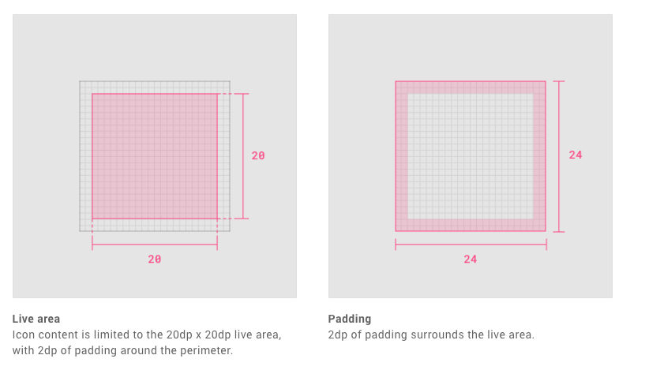

{: .no_toc }

# Adobe XD Basics

This walk-through uses Google Material Design guidelines do create proportionally sized and aligned design assets (components) on an 8pt grid with 16 & 24pt spacing of icons. It also covers naming protocols, the grouping of layers, creating and updating components, locally and on the cloud. Although there is a focus on Adobe XD these principles can be applied to Sketch and Figma.

**MATERIAL DESIGN, 2020.** Material Design [viewed 4 November 2020]. Available from:https://material.io/design/iconography/system-icons.html#design-principles

[MORE ON UI GRIDS](ui_grids.md){: .btn .btn-purple }

## Adobe XD Introduction Tutorial Videos Playlist

<iframe width="560" height="315" src="https://www.youtube.com/embed/videoseries?list=PL-C4a9Qw2_Y6TTMg6dvNJ967jmMwrqbp3" frameborder="0" allow="accelerometer; autoplay; clipboard-write; encrypted-media; gyroscope; picture-in-picture" allowfullscreen="" style="font-size: 0.9375rem; letter-spacing: 0.45px;"></iframe>

Download Icons & Grids Systems walk-through

[Download Xd Starter File](https://learn.solent.ac.uk/pluginfile.php/2432386/mod_resource/intro/starter_2.xd){: .btn .btn-purple }

XD allows you to share your work through the cloud to undertake usability testing, show to clients, share with colleagues and also for developers to code your digital concepts Follow the link below to see what this looks like

[XD Development File](http://example.com/){: .btn .btn-blue }

