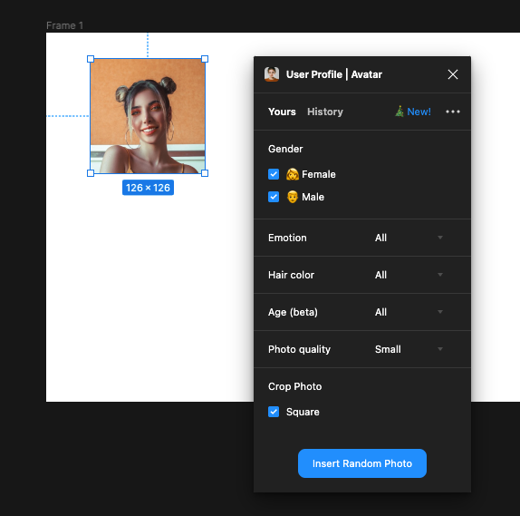
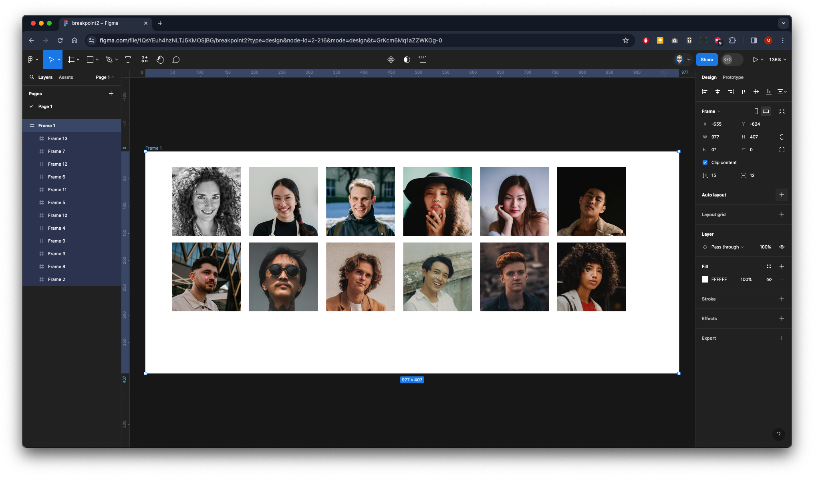

{: .no_toc }

# Breakpoints

<iframe src="https://solent.cloud.panopto.eu/Panopto/Pages/Embed.aspx?id=e2d86871-1aa2-486c-842c-b11b0163b6db&autoplay=false&offerviewer=true&showtitle=true&showbrand=true&captions=true&interactivity=all" height="405" width="720" style="border: 1px solid #464646;" allowfullscreen allow="autoplay" aria-label="Panopto Embedded Video Player"></iframe>

In UI (User Interface) design, breakpoints refer to specific points or ranges of screen widths at which a website or application layout responds and adapts to accommodate different devices or screen sizes. Breakpoints are crucial for creating responsive designs that provide optimal user experiences across various devices, such as desktop computers, laptops, tablets, and smartphones.

When a user accesses a website or application, the layout and content should adjust dynamically based on the device's screen size to ensure readability, usability, and accessibility. Breakpoints allow designers to define how the layout should change at different screen widths to maintain functionality and aesthetics.

**Common breakpoints include:**

**Desktop:** This is typically the default layout for larger screens like desktop computers and laptops. The layout might feature multiple columns, larger fonts, and more detailed navigation elements.

**Tablet:** As the screen width decreases to accommodate tablets and larger mobile devices in landscape orientation, the layout may adjust by rearranging elements, resizing images, and simplifying navigation.

**Mobile:** For smaller screens like smartphones, the layout may switch to a single-column design, prioritize content based on importance, enlarge touch targets for easier interaction, and hide non-essential elements to optimize space.

## Breakpoint Walk-through

<iframe src="https://solent.cloud.panopto.eu/Panopto/Pages/Embed.aspx?id=4aa56950-a08b-4f02-b200-b11b0169e6b1&autoplay=false&offerviewer=true&showtitle=true&showbrand=true&captions=true&interactivity=all" height="405" width="720" style="border: 1px solid #464646;" allowfullscreen allow="autoplay" aria-label="Panopto Embedded Video Player"></iframe>

This is just a quick walkthrough to show how you could set up breakpoints if you are doing this for real with UI design you obviously need to pay attention to the layout as well as naming conventions of your layers.

Create a new Frame

Inside this Frame create another one that is a perfect square bt holding `SHIFT` & `ALT` when dragging out

With the Frame still selected right mouse click to go to plugins to access User Profile | Avatar (this will need to have already been installed from Figma community)

Click on the button to insert a random image

Now `SHIFT` & `ALT` Drag to the right to duplicate

Continue until you have 6

 With all six selected `SHIFT` & `ALT` drag down to create another row

Make sure they are all selected.

Then access the User Profile plugin to randomise all the images so they are different.

Make sure the main Frame 1 is selected 

 In the Properties on the panel on the right click on the **+** next to the Auto Layout

 Make sure it's aligned middle centre

 Now rename the Frame two **Photos**

Now turn the frame into a Component

The Frame name will turn purple and have a diamond clustered icon

Now create a Variant by clicking on the diamond icon with the **+** from the top menu bar

This will create a copy underneath the original frame - drag in the right side so it shrinks to three images wide - as you have used auto layout it will flow the child elements within the main frame

It will be the case that the variant box has clipped your design you can drag this out by first clicking at the top on the name of the component Photo then going down and dragging out the bottom of the box

Now click the purple add variant icon at the bottom of the copied 3 column frame.

Now click the purple add variant icon 

A copy will appear

Drag the right side in to flow into a two-column layout.

Again, you will see your design clipped you can either drag it out or just again click the **+** to add a new variant and it should push the variant box down to make it larger.

A copy will appear

Drag the right side in to flow into a one-column layout.

We will now add Variant Properties

In the current variant section rename property to **breakpoint **and default to **desktop** then press `RETURN`

Now repeat the process with the rest of the images the property value of **breakpoint** can stay the same 

Three column should be cold **tablet**

Two column called **phone**

One column called **small phone**

All done!

Create a New Page

Click on the Assets Panel on left & drag out a instance of the Photos Component

From the properties panel on the right you now can customise the photo component instant to change the layout to a tablet or a phone or back again

