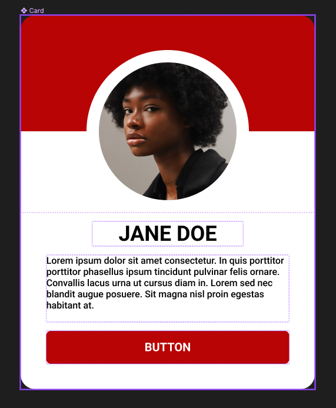
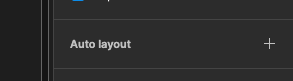
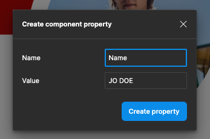

{: .no_toc }

# Simple Card Walk-though

---

Create a new Figma Design document and give it a name.

---

Create two pages one for the Components, and the other for Layout

---

Create a Button using A Frame and Auto-Layout
Height 36 - with does not matter but 110 approx, FIXED width and height and a radius of 4

---

Make it into a component either by right mouse click and selecting Create Component or shortcut `MAC: Alt + Cmd + K` `PC: Alt + Ctrl + K` or click Component icon in the tools

---

Create a frame either by pressing F on the keyboard or selecting the frame icon from the menu bar.

Drag out a rectangle then adjust the width to 500 and the right to 600 in the Property panel on the right

---

Create another rectangle inside this frame at the top with a width of 500 and a height of 197 - zero the ex and Y coordinates so it sits snuggly to the top of the frame. 

Give it a Fill colour

---

Now drag out a perfect circle using the ellipse tool - either select it from the shapes menu or press o on your keyboard.

Now drag out from the centre holding Alt + Shift to give a perfect circle on top of the rectangle shape 270 x 270 and align it as below.

Finally give a 21pt White filled Stroke

---

In the Layer panel so that both the ellipse and rectangle layers

---

Right mouse click to group them or press `Mac: Cmd + G` or `PC: Ctrl + G`

---

Then rename Group to Heather, ellipse to Avatar and rectangle tube bg as below - 

---

Now create a text box for the name by clicking T on the keyboard or selecting the text tool from the menu bar.

The selected font is Roboto Bold 36pt - in the property set to auto width and centre both horizontal and vertical

---

Now add another text box underneath this will contain the body text.

Roboto Bold 16pt regular in the property set the auto height, Text align left and Align Middle.

Then add some text

---

In the layers panel rename the text layers: **name** and **body text** 

---

We will now add some Latin body text into the body text box using a plug-in - select the text in the box then right mouse click and select the Latin body text **Lorem Ipsum** plugin.

---

Then add five sentences from the plug-in, you may need to re-align this text box afterwards to maintain its spacing and  centring to its parent element.

---

Your card will now look like this

---

We now need to auto- layout Card frame. Selected by clicking on the card title top left or pressing `\` (backslash) on the keyboard this lets the parent element.

From the properties panel in the auto layout section click the `+`

---

Your card will look like this:

---

We will need to adjust the frame properties.

In the frame properties change the width from Hug to Fixed and Radius to 25.

In the auto-layout properties expand independent padding and increase the bottom margin to 59 approximately

---

At the start of this tutorial we created a button, saved it as a component, it will now be available in the Assets panel on the right - drag it out to the bottom of your card - expand the width as below

---

We will now add an image to the Avatar layer using a plug-in called User Profile

---

Finally save your card as a component either by right mouse click and selecting Create Component or shortcut `MAC: Alt + Cmd + K` `PC: Alt + Ctrl + K` or click Component icon in the tools.

Finally we will set up some component properties for adding text content and switching the button on and off.

Select the name text either within the component or clicking on its layer, in the Content section of the properties on the right panel - click the icon on the right

---

In the property pop-up type name in the name field

---

Confirmation that it has completed will appear in the content section

---

Now select the body text - go to the content section of the properties click the icon on the right

---

Select Create property...

---

In the Name field type body text

---

Confirmation will appear in the contents section of the property panel

---

We will now put a property on the button to turn it on and off. Sweat the button either within the component or from the layers. In the layers properties section click the icon on the right. 

---

The pop-up should present with Show Button - if this is not the case type it in - then click drain property

---

Confirmation should now appear in the layer property section

---

Creation of the Card component is complete.

Navigate to the layout page and then select the assets panel drag out an instance onto the canvas.

From the Properties panel you can switch the button on and off, also you can amend the text contents from within the Properties panel or within the text box within the layout. The design will expand and contract vertically as content is added and removed.

