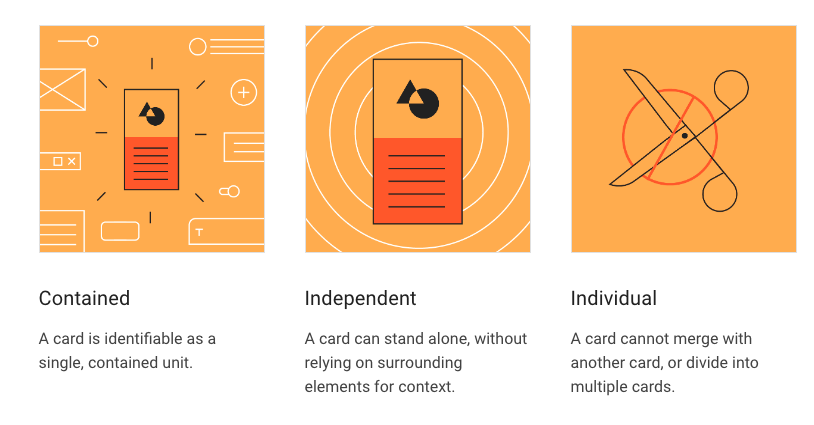
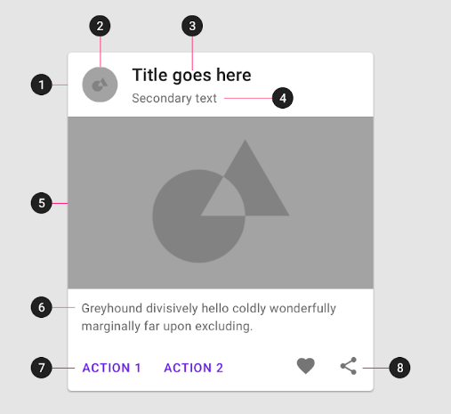

{: .no_toc }

# Simple Card - with Auto Layout

*Cards are surfaces that display content and actions on a single topic.*

*They should be easy to scan for relevant and actionable information. Elements, like text and images, should be placed on them in a way that clearly indicates hie*rarchy.

[Google Material Design](https://m2.material.io/components/cards#usage)

https://m2.material.io/components/cards

### Links & Research

[Material Design M3 - Cards Overview](https://m3.material.io/components/cards/overview)

[4 popular types of cards in UI design](https://bootcamp.uxdesign.cc/4-popular-types-of-cards-in-ui-design-c805406ea0f3)