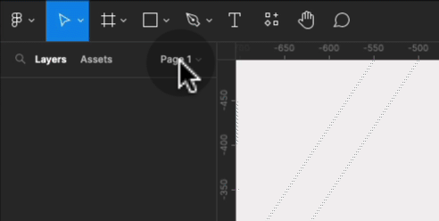
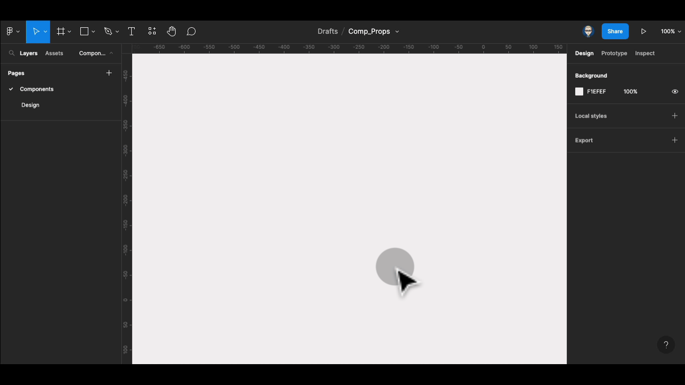
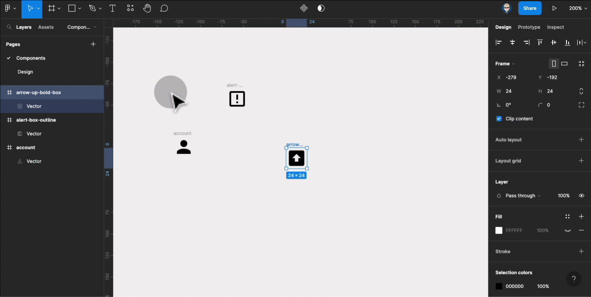
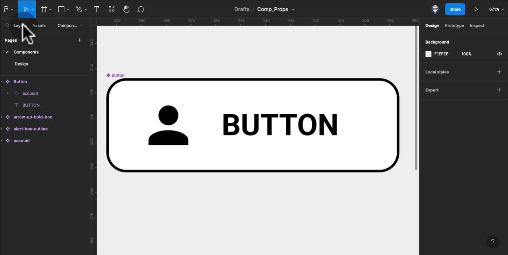
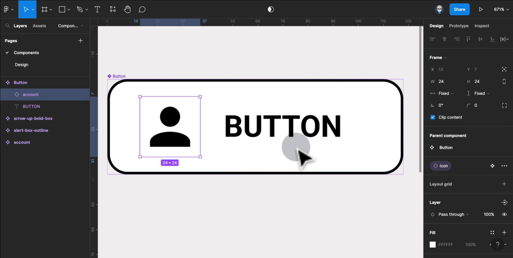

{: .no_toc }

# Component Properties

We will create a Button with an icon that can allow customisation of its Instances in the design layout UI.

We need some icons – get them from using a plug from[ Figma Community](https://help.figma.com/hc/en-us/articles/360038510693-Guide-to-the-Figma-Community), here we have use Material Design (Community) plug in and set up 3 icon and make them into Components

Create a Button with an icon with Auto Layout – details on making a simple Auto Layout Button can be found here. 
Make a Frame – Fill and add a Stroke – make it into an Auto Layout

## Support for independent study

Guide from the Figma YouTube Channel with Playground file.

<iframe width="560" height="315" src="https://www.youtube.com/embed/iIq8FLt1hUY" title="YouTube video player" frameborder="0" allow="accelerometer; autoplay; clipboard-write; encrypted-media; gyroscope; picture-in-picture" allowfullscreen></iframe>

This is an excellent blog on Components Properties
[https://uxplanet.org/figma-component-properties-548728f25392](This is an excellent blog on Components Properties
https://uxplanet.org/figma-component-properties-548728f25392
)

