{: .no_toc }

# Button Properties Walk-through

Create a button containing an icon using auto layout then make into a component - remember the icon should be created as a component before you drag and drop it in to the main button component

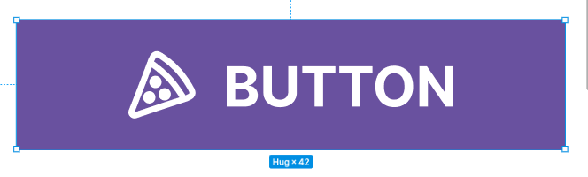

## Create an Instance Swap Property

We will now put an instance swap property on the icon so we can change icons

Select the icon

In the properties panel in the you will see the properties for the icon in this case Pizza. Click on the icon to the right to create a instantance swap property

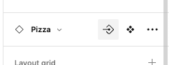

Give the property name icon and click create property

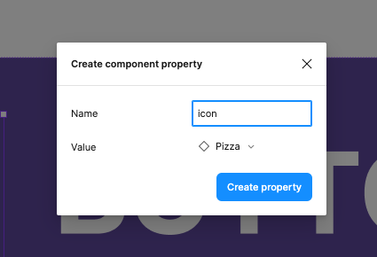

Confirmation of the creation of the property will be shown in the properties panel

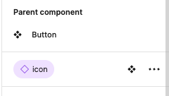

## Create a Boolean layer property 

No need to set up a property to switch the icon on or off to do this we will use a Boolean layer property

With the icon still selected in the properties panel in the layer section click the icon on the right to set up a Boolean property

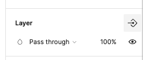

Name this has icon and then click create property

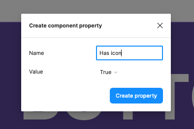

Confirmation of the success of setting this property up will be presented in the layer section of the properties panel

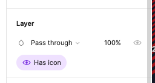

## Create a content property

We will now set up a content property for updating the text label of the button

Select the text label inside the button component and click on the icon to the right to set up a content property

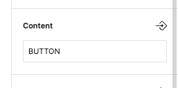

Now name the property label and click create property

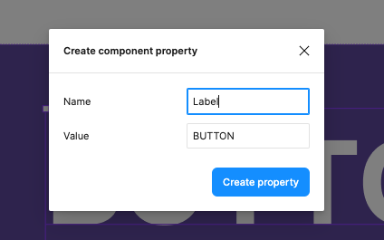

## Instance customisation

We have now completed setting up the properties for changing the icon, switching the icon on and off and updating the button label.

You can now create a new page and add a frame, then select the Assets panel on the left

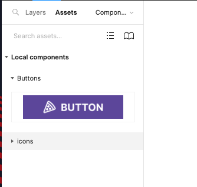

Drag out on Instance of your component to the frame

Select the button on the properties panel on the right you will see all the properties you have set up to customise your component

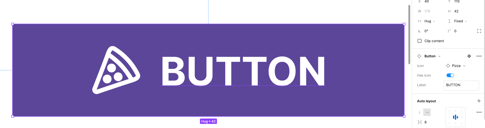

First we will change the icon so click on the properties for this and from the drop-down select another icon

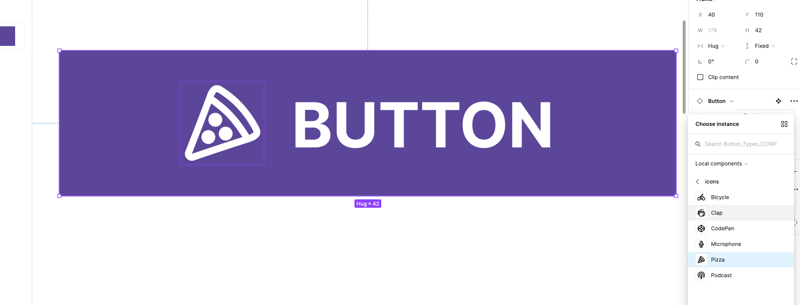

Your icon should now change.

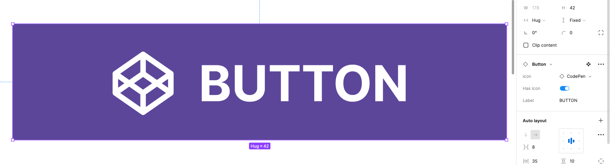

Now use the toggle switch in the properties to switch your icon off

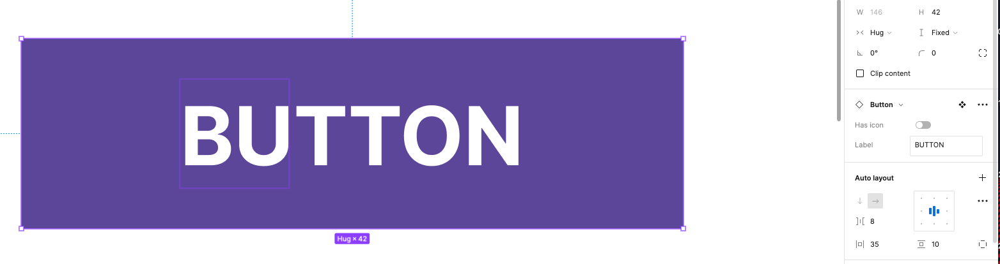

And lastly click on the Content property field,s type in a different label title and hit enter on your keyboard

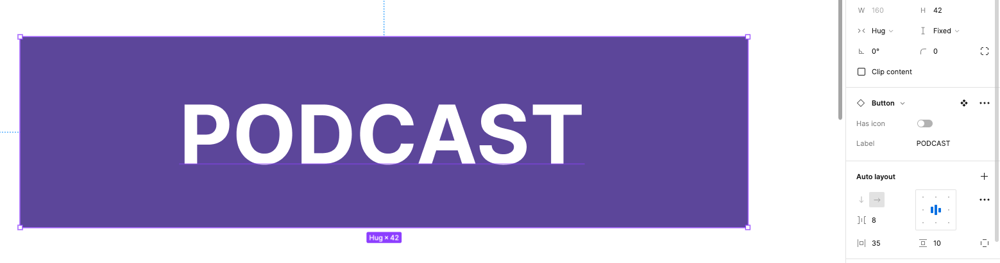

