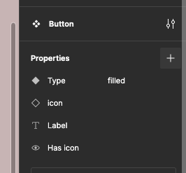
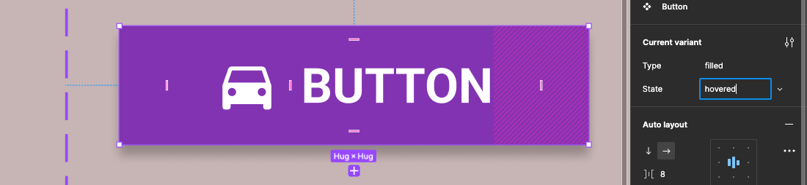

{: .no_toc }

# Variant States

{: .note }
>To create this button you will need to create a frame 178×42 with Auto-Layout, text bold and 18pt - left right margin 35 - top and bottom margin time - yeah between icon and text label 8

## Property: Type = Filled

Click on your button component and click the variant icon from the top bar to create a variant of your bottom

In the properties panel change property by typing in Type

Click on default and select rename from the drop-down

Call it filled

Click on variant to underneath the first button and change variance to  filled

You will get an error to say the all two properties with the same name don't worry we will fix this later on

Create another variant by clicking on the plus at the bottom of the second variant - with its selected change the type to filled.

With the third variant still selected change the colour to a darker shade this will eventually be pressed state

Now select the second variant (middle button) give it a drop shadow in the properties panel on the right this button will eventually be the hovered state

You will now have three variants of your button grouped together

---

## Property: State = enabled - hovered - pressed

Now select the whole of the variant box this can be done by clicking on the name label button on the top left you should see everything selected in your layers outline

Variance box selected go to the properties panel on the right - click on the + to add a new property

Select variant from the drop-down

Type in State for the name

Your properties panel should now look like this:

Now select the top button in the varying box and from the properties panel click on default and select Add new from the drop-down

Now type in enabled for the State

Click on the second button in the variant box - again add new from the drop-down and name the State hovered

Finally click on the third button in the variant box and cool this State pressed

Your expanded layers outline will look like this:

And an expanded like this:

---

##  Create outlined buttons

Create a fourth button variant - select the icon and change it to black and do the same for the text label

Fill the buttons frame and add a black stroke

With this button selected add a new property for Type call it outlined

This button should have Type = outline and State = enabled

Create another button variant - Type = outlined and State = hovred

With the button still selected give it a drop shadow from the properties panel on the right

Now create a final outlined button variance give the film a different colour - light grey

This button Type = outlined and State = Pressed

---

## Test in a layout view

Now create a new page for your layout create a frame and drag the button to the frame and try out customising it from the properties panel

