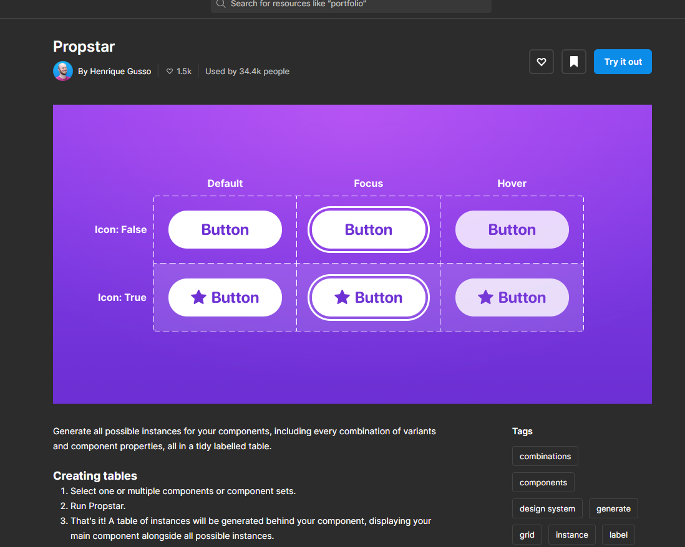
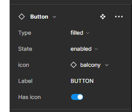
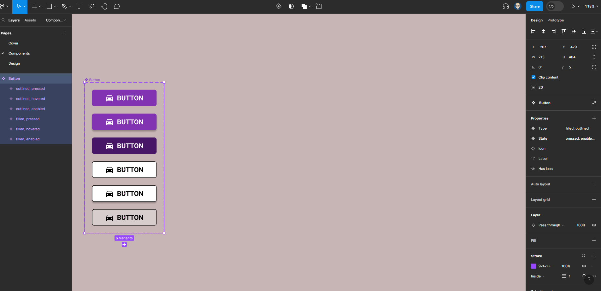
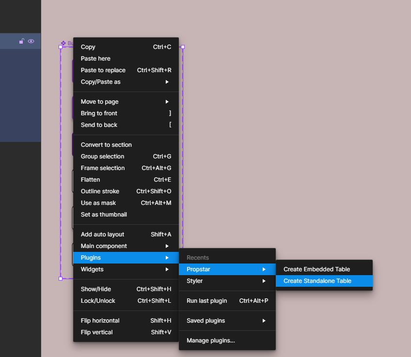
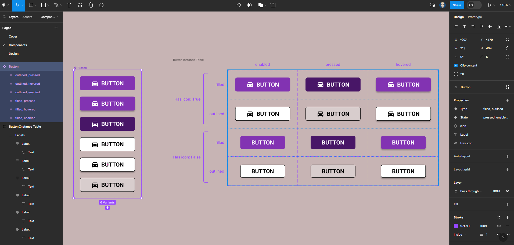

---

layout: default
title: Propstar Plugin
parent: Component Properties
nav_order: 7
---

{: .no_toc }

# Propstar Plugin

*Generate all possible instances for your components, including every combination of variants and component properties, all in a tidy labelled table*

[figma.com/community/plugin/1116018586739867857/propstar](https://www.figma.com/community/plugin/1116018586739867857/propstar)

A Button Variant - in this example it has been set-up with:

**Type:** filled & Outlined

**State:** enabled, hovered & pressed

**Instance Swop**  On icon

**Boolean (true:false)**: has icon

1. Install the Propstar plugin

[figma.com/community/plugin/1116018586739867857/propstar](https://www.figma.com/community/plugin/1116018586739867857/propstar)

2. Select the Variant and right-mouse to select:
 `Plugins > Propstar > Create Standalone Table`

3. This will create table of all the Variants for the Component. This can be cut/pasted onto a Style-Sheet orDocumentation page

