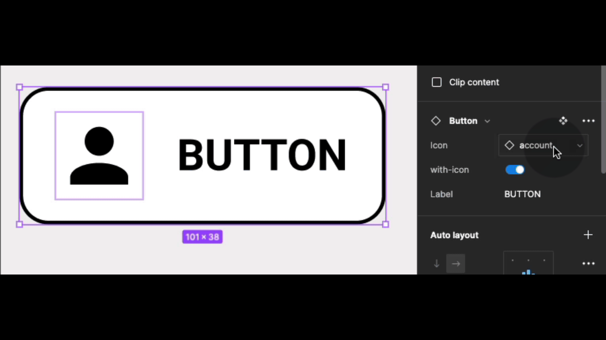

{: .no_toc }

# Component Properties Intro

Component properties are tied to different design properties. You can create component properties for any main component or component set, and apply them to nested layers of the component or variant.

Component properties come in different types:

* Boolean properties 
* Instance swap properties
* Text properties
* Variant properties

[https://help.figma.com/hc/en-us/articles/5579474826519-Explore-component-properties](https://help.figma.com/hc/en-us/articles/5579474826519-Explore-component-properties)

We will create a Button with an icon that can allow customisation of its Instances in the design layout UI.

We need some icons – get them from using a plug from[ Figma Community](https://help.figma.com/hc/en-us/articles/360038510693-Guide-to-the-Figma-Community), here we have use Material Design (Community) plug in and set up 3 icon and make them into Components

### Introduction to component properties

<iframe src="https://solent.cloud.panopto.eu/Panopto/Pages/Embed.aspx?id=63dfe75e-543b-4e56-bfae-af55014b7286&autoplay=false&offerviewer=true&showtitle=true&showbrand=false&captions=true&interactivity=all" height="405" width="720" style="border: 1px solid #464646;" allowfullscreen allow="autoplay"></iframe>

### Importing icons from plug-in

<iframe src="https://solent.cloud.panopto.eu/Panopto/Pages/Embed.aspx?id=31e517e7-378d-4e29-b82c-af550151bbf8&autoplay=false&offerviewer=true&showtitle=true&showbrand=false&captions=true&interactivity=all" height="405" width="720" style="border: 1px solid #464646;" allowfullscreen allow="autoplay"></iframe>

### Creating a button with icon  - Part 1

<iframe src="https://solent.cloud.panopto.eu/Panopto/Pages/Embed.aspx?id=9f17e348-380a-4acb-aa91-af55015a340e&autoplay=false&offerviewer=true&showtitle=true&showbrand=false&captions=true&interactivity=all" height="405" width="720" style="border: 1px solid #464646;" allowfullscreen allow="autoplay"></iframe>

### Creating a button with icon  - Part 2

<iframe src="https://solent.cloud.panopto.eu/Panopto/Pages/Embed.aspx?id=e34e0ef9-0b50-40ef-8f8d-af55015a810c&autoplay=false&offerviewer=true&showtitle=true&showbrand=false&captions=true&interactivity=all" height="405" width="720" style="border: 1px solid #464646;" allowfullscreen allow="autoplay"></iframe>

### Creating a button with icon  - Part 3

<iframe src="https://solent.cloud.panopto.eu/Panopto/Pages/Embed.aspx?id=c2b604b7-fb27-45e6-872e-af55015bbaac&autoplay=false&offerviewer=true&showtitle=true&showbrand=false&captions=true&interactivity=all" height="405" width="720" style="border: 1px solid #464646;" allowfullscreen allow="autoplay"></iframe>

### Creating a content property

This property will allow a text box to be edited on an instance

<iframe src="https://solent.cloud.panopto.eu/Panopto/Pages/Embed.aspx?id=a37826c1-2299-4811-bbea-af55015bba8d&autoplay=false&offerviewer=true&showtitle=true&showbrand=false&captions=true&interactivity=all" height="405" width="720" style="border: 1px solid #464646;" allowfullscreen allow="autoplay"></iframe>

### Instance swap property

This property will allow a component instance to be changed/swapped

<iframe src="https://solent.cloud.panopto.eu/Panopto/Pages/Embed.aspx?id=f18c6b80-2466-4878-abac-af55016d5c28&autoplay=false&offerviewer=true&showtitle=true&showbrand=false&captions=true&interactivity=all" height="405" width="720" style="border: 1px solid #464646;" allowfullscreen allow="autoplay"></iframe>

### Boolean property

Boolean property is set to true or false which allows switching on and off components

<iframe src="https://solent.cloud.panopto.eu/Panopto/Pages/Embed.aspx?id=d96511d2-f16b-49a2-9c0a-af55015cd664&autoplay=false&offerviewer=true&showtitle=true&showbrand=false&captions=true&interactivity=all" height="405" width="720" style="border: 1px solid #464646;" allowfullscreen allow="autoplay"></iframe>

## Support for independent study

Guide from the Figma YouTube Channel with Playground file.

<iframe width="560" height="315" src="https://www.youtube.com/embed/iIq8FLt1hUY" title="YouTube video player" frameborder="0" allow="accelerometer; autoplay; clipboard-write; encrypted-media; gyroscope; picture-in-picture" allowfullscreen></iframe>

This is an excellent blog on Components Properties
[https://uxplanet.org/figma-component-properties-548728f25392](This is an excellent blog on Components Properties
https://uxplanet.org/figma-component-properties-548728f25392)

