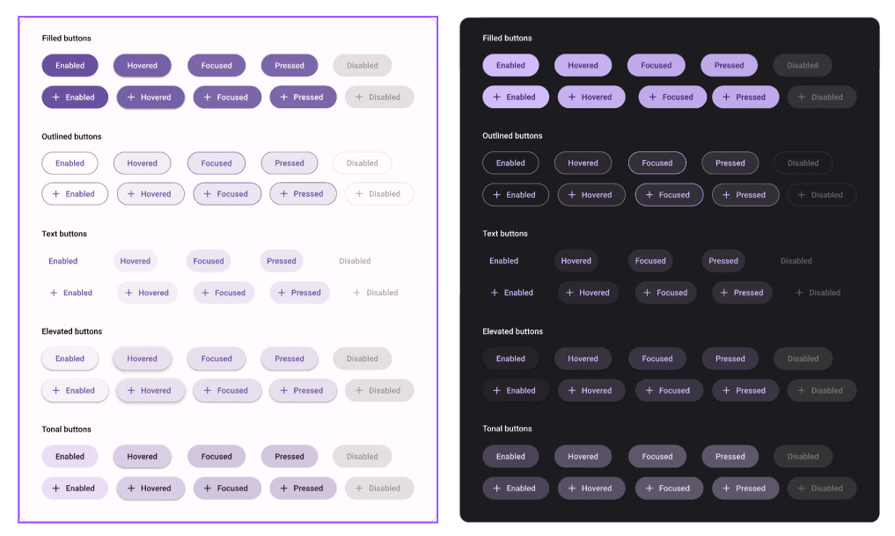
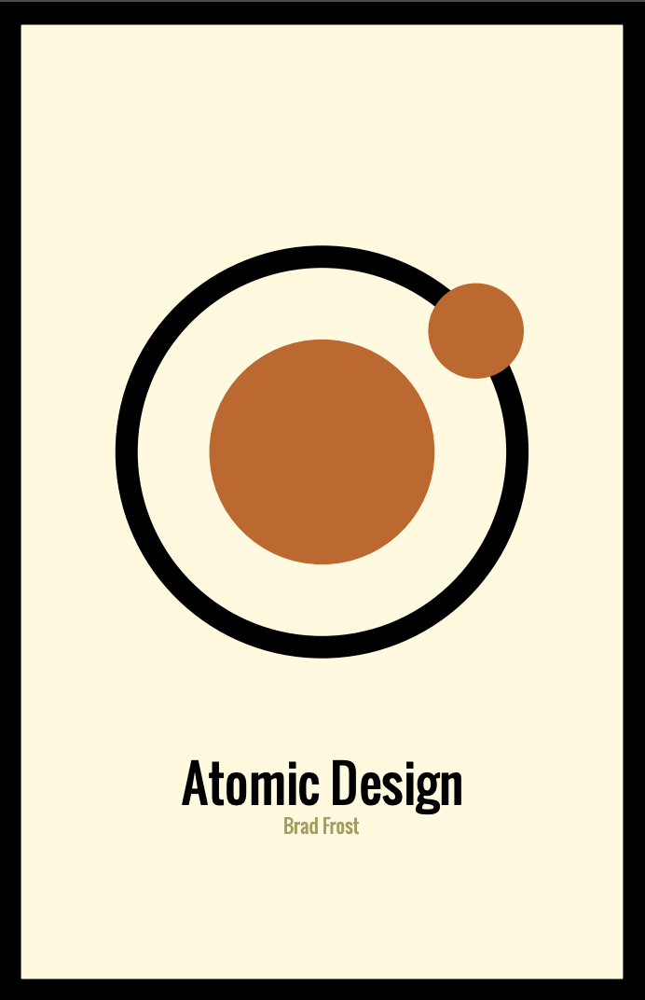

{: .no_toc }

# Design Systems

A design system is a set of standards and components that are used to create a consistent look and feel across digital products. It often includes elements such as fonts, colors, spacing, user interface components, and more. A design system also provides guidelines for how to use the components to create a cohesive experience for users.

## Atomic Design

"This book introduces a methodology for thinking of our UIs as thoughtful hierarchies, discusses the qualities of effective pattern libraries, and showcases techniques to transform your team's design and development workflow."

Available in the Solent University Library as PDF (sign in needed)

[FROST, B., 2016. Atomic design. Pittsburgh, Pennsylvania: Brad](https://learn.solent.ac.uk/draftfile.php/4122/user/draft/342966793/atomic-design.pdf)