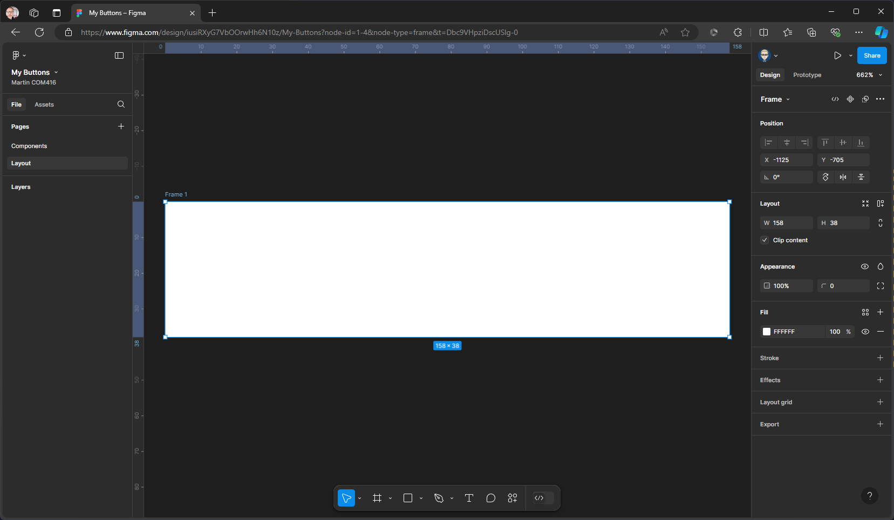

{: .no_toc }

# Figma Basics

### Create a Button

#### 1. 

1. Create a new Design File

1. Give your file a name

1. We now need to bring in some icons to use in our project these have been previously imported from Figma community and are free to use. With Assets still selected, click on the library icon

1. Change current file to your teams, you should now see material design icons community, click on add to file.

1. This will add the library to the Assets panel on the left, you can now close the libraries panel by clicking on the X top right.

1.You can double click on the library cover to reveal the icons contained within this

1. Switch Assets to File

1. Rename page 1 to Components

1. Create a new page by clicking on the plus icon

1. Call this **Layout**

1. Click on the Frame Tool

1. Drag out a frame on your **Paste Board**

1. Resize in the right **Properties Panel** in the Layout Section to **W150 & H38** 

 **Remember** you can zoom in on a component to fill the pasteboard by pressing Shift + 2
 
