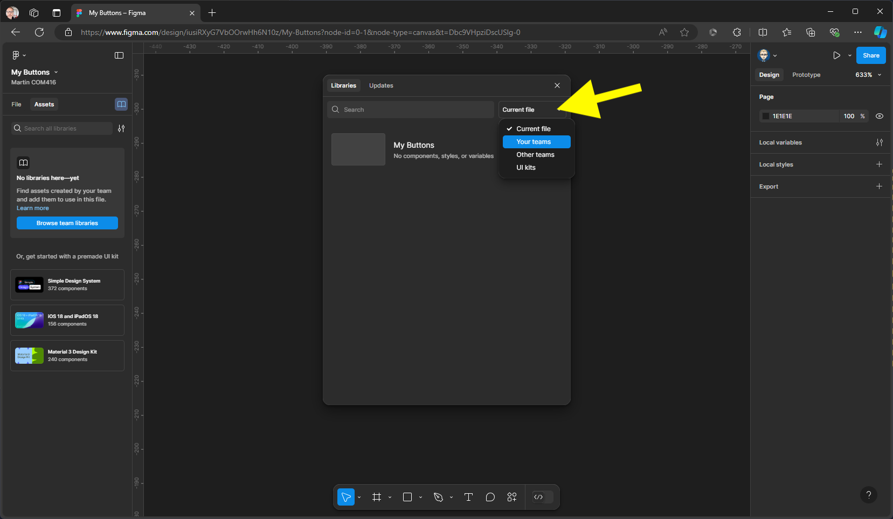
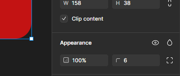

{: .no_toc }

# Figma Basics

### Create a Button

1. Create a new Design File

2. Give your file a name

3. We now need to bring in some icons to use in our project these have been previously imported from Figma Community and are free to use. With Assets still selected, click on the library icon

4. Change current file to **Your Teams**, you should now see material design icons community, click on add to file.

51. Click A**dd to file** button next to the **Material Design icons**

7. This will add the library to the Assets panel on the left, you can now close the libraries panel by clicking on the X top right.

8. You can double click on the library cover to reveal the icons contained within this

9. Switch Assets to File

10. Rename page 1 to Components

11. Create a new page by clicking on the plus icon

12. Name it **Layout**

14. Click on the Components page in the Pages section. Then Drag out a frame on your **Paste Board**

15. Resize the Frame in the right **Properties Panel** in the Layout 
Section to **W150 & H38** 

 **Remember** you can zoom in on a component to fill the pasteboard by pressing Shift + 2

16. Rename the Frame either in the Frame label or in the Layers panel

Name it **Button**

Your set-up will now look like this:

17. Now change the Button colour: In the properties Panel on the right within the Fill section click on the colour swatch to change & close the Colour Panel

18. Now add a 6x Radius in the Appearance section

Your Button will look like this

19. We will now add an [Auto Layout](https://help.figma.com/hc/en-us/articles/5731482952599-Add-auto-layout-to-a-design) to enable responsive design.

First select the Frame, then you can either right-mouse, `SHIFT + A` on the keyboard or from the click on the Auto layout in the Layout section in the Properties Panel in the 

Once applied you will have the ability to customise 

20. Centre - Middle align

21. For **H** (Height) change from Hug to Fixed but still on 38 this will mean it will aways be this height but the width can auto change

Close up of the Panel

22. Now select the Type tool from the Tools `T` on the keyboard & Click inside the the button. The with will collapse - Don't Worry!

23. In the Typography section of the Properties make the fot wait **Medium** & size **16** The font colour should contrast with the background colour

Type the word **Button** When yoy select the Button background the height should stay fixed at 38.

Only drag out the width of a Button and leave this height as is (Fixed)

24. We need to add a icon to the Button, - we have already imported Material Design Icon -  switch **File** to **Assets** You might need to double click to open the cover image - then find an icon

Then drag drop the icon on top of the Button

Change Assets back to File and check if the Icon is inside the Button Frame as below - if not re-adjust in the Layers Panel

Make sure the icon is selected. Then in the **Design Panel** on the right scroll down to the **Selected Colours** section to change to colour in this case from black to white, click on the black swatch

And from the colour picker select white 

Then close the Picker panel - the icon will be white

                                      

  

  

  