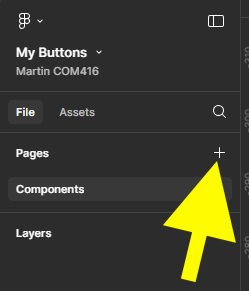

{: .no_toc }

# Figma Basics

### Create a Button

1. Create a new Design File

2. Give your file a name

3. We now need to bring in some icons to use in our project these have been previously imported from Figma Community and are free to use. With Assets still selected, click on the library icon

4. Change current file to **Your Teams**, you should now see material design icons community, click on add to file.

51. Click A**dd to file** button next to the **Material Design icons**

7. This will add the library to the Assets panel on the left, you can now close the libraries panel by clicking on the X top right.

8. You can double click on the library cover to reveal the icons contained within this

9. Switch Assets to File

10. Rename page 1 to Components

11. Create a new page by clicking on the plus icon

12. Call this **Layout**

14. Click on the Components page in the Pages page. Then Drag out a frame on your **Paste Board**

15. Resize in the right **Properties Panel** in the Layout 
Section to **W150 & H38** 

 **Remember** you can zoom in on a component to fill the pasteboard by pressing Shift + 2

Rename the Frame either in the Frame label or in the Layers panel

Name it **Button**

Your set-up will now look like this:

Now change the Button colour: In the properties Panel on the right within the Fill section click on the colour swatch to change & close the Colour Panel

Now add a 6x Radius in the Appearance section

