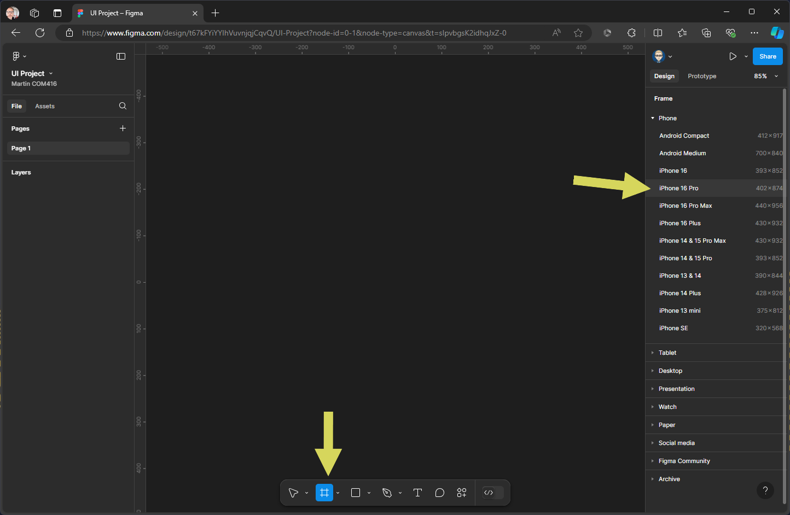

{: .no_toc }

# Figma Basics

### Quick Start

#### 1. Setting up a Design File

Create a new Design File

Give the file a name

#### 2. Importing and IU Kit Library

Click on Assets & the click on the Libraries icon - change Current file to UI kits

Add file for iOS18 UI kit

Close Library panel & the kit will now be added to the Asset panel on the left

Double click the UI Kit icon

This will reveal all components in the UI kit

#### 3. Create UI Screens

We will now create a Frame (Screen) for out UI, click on File to change from Assets

Click the Frame tool & select iPhone 16 Pro (402 x 874) this will match the size of our UI kit

You may need to drag-drop inside the Home Frame in  the layers panel on left

Create another screen - Click Frame and the select iPhone 16 Pro (402 x 874) give it a name

Change File to Assets & click on Navigation Bars

Click on NNavigation Bar Compact 

This will preview the component & allow customisation - click on insert button

As with the home screen make sure the Nav Bar in inside the screen frame

Drag out iPhone Keyboard under screen 2

#### 4. Interaction

