{: .no_toc }

# Figma Basics

### Quick Start

#### 1. Setting up a Design File

Create a new Design File
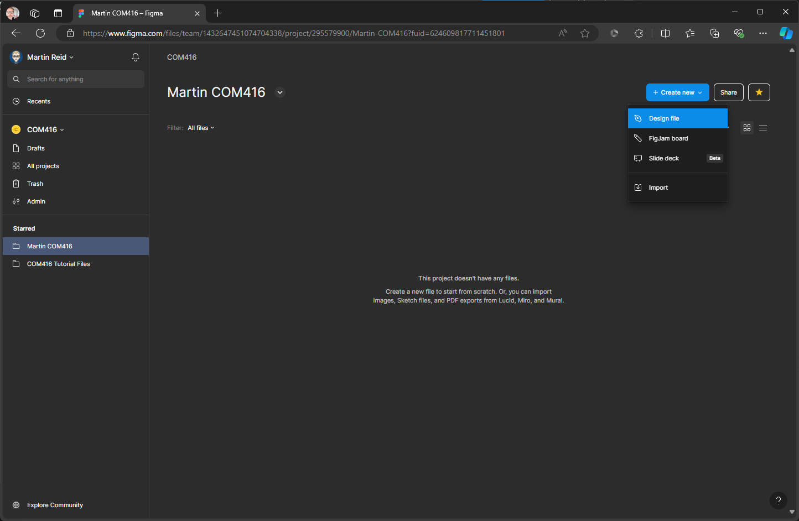

Give the file a name

#### 2. Importing and IU Kit Library

Click on Assets & the click on the Libraries icon - change Current file to UI kits

Add file for iOS18 UI kit

Close Library panel & the kit will now be added to the Asset panel on the left

Double click the UI Kit icon

This will reveal all components in the UI kit

#### 3. Create UI Screens

We will now create a Frame (Screen) for our UI, click on File to change from Assets

Click the Frame tool & select iPhone 16 Pro (402 x 874) this will match the size of our UI kit

You will need to name your Frame, either do this on the label top left of the Frame or in the Layers panel on the left
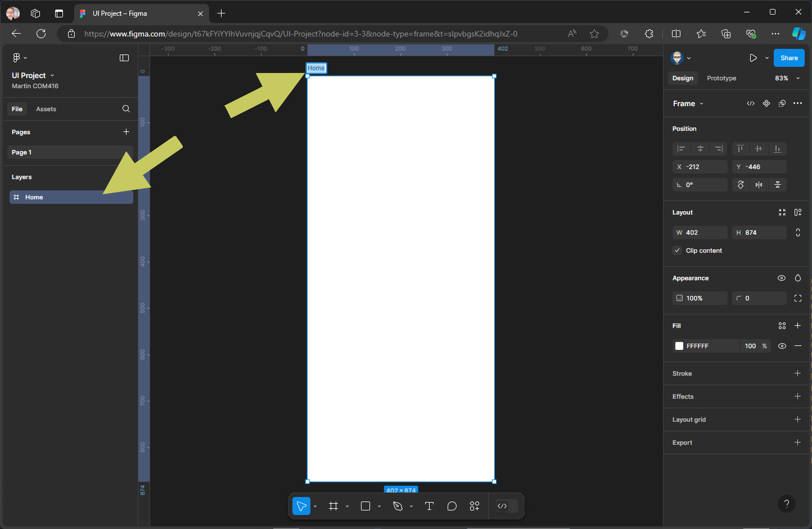

Now change File to Assets in the left panel, within the UI Kit components Scroll down till you locate the System section & click to open
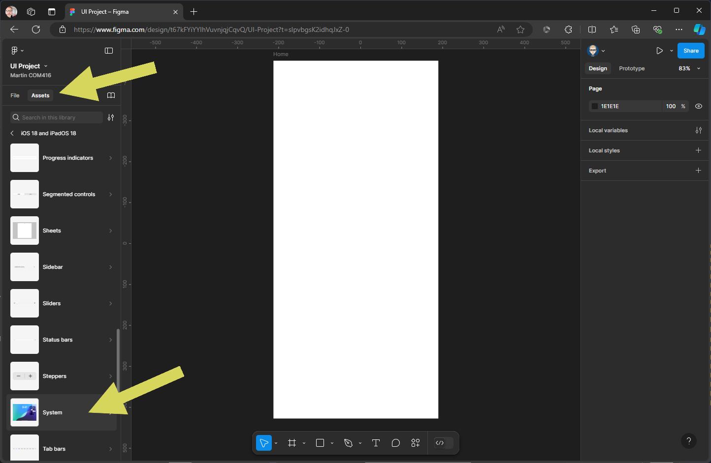

 Locate the Home Screen component and drag out on top of the Frame

 Change back to File for Asset  this will make your Layers panel visible, check to see if the home screen component is inside the Home Frame - if it is, it will be underneath the Home Frame and indented - if it is above and/or not indented, then  drag and drop the Home screen component on top of the Frame layer.

You may need to drag-drop inside the Home Frame in  the layers panel on left
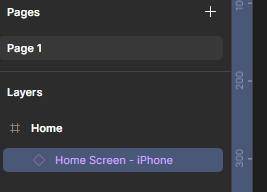

Create another screen - Click Frame and the select iPhone 16 Pro (402 x 874) give it a name

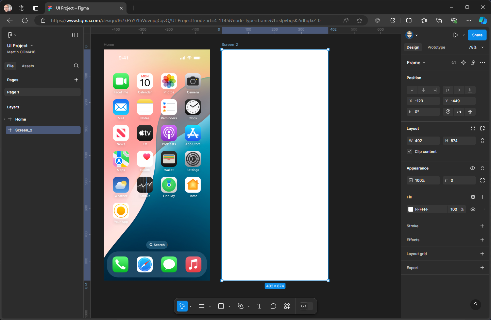

Change File to Assets & click on Navigation Bars
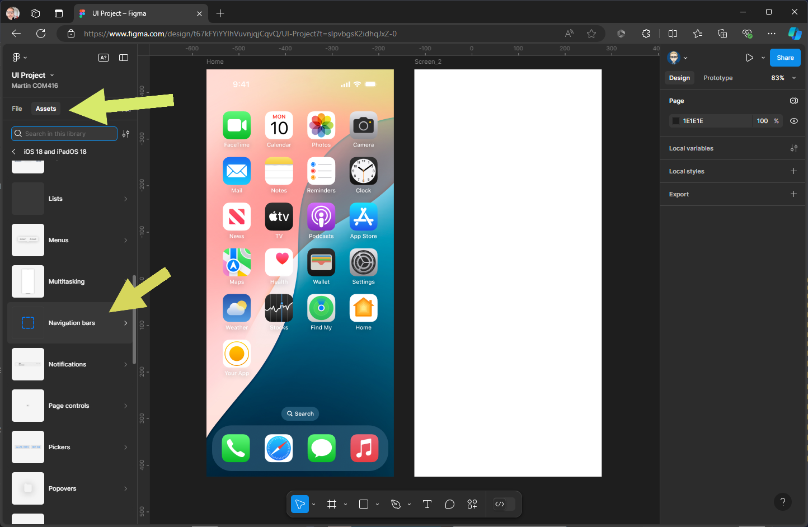

Click on Navigation Bar Compact 
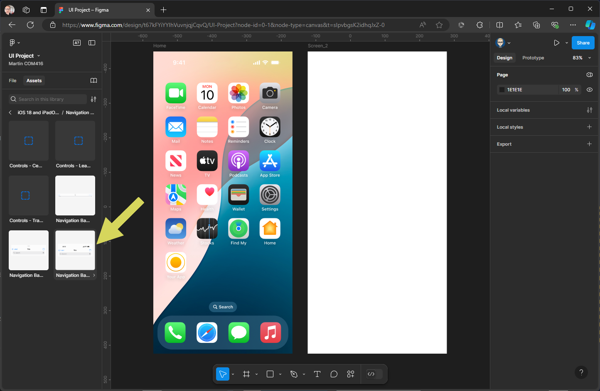

This will preview the component & allow customisation - click insert
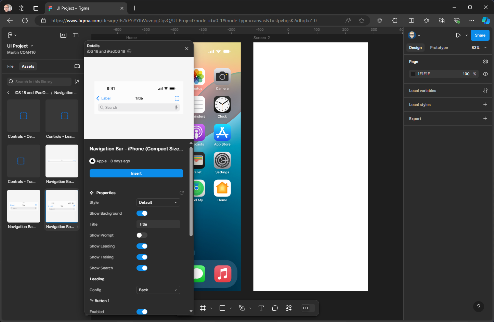

As with the Home screen make sure the Nav Bar in inside the  Frame
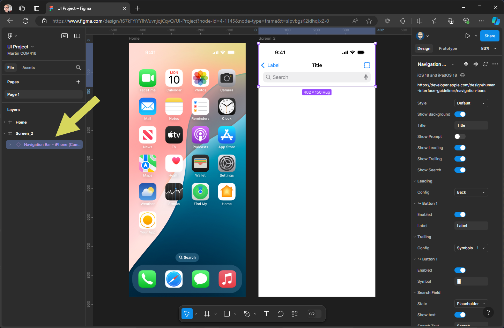

Change File to Assets &within the UI Kit components locate Keyboards & click to open

Drag out iPhone Keyboard under screen 2
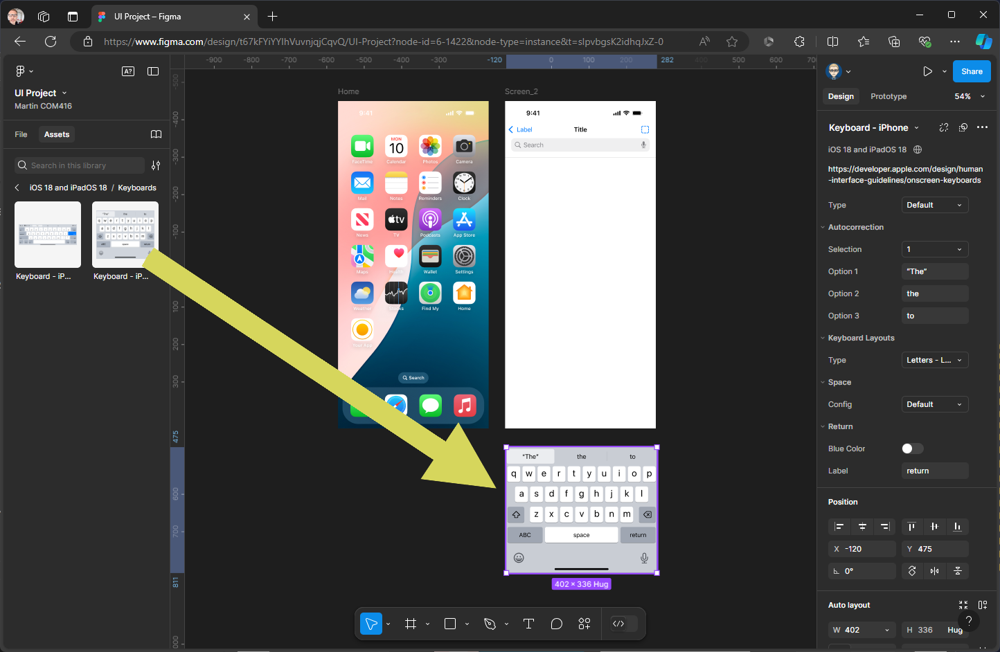

#### 4. Interaction

On the Home screen hover your mouse over the Your App icon and continually click until you have selected this component. Then from the panel on the right change Design to Prototype

Now hover your mouse over the My App component as you move the mouse a + in a circle will appear on the right side - click this and drag out a connection to Screen 2 - a popup panel will appear to allow customisation but this will have worked out what we intend to do
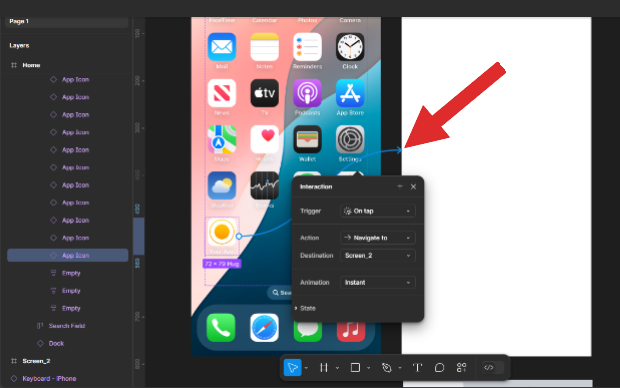

This will create a hyperlink
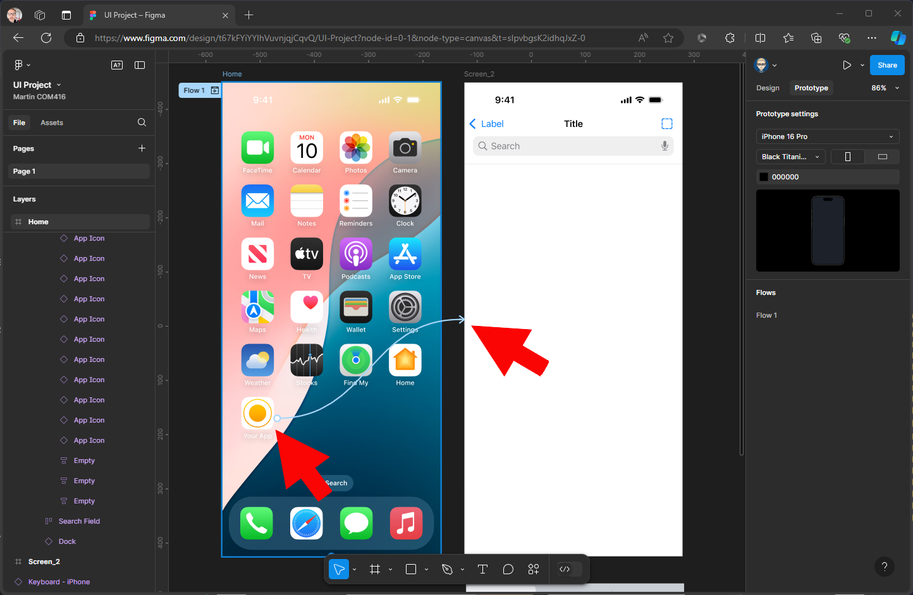

We now need to connect the Back button on Screen 2 so when clicked it will return to the Home screen - in this example we have not updated the Label, but you can update this to Back to give more meaning 
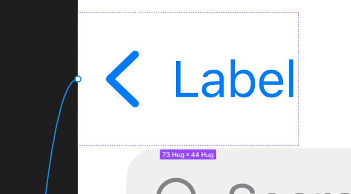

As with the My app icon drag out a connection back to the Home screen
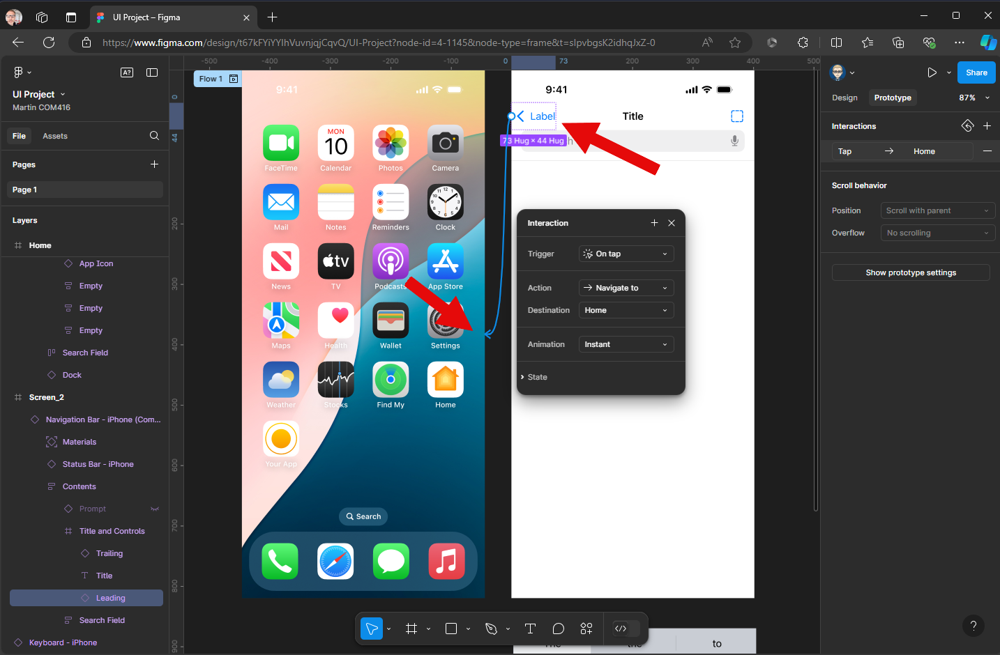

We will now add an interaction on the Search field so when it is tapped it will display the Keyboard - click on the search field
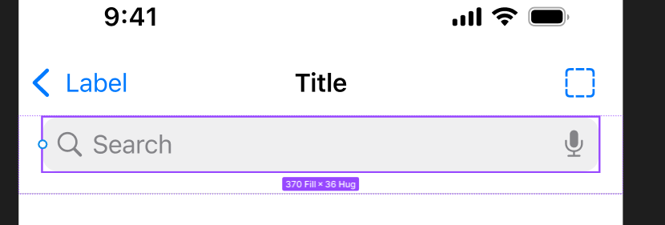

Make sure your in Prototype in the right panel & click `+`  in Interactions

The Trigger will be On Tap, the action will be Open Overlay

Within the Overlay you need to select Keyboard - iPhone

In Position change to Bottom Centre - this is where you want the component to move to when the interaction takes place

The Animation needs to be changed to Move In  - this is to set up an off screen interaction

And finally, you need to check Close when clicking outside, this will mean when the user taps off the keyboard it will close
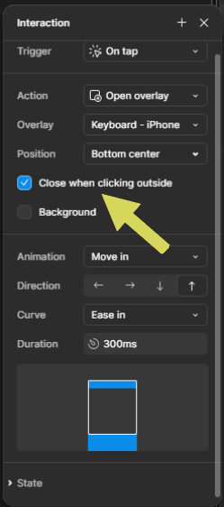

We can now run the prototype to see how the interactions work.

The device your prototype will present within, will be the original device you selected at the beginning of your project when setting up your first Frame. If for any reason you want to change it to another device - you can do this through the Prototype Settings - in this example, we won't change anything as it will prototype to the iPhone 16 Pro dimensions

Click the the Play (Run) button.

The prototype will open up in a new browser window and you can test the links and interaction alternatively it will be available on your Figma mobile device app

