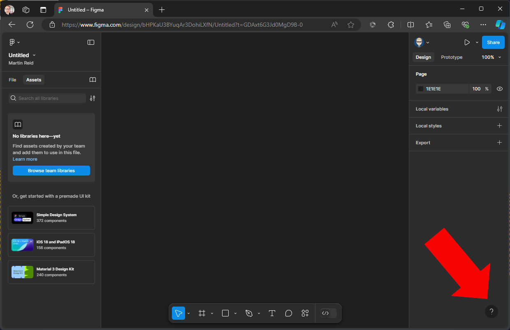
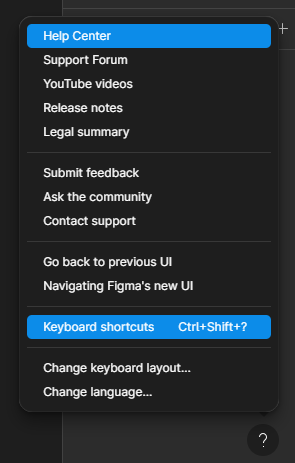
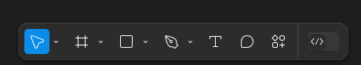
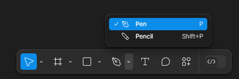
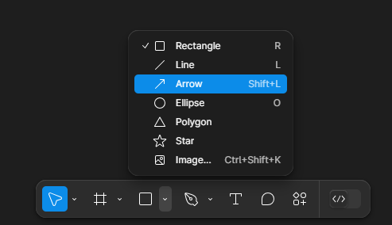
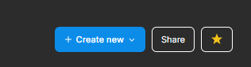

{: .no_toc }

# Figma Basics

### Workspace Update 2024

Figma typically releases major updates each summer. In 2024, they updated the UI significantly, adding extensive automation and AI features.

[What's New? - Config June 2024](https://www.figma.com/whats-new/)

A big change in [UI3](https://help.figma.com/hc/en-us/articles/23954856027159-Navigating-UI3-Figma-s-new-UI) was the placement of the [Tool Bar](https://help.figma.com/hc/en-us/articles/360041064174-Access-design-tools-from-the-toolbar) from the top to the bottom of the work space

Get start with help and short cuts by clicking the **?** icon bottom right of the work space.

To start off with explore the keyboard shortcuts

The select the Zoom shortcuts.

The Tool Bar is centre bottom

Pen Tool

Shapes Tool

Actions

Create a new File

Select Design

