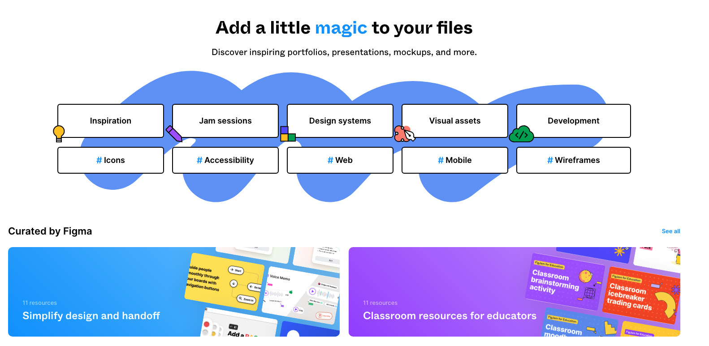
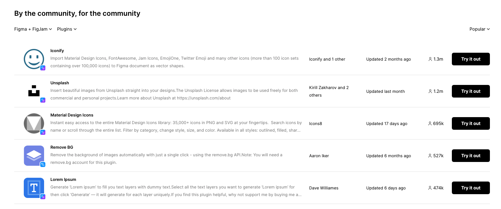

{: .no_toc }

# Figma Community

### Add a little magic to your files

 Discover inspiring portfolios, presentations, mockups, and more.

Figma Community offers a large number of free resources including project files, templates and plug-ins to use in your Figma projects.

By clicking the Try it out button it will copy the resource to your Figma account where it will be available as a project or be able to run as a plug-in

[Figma Community](https://www.figma.com/community)
