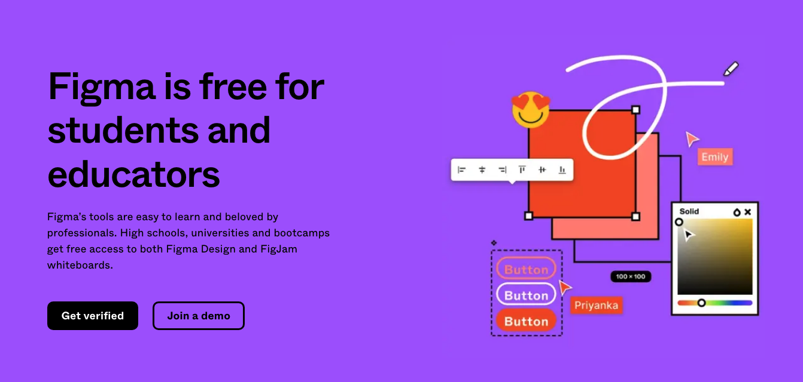

{: .no_toc }

# Figma Education

### How students use Figma
*Whether you’re an aspiring designer or collaborating on group project, you can do it in Figma. Here are the top ways students like you use Figma.*

Students and educators get Figma and FigJam FREE Professional Account which would normally cost $12 a month

| FREE Education Account                                       | Free Account                                                 |
| ------------------------------------------------------------ | ------------------------------------------------------------ |
| Unlimited Figma files  Unlimited version history  Sharing permissions  Shared and private projects  Team libraries  Audio conversations | 3 Figma and 3 FigJam files  Unlimited personal files  Unlimited collaborators  Plugins, widgets, and templates  Mobile app |

[Find out more](https://www.figma.com/education/students/)

You will need to verify that you are a student and will be asked to photograph your campus card as part of the sign up process.

[Sign up for a Figma Education Account using your University Email](https://www.figma.com/education/)

