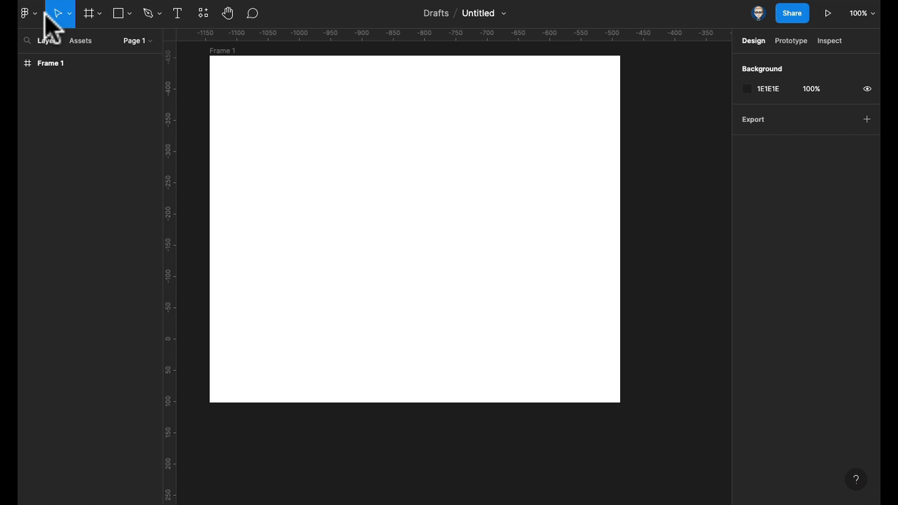
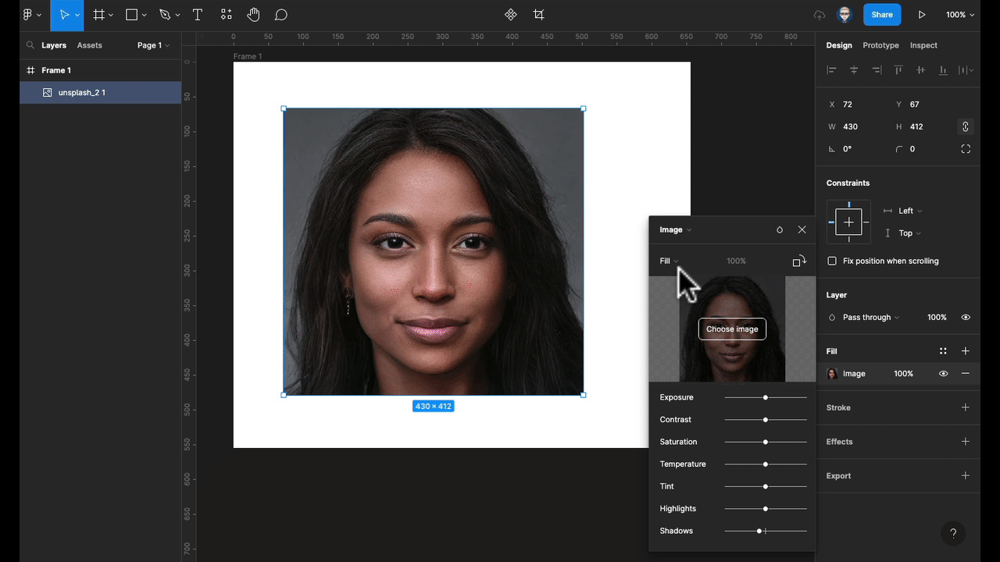
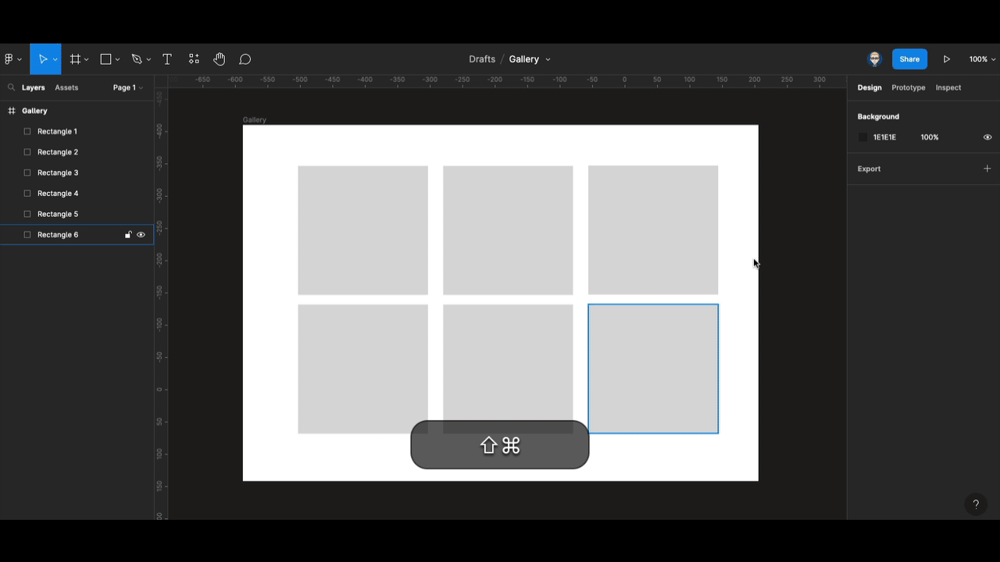

{: .no_toc }

# Figma Working with Images

We will look at importing and working with images in Figma.

[More help on figma.com](https://help.figma.com/hc/en-us/articles/360041098433-Adjust-the-properties-of-an-image)

**[Figma downsizes](https://help.figma.com/hc/en-us/articles/360040028034) images with a width or height larger than 4096 pixels. This scales the image's original dimensions proportionally, so the longest edge is less than 4096 pixels.**

**So you may need to [downsize larger images](https://youtu.be/S_YFUqhKjdY) in another programme such as Photoshop before importing them into Figma**

[Download the resource files](images/face_images.zip)

### Importing Images

There are a number of ways to import images into Figma.

From the main menu `File/Place image` or from the **Shape Tools** menu, drag and drop onto the Figma Canvas, using the Fill Properties or the best option using keyboard shortcut:`Windows: Ctrl+Shift+K` `Apple Mac: Cmd+Shift+K`

### Import through File Menu

Go`File/Place image` then mouse click to bring in the image at its exact size or mouse click and drag are to the required dimensions adjust the size in the properties panel on the right.

### Import Through the Fill Properties

Create a shape with it selected go to the fill properties and select image navigate to your image and import you can also swap an image through this process also.

### Adjust the image through image properties

Either double click on your image or select then click on the Fill Properties to open up the image adjustment panel.

You can adjust the following: exposure, contrast, saturation, temperature, tint, highlights and shadows.

You can you can also rotate the image

### Scaling images with Fit

In the image properties select Fit as you drag the container in and out the image will always fill either horizontally or vertically.

### Scaling images with Fill

In the image properties select feel as you drag the container out it will always fill the container although this may mean some of your image may be clipped.

### cropping images

Again from the properties panel select crop

### Placeholders & multi image import

Create rectangular shapes and space them out evenly

Use the following keyboard shortcut:

`Windows: Ctrl+Shift+K`

`Apple Mac: Cmd+Shift+K`

Then shift click images and press Open

Click the mouse on each of the placeholders to add an image.

### Scale Tool

When you scale an image it will clip while scaling, which is not ideal so you will need to use the scale tool.

You can select the Scale Tool from the Move Tool menu - or you can press K on your keyboard now when you scale your image it will maintain its original proportions.

