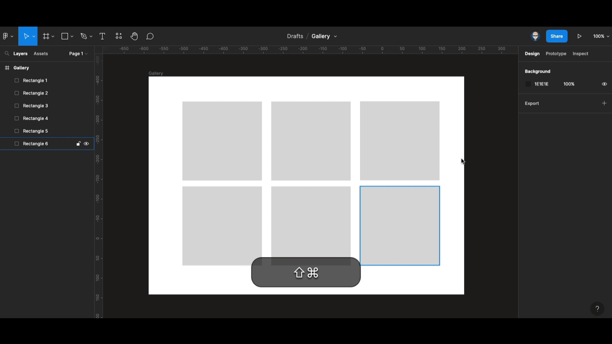

{: .no_toc }

# Figma Working with Images

We will look at importing and working with images in Figma.

[More help on figma.com](https://help.figma.com/hc/en-us/articles/360041098433-Adjust-the-properties-of-an-image)

**[Figma downsizes](https://help.figma.com/hc/en-us/articles/360040028034) images with a width or height larger than 4096 pixels. This scales the image's original dimensions proportionally, so the longest edge is less than 4096 pixels.**

**So you may need to [downsize larger images](https://youtu.be/S_YFUqhKjdY) in another programme such as Photoshop before importing them into Figma**

### Importing Images

There are a number of ways to import images into Figma.

From the main menu `File/Place image` or from the **Shape Tools** menu, drag and drop onto the Figma Canvas or the best option using keyboard shortcut:`Windows: Ctrl+Shift+K` `Apple Mac: Cmd+Shift+K`

                          

### Placeholders & multi image import

Create rectangular shapes and space them out evenly

Use the following keyboard shortcut:

`Windows: Ctrl+Shift+K`

`Apple Mac: Cmd+Shift+K`


Then shift click images and press Open