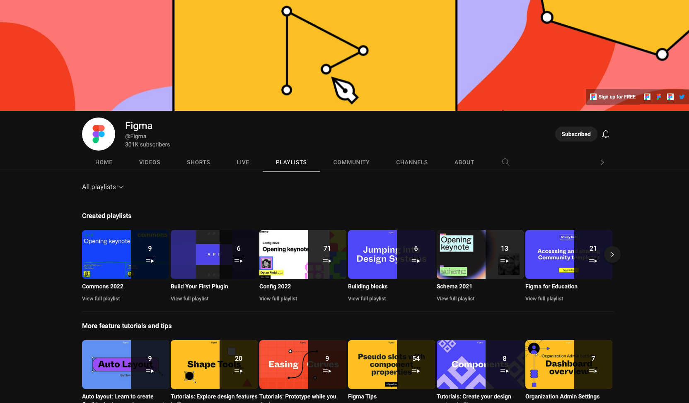
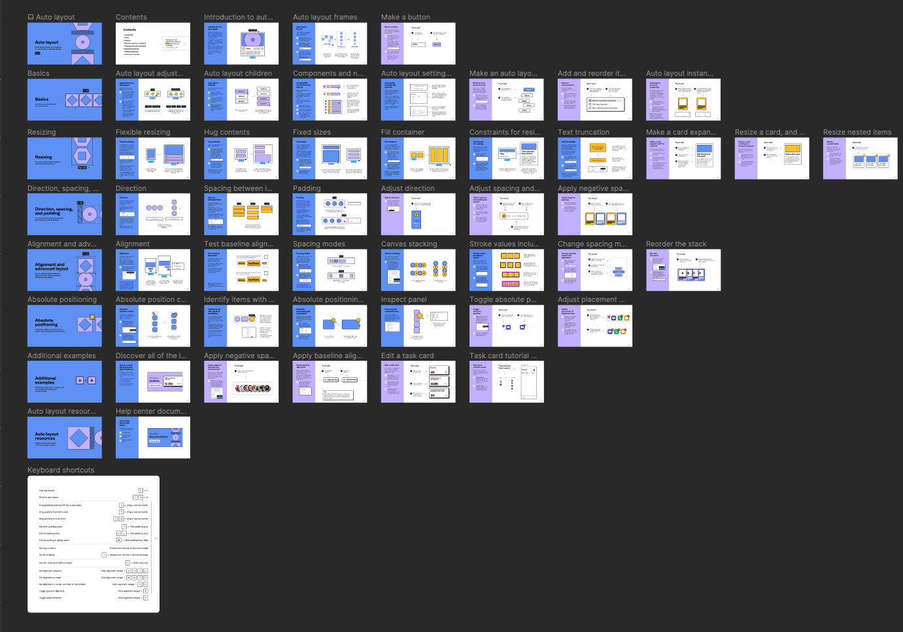

{: .no_toc }

# Figma Resources

[freebiesupply.com](hhttps://freebiesupply.com/free-figma/free_figma_resources)

[dribbble.com/](https://dribbble.com/tags/free_figma_resources)

[figma.com/community](https://www.figma.com/community)

[developer.apple.com](https://developer.apple.com/design/resources)

[developer.android.com](hhttps://developer.android.com/develop/ui)

## Figma Learning Resources

[https://www.youtube.com/c/Figmadesign/playlists
](https://www.youtube.com/c/Figmadesign/playlists)

Figma has some amazing resources on their YouTube channel with in-depth tutorials that always link to a playground file on Figma Community which will guide you through the video tutorial.

<blockquote class="tiktok-embed" cite="https://www.tiktok.com/@zander_whitehurst" data-unique-id="zander_whitehurst" data-embed-type="creator" style="max-width: 720px; min-width: 288px;" > <section> <a target="_blank" href="https://www.tiktok.com/@zander_whitehurst?refer=creator_embed">@zander_whitehurst</a> </section> </blockquote> 

https://www.memorisely.com/
