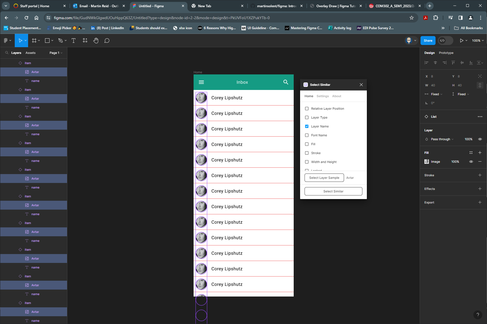

{: .no_toc }

# Overlay Draw

<iframe src="https://solent.cloud.panopto.eu/Panopto/Pages/Embed.aspx?id=c7a51eea-3ce5-46c0-9a2b-af6301582dde&autoplay=false&offerviewer=true&showtitle=true&showbrand=true&captions=true&interactivity=all" height="405" width="720" style="border: 1px solid #464646;" allowfullscreen allow="autoplay"></iframe>

Create a title bar -with a menu icon, a title and an icon in this case a search/magnifying glass

Now we will create a label item this will consist of the frame with an ellipse shape containing an avatar and the name label.

Create a bottom Stroke with the colour black

Text justified left - centred vertically and fixed size

Create a list item save it as a component then create a variance with the second variant this will be the hover state so change the background colour

You can add interaction either do a while hovering interaction or a mouse enter leave

You will need to create a component to be the drawer navigation which will come in from the right of the screen this has a header with an avatar and a list of items

You can now copy out an instance of your list item and duplicate it before creating it as a component

You will now have the following components in the asset panel

Now publish (this vwill only work if in a Teams Plan)

Once published we can create a new project/ Figma File and import if you do not have a Teams Plan you can use the in your Figma file.

Create a new Frame 360 x 800
Call it **Home** 

The Assets (Components) have already been created and/or imported as a shared library into out File (Project)

Drag out the **titlebar** on to the **Home** Frame and position

Drag out **List**  component and position

Resize by dragging down the **List** component to make it **1659** high. It this case this is the "height" of the component that has been created to allow for a scroll affect

Now select the **titlebar** in the **Properties** panel switch **Design** to **Prototype**

Within the **Scroll Behaviour** section change to **Fixed (stay in place)**

Change **Overflow** to **Vertical**

Use the Overlay interaction to bring in your drawer onto the main screen

!