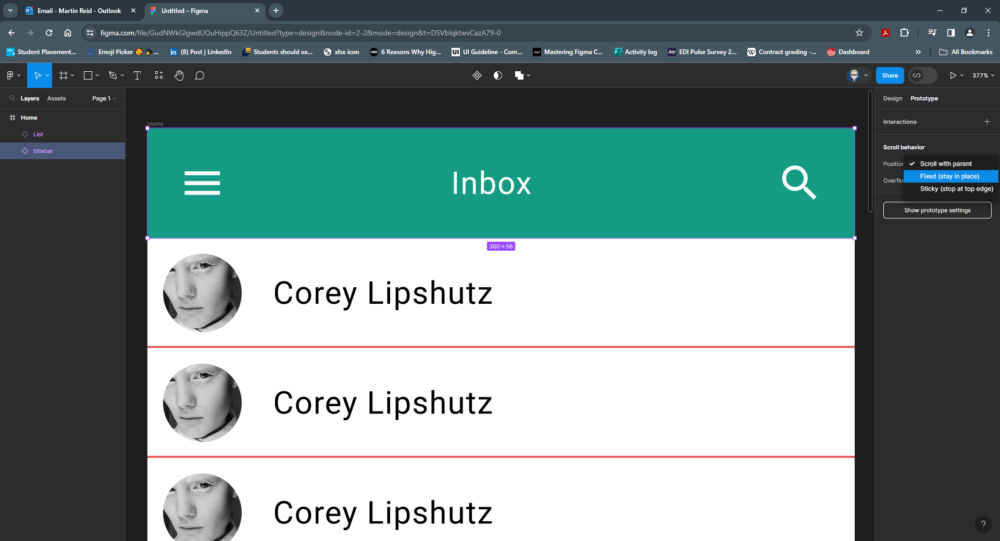

{: .no_toc }

# Overlay Draw

<iframe src="https://solent.cloud.panopto.eu/Panopto/Pages/Embed.aspx?id=c7a51eea-3ce5-46c0-9a2b-af6301582dde&autoplay=false&offerviewer=true&showtitle=true&showbrand=true&captions=true&interactivity=all" height="405" width="720" style="border: 1px solid #464646;" allowfullscreen allow="autoplay"></iframe>

Create a title bar -with a menu icon, a title and an icon in this case a search/magnifying glass

Now we will create a label item this will consist of the frame with an ellipse shape containing an avatar and the name label.

Create a bottom Stroke with the colour black

Text justified left - centred vertically and fixed size

Create a list item save it as a component then create a variance with the second variant this will be the hover state so change the background colour

You can add interaction either do a while hovering interaction or a mouse enter leave

You Will need to create a component to be the drawer navigation which will come in from the right of the screen this has a header with an avatar and a list of items

You can now copy out an instance of your list item and duplicate it before creating it as a component

You will now have the following components in the asset panel

You will need to drag them out from the outside panel and create a lounge with the top title bar This will need to be fixed position scrolling

Use the Overlay interaction to bring in your drawer onto the main screen

