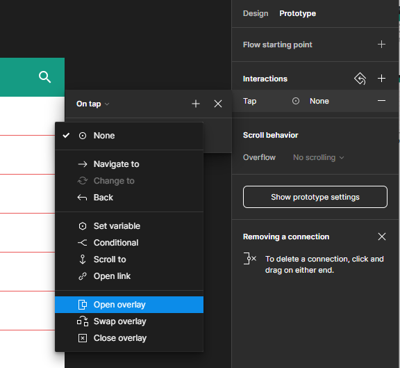

{: .no_toc }

# Overlay Draw

## Overview

<iframe src="https://solent.cloud.panopto.eu/Panopto/Pages/Embed.aspx?id=c7a51eea-3ce5-46c0-9a2b-af6301582dde&autoplay=false&offerviewer=true&showtitle=true&showbrand=true&captions=true&interactivity=all" height="405" width="720" style="border: 1px solid #464646;" allowfullscreen allow="autoplay"></iframe>

#### Create a Draw Overlay Interaction

**Create your Components**

1. Create a title bar -with a menu icon, a title and an icon in this case a search/magnifying glass

2. Now we will create a label item this will consist of the frame with an ellipse shape containing an avatar and the name label.

3. Create a bottom Stroke with the colour black

4. Text justified left - centred vertically and fixed size

5. Create a list item save it as a component then create a variance with the second variant this will be the hover state so change the background colour

6. You can add interaction either do a while hovering interaction or a mouse enter leave

7. You will need to create a component to be the drawer navigation which will come in from the right of the screen this has a header with an avatar and a list of items

8. You can now copy out an instance of your list item and duplicate it before creating it as a component

9. You will now have the following components in the asset panel

**Now publish (this vwill only work if in a Teams Plan)**

Once published we can create a new project/ Figma File and import if you do not have a Teams Plan you can use the in your Figma file.

#### Using your Components in a UI Layout
Create a new Figma File (Project) if you have a Teams Plan otherwise create a new page and create you UI layout on it.

1. Create a new **Frame 360 x 800**
Call it **Home** 

2. The Assets (Components) have already been created and/or imported as a shared library into out File (Project)

Drag out the **titlebar** on to the **Home** Frame and position

3. Drag out **List**  component and position

4. Resize by dragging down the **List** component to make it **1659** high. It this case this is the "height" of the component that has been created to allow for a scroll affect

5. Now select the **titlebar** in the **Properties** panel switch **Design** to **Prototype**

Within the **Scroll Behaviour** section change to **Fixed (stay in place)**

6. Change **Overflow** to **Vertical**

7. Now in click Run to test the interaction

The Device has been set at **Android Large**

Your interaction should behave like this

**Customise the layout**

All **Avatar** images are the same, we need to change this. As we have called all of the Avatar we can install and use the

**Select Similar Plug-in**
[Select Similar Plug-in](https://www.figma.com/community/plugin/792767780551514994) 

Select one of the Avatar images.

Then right mouse to bring up yje plugins and select **Select Similar Plug-in**

Check **Layer Type** and the Select **Layer Sample** button

Then click the **Select Similar** button

This will select ALL layers called **Avatar**

Now to change the images using the User Profile [User Profile Plug-in](https://www.figma.com/community/plugin/749945157855564842/User-Profile)

Once installed, right mouse and select **User Profile**

Select **Male & Female** and click **Insert Random Images**

The image will be replace by random images

**Add a left Side Draw Overlay**

1. Drag **Draw** Component from the **Asset** Panel

2. Slect the Hamburger Menu icon on the Titlebar on the Home Screen

In the Prototype Panel on the Interaction section, click on tap

Change **None** to **Open Overlay**

Select **Draw**
Move in Right
And **Top Left**

Final run the prototype again to test and check on your phone using the Figma app.

