{: .no_toc }

# Switch Walk-through

### 1. Create Track

Create a new Figma file for your project - Give it a name in this example **switch_fun** Create two pages: **Components** & **Layout**

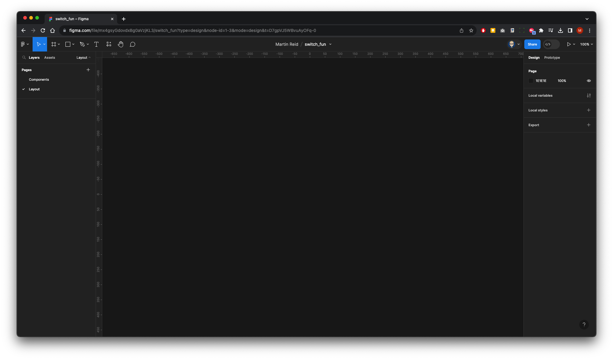

Either press `F` your keyboard or select the Rectangle Tool from the Tools menu

Drag out a rectangle. Resize to **52H x 32W** in the right Properties panel.

Name it **Track** in the layers panel
 
Then press `shift + 2` on your keyboard to zoom in

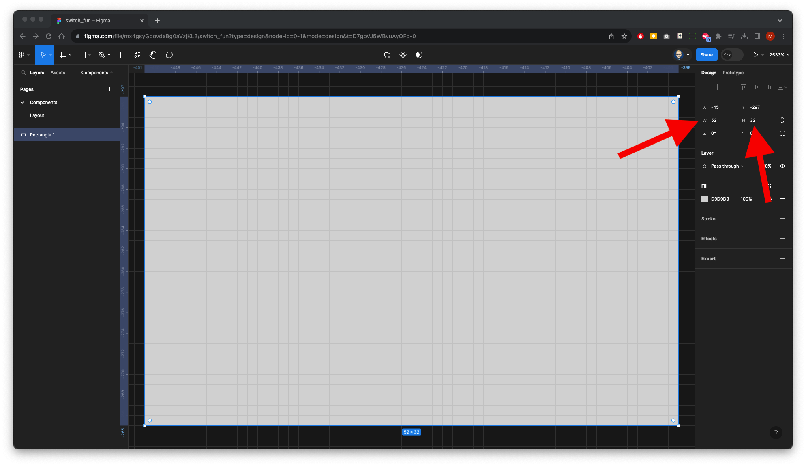

In the right Properties panel add a Radius of **100**

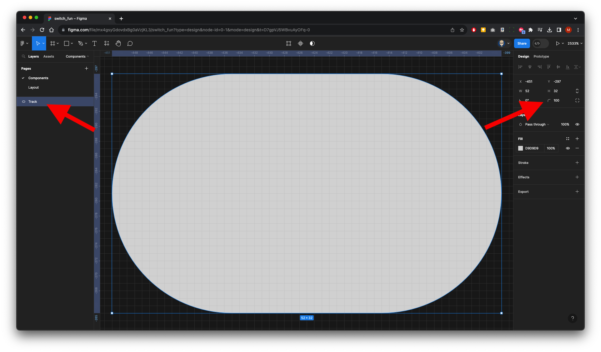

### 2. Create Track

Either press `o` on your keyboard or select the Ellipse Tool from the tools menu

Hold `Option + Shift` on your keyboard and drag out a 24 x 24 circle.

Name it **Handle** in the layers panel
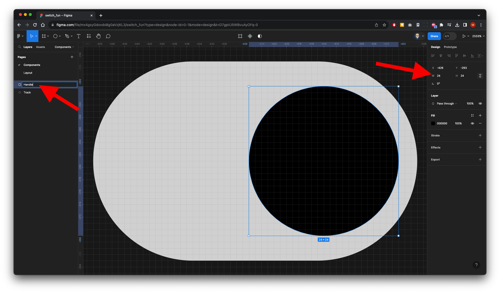

In the Layers select the **Track** and change its colour (Red)
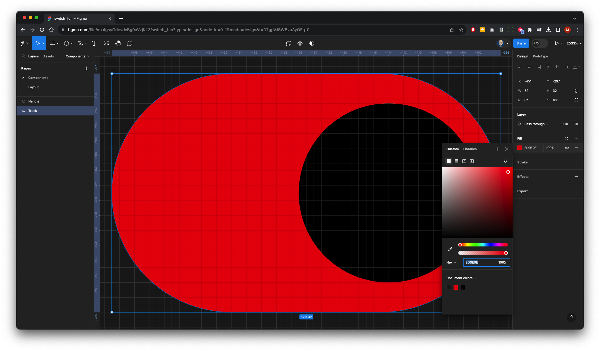

### 3. Create a Component

Select both the **Track & Handle** in the Layers panel

Either click on the **Create Component** icon on the menu bar

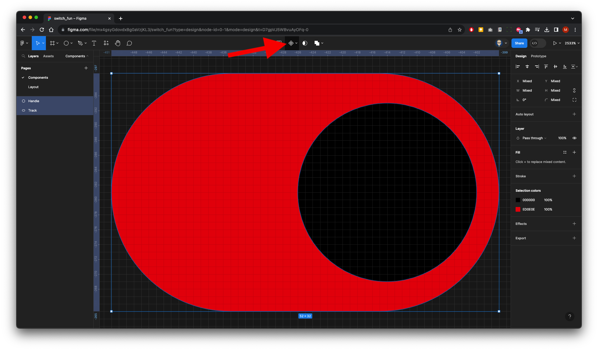

Your Layers panel will look like this:

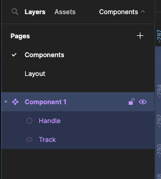

### 4. Create a Variant
You can zoom out by using `COM + -` or `CTRL + -`

Then click the Create Variant icon on the menu bar

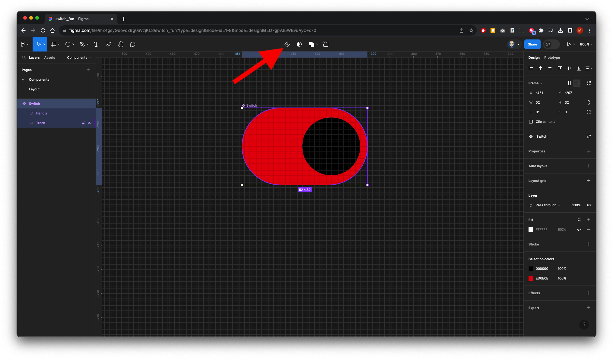

Your Component will duplicate

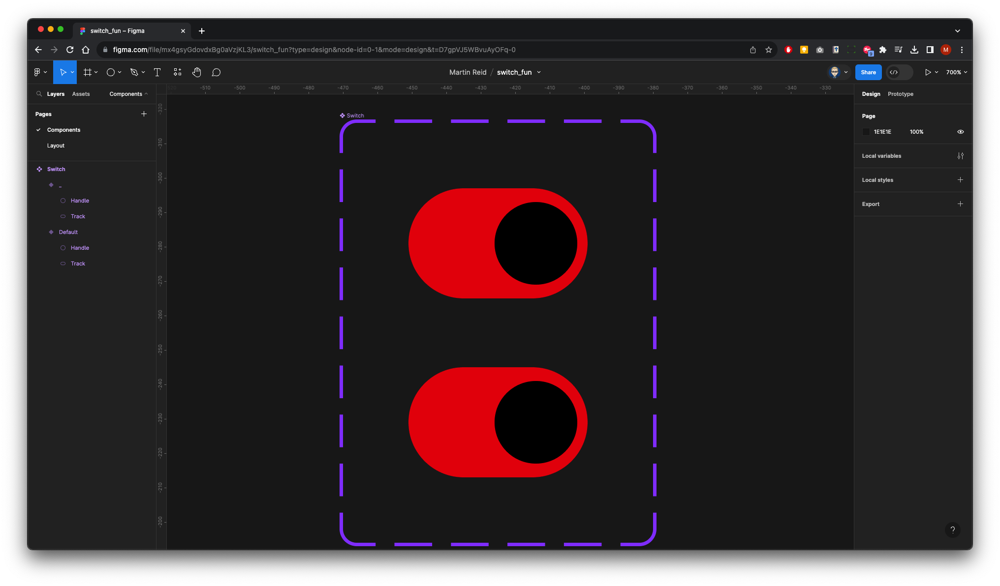

Select the Default Component either in the layers or in the design

In the Properies panel on the right change **Default** to **State**

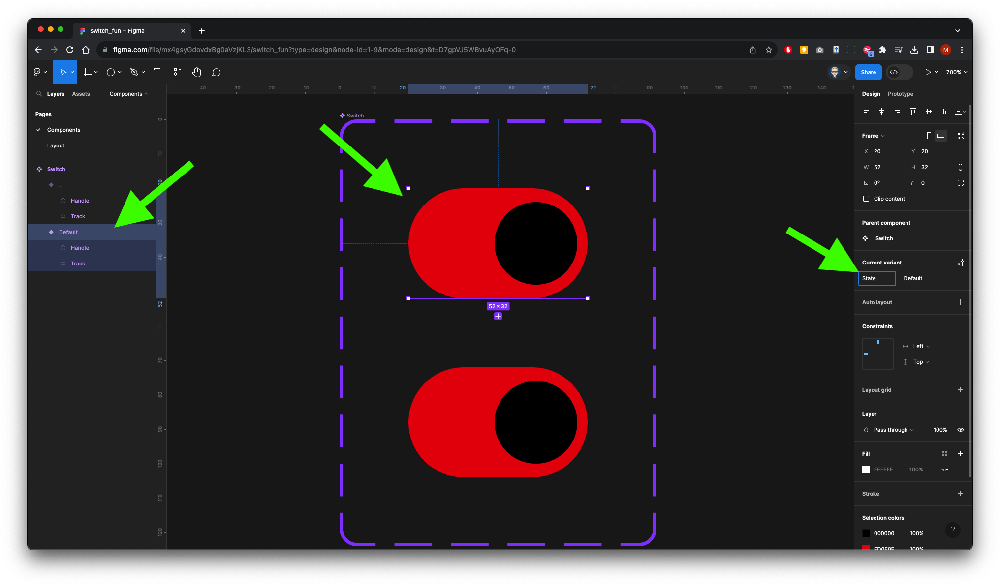

Name the **State** as **On**

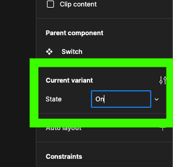

Your Layers will look like this:

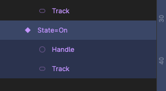

In the Layers - the top layer will have **State** but no name

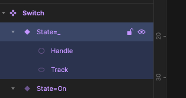

In the Properies panel on the right name the **State** to **On**

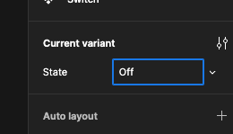

Reorder the On Component to the top so it matches the order in the design

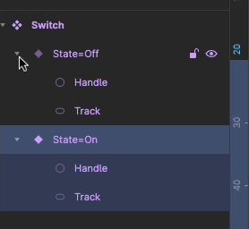

Select and change the Fill colour of the Track in the bottom Component 

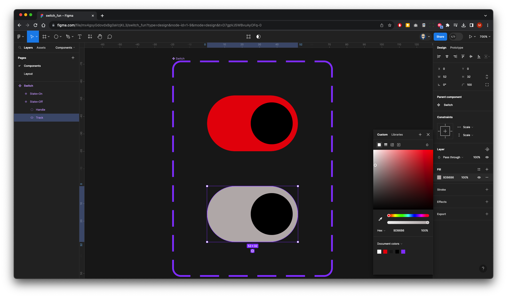

`Shift` drag the **Handle** to the left

### 5. Create Prototype Interaction

On the right panel click on Prototype

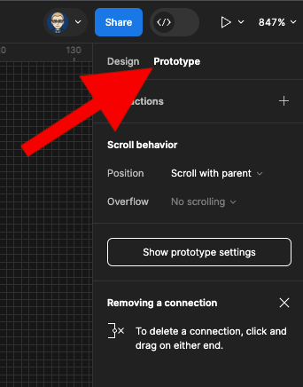

Click on the **Handle** - a plus in a circle will appear on the right  - click on it and drag down to the Off Component at the bottom of the Variant box

In the bottom (Off) Component click on the Handle  - a plus in a circle will appear on the right  - click on it and drag up to the On Component at the top of the Variant box

### 6. Place an Instance of the Swith Component on the Layout page

Select Assets from the side panel - drag or insert  - move into position

### 7. Run (Preview)

In the Right panel select **Prototype** and click on **Device**

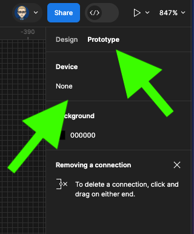

Select **Presentation**

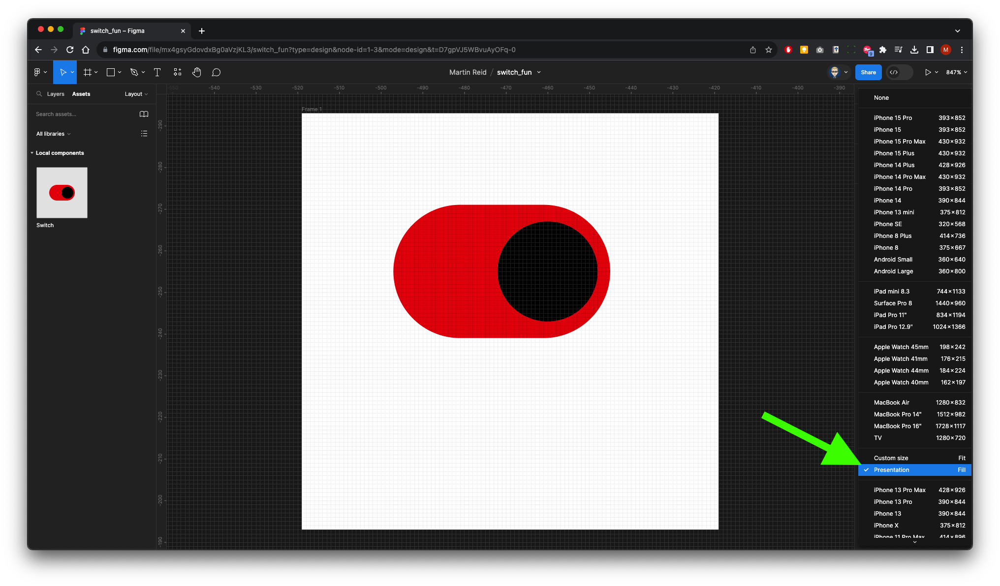

You now can interact with your Component

