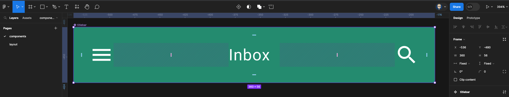
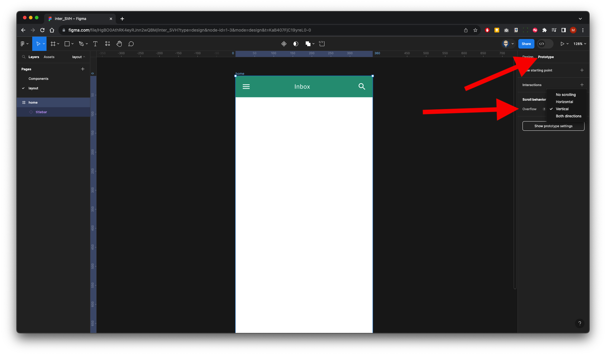

{: .no_toc }

# Vertical & Horizontal Scrolling Walk-through

**Introduction**

<iframe src="https://solent.cloud.panopto.eu/Panopto/Pages/Embed.aspx?id=697abf69-cdd8-4756-9d88-b0cf011ba36e&autoplay=false&offerviewer=true&showtitle=true&showbrand=true&captions=true&interactivity=all" height="405" width="720" style="border: 1px solid #464646;" allowfullscreen allow="autoplay" aria-label="Panopto Embedded Video Player"></iframe>

**Walkthrough Video**

<iframe src="https://solent.cloud.panopto.eu/Panopto/Pages/Embed.aspx?id=fdbf2969-9555-4744-8422-b0cf011b9fc6&autoplay=false&offerviewer=true&showtitle=true&showbrand=true&captions=true&interactivity=all" height="405" width="720" style="border: 1px solid #464646;" allowfullscreen allow="autoplay" aria-label="Panopto Embedded Video Player"></iframe>

### 1. Set-up

This walkthrough is to set-up/create components and layout to create a drag scroll interaction.

* Create a new Figma file (project)
* Give it a name
* Rename Page 1 to **Components** and create a new page and call this **layout**
* Create a Frame by pressing `F` on keyboard, using the Android Large template from the Properties panel Android large **360 x 800**

 On the **Components page**, create a Title Bar 360 x 56 and turn it into a Component. Or import one from a shared library.

 Go to **Assets** in the left panel and drag out the title bar onto your screen

Now go back to the Layers panel

Select the **Home** frame, then in the **Properties** panel on the right select **Prototype**

 In the **Scroll Behaviour** section Change **Overflow** to **vertical** - You will receive an error message, this is because this container does not contain any child elements that are larger (overflowing) the frame. We will fix this later when we have content.

 Now select the title bar again in the **Prototype** properties within the **Scroll behaviour** section, change **Scroll with parent** to **Fixed (stay in place)**

We will now go back to the com Component page to select a horizontal scrolling component

 Create a square frame by holding the `shift` key and dragging diagonally get the size near enough 150 and then refine the size In the Design properties panel

 We need to duplicate this frame by holding `shift` + `alt` and dragging out a copy, continue until you have either five or six frames they should all be touching each other on the left sides

 To do the next step, we will use **User Profiles** plug-in which is available in Figma community, once installed, you need to right mouse click on the pasteboard and go to plug-ins User Profile

Customise as you see fit and then click the Insert Random Photo button - You can continue to click the button until you are satisfied with the random image selection.

Each of the frames is now populated with an image.

Now we need to create a Container for these frames - Make sure you have all the frames selected, then right mouse click, and from the pop-up click on frame selection

Name the container **slider**

 With the container element selected in the **Design** properties on the right check clip content.

 We will now resize this container to 360 wide. This will allow clipping (masking) which will make the contents scrollable.

Currently the container is **900** wide

Change the width to **360** in the **Properties** panel 

 We now need to make this element scrollable horizontally

In the **Properties** panel on the right, select **Prototype** within the **Scroll behaviours** change overflow to horizontal

Finally, we will convert this element into a **Component**

Right mouse click on the element and click on **Create Component**

 We will now go back to the layout page, select **Assets** from the left panel and drag out the **Slider** component onto your screen

 We need to preview by running and presenting our prototype. Make sure you select **Prototype** from the properties panel on the right and click Play button to run.

It should now horizontal scroll when dragged lef or right

