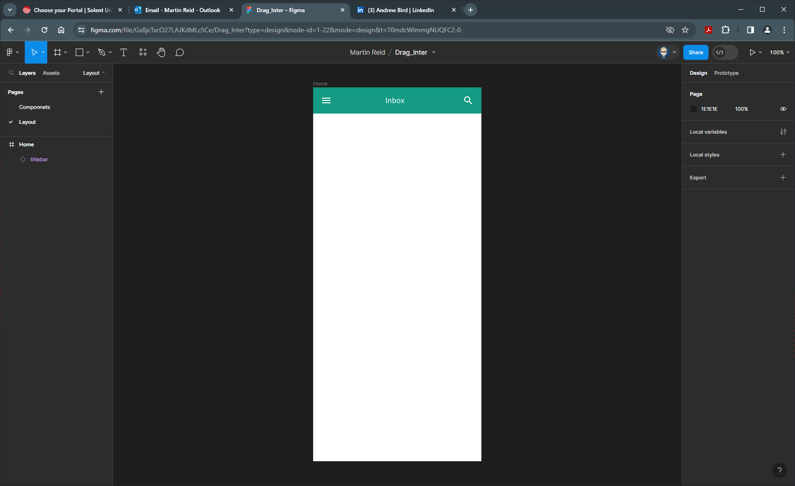

{: .no_toc }

# Vertical & Horizontal Scrolling Walk-through

**Introduction**

<iframe src="https://solent.cloud.panopto.eu/Panopto/Pages/Embed.aspx?id=697abf69-cdd8-4756-9d88-b0cf011ba36e&autoplay=false&offerviewer=true&showtitle=true&showbrand=true&captions=true&interactivity=all" height="405" width="720" style="border: 1px solid #464646;" allowfullscreen allow="autoplay" aria-label="Panopto Embedded Video Player"></iframe>

**Walkthrough Video**

<iframe src="https://solent.cloud.panopto.eu/Panopto/Pages/Embed.aspx?id=fdbf2969-9555-4744-8422-b0cf011b9fc6&autoplay=false&offerviewer=true&showtitle=true&showbrand=true&captions=true&interactivity=all" height="405" width="720" style="border: 1px solid #464646;" allowfullscreen allow="autoplay" aria-label="Panopto Embedded Video Player"></iframe>

### 1. Set-up

This walkthrough is to set-up/create components and layout to create a drag scroll interaction.

* Create a new Figma file (project)
* Give it a name
* Create a Frame bu pressing `F` on keyboard, using the Android Large template from the Properties panel **360 x 800**

