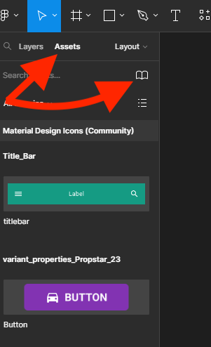

{: .no_toc }

# Linking Screens

We are going to create 3 screen within 3 buttons on each and link them together.

We will create a new Figma file and import [Material Design Icons from Figma Community](https://www.figma.com/community/file/1014241558898418245) and libraries that have been created in [previous walk-throughs](https://martinsolent.github.io/figma/docs/comp_props/child_4.html)

### 1. Set-up

Create a new Figma file and give it a name

In the left panel click on Assets and then the Library icon import