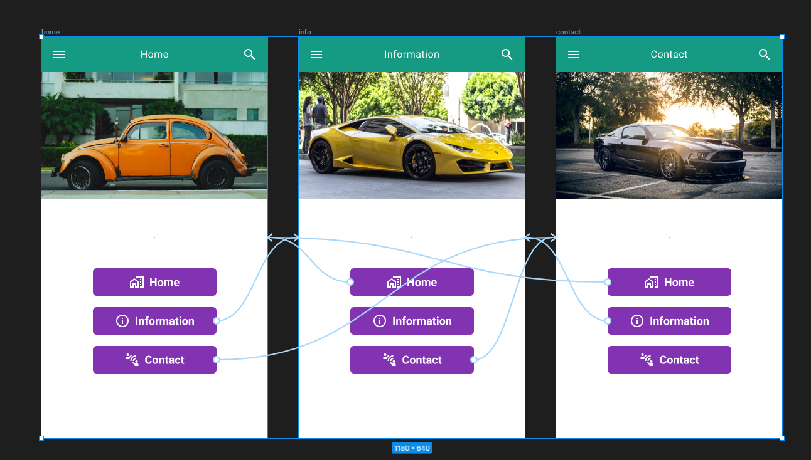
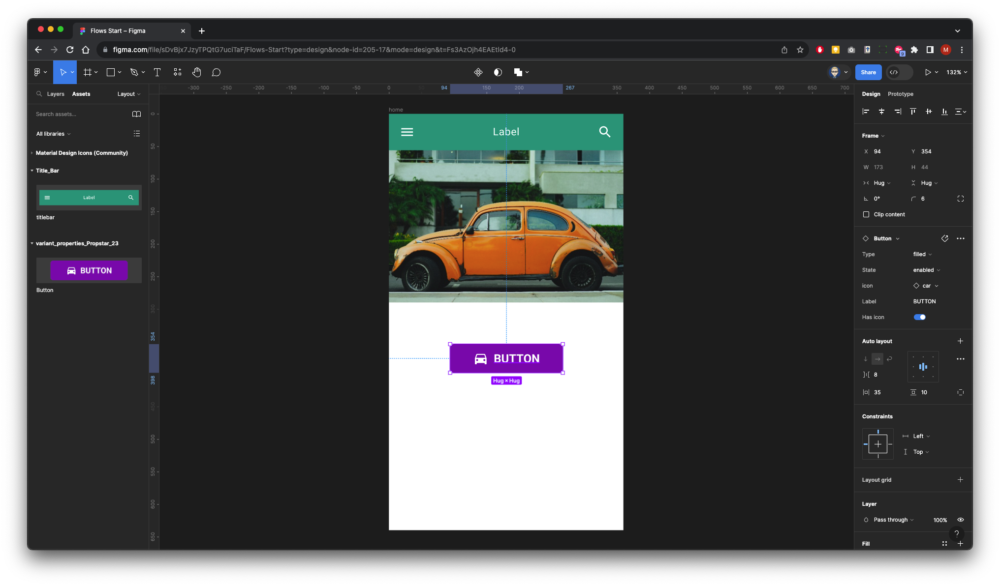

{: .no_toc }

# Linking Screens

We are going to create 3 screen within 3 buttons on each and link them together.

We will create a new Figma file and import [Material Design Icons from Figma Community](https://www.figma.com/community/file/1014241558898418245) and libraries that have been created in [previous walk-throughs](https://martinsolent.github.io/figma/docs/comp_props/child_4.html)

### 1. Set-up

Create a new Figma file and give it a name

Re-name Page 1  Layout

Create a new Frame - **Android Small (360 x 640)** from Template in right hand Properties Panel 

Name the Layer **Home**

In the left panel click on Assets and then the Library icon import

Import:

[Material Design Icons from Figma Community](https://www.figma.com/community/file/1014241558898418245)
and if studying with Solent import these: **variant_properties_Propstar_23** & **Title_Bar**

### 2. Layout

Click on **Assets** in the Left panel and drag out the Title Bar Component onto the screen and position

 create a new frame directly below the title bar approximately 360 x 234 - Although this can be adjusted later.

  Rename the frame image in the layers panel.

   With the Frame still selected - Right Mouse Click on the baseboard, go to plug-ins, and select on **UnSplash** - (this plug-in will need to have already been set up from **Figma Community**)

 Select an image and insert

 You may need to adjust with the help with the **Image Properties** in the right panel.

 Again from the asset panel on the left, drag out the button component.

 Then select **Layers** in the panel on the left

With the Button/Layer Instance selected

In the **Component Properties** section in the right panel

As we have imported, the Material Design Icons, we can now can select and swap an icon - In this case, we will search for **home** and come up with a suitable icon.

 Again with it still selected within the component properties we will update the label name to home and press enter

Now in the layers panel on the left, update the button name to **Button_home**

 With the button selected change **Design** to **Prototype** in the **Properties** panel on the right

Set up a **While Pressing** **State** to **pressed** (This was set up within the imported library)

 Press `alt` and `shift` on your keyboard and drag copy two more buttons

Repeat the process above for changing the icon and the label for each of the copied buttons

**Information**

**Contacts**

 Rename the layer names of each of the buttons to match the content, you may need to drag to rearrange the hierarchy of each of the elements on the screen

Now we will run to preview how the buttons respond when pressed

OK, all look good

Now we need to copy two more screens. Make sure you have the **Home** Frame selected hold `alt` and `shift` on your keyboard and drag two the right to copy to more screens.

 now you need to rename the layers to match the content

Second frame layer will be **info** and the third frame will be **contact**

You will need to re-order the hierarchy to match what on the pasteboard

 Switch to **Prototype** in the right **Properties** panel.

  Click on the **Information** button on the **Home** screen. Click on the `+` icon and drag out a link to the `Information` screen.

 Repeat with the contact button and drag out a link to the **Contact** screen

Now link the buttons on the **Information** screen

 and finally link the buttons on the **Contact** screen

Now change the images on the **Information** and the **Contact** screens using the **Unsplash** plug-in. You will need to make sure you've selected the image frame on each of the screens before launching the plug-in

 Finally test out your prototype click Run/Play button top right of your screen and test out the button interactions

 