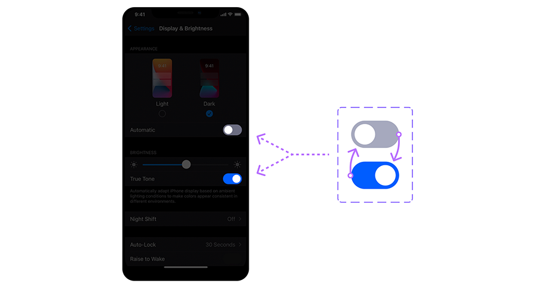

{: .no_toc }

# Interaction

SMASHINGMAGAZINE.COM, 2021. An Introduction To Figma Interactive Components [viewed 8 November 2023]. Available from: https://www.smashingmagazine.com/2021/07/introduction-figma-interactive-components/

**Interaction design (IxD)** is a discipline within the field of user experience (UX) design that focuses on creating meaningful and engaging interactions between users and digital products or services. It encompasses the design of the user interface and the overall user experience. Interaction designers work to make digital products and interfaces intuitive, efficient, and enjoyable to use.

**TEO, Y.S., 2020. What is Interaction Design?** [viewed 8 November 2023]. Available from: [https://www.interaction-design.org/literature/article/what-is-interaction-design](https://www.interaction-design.org/literature/article/what-is-interaction-design)

## Hovered Buttons

To get started this is how you would create a basic interaction on a Button Component.

<iframe src="https://solent.cloud.panopto.eu/Panopto/Pages/Embed.aspx?id=3034d1da-e9a2-45ff-8ed2-af630167b96d&autoplay=false&offerviewer=true&showtitle=true&showbrand=true&captions=true&interactivity=all" height="405" width="720" style="border: 1px solid #464646;" allowfullscreen allow="autoplay"></iframe>

