{: .no_toc }

# Layout & Grids - Fashion App

#### 1. Set-up

We will create this home screen for a fashion app using a two column layout.

Original designs can be found here:
[*eCommerce Concept - 12 App Screen* - Alfonso Severo](https://dribbble.com/shots/2051093-eCommerce-Concept-12-App-Screen)

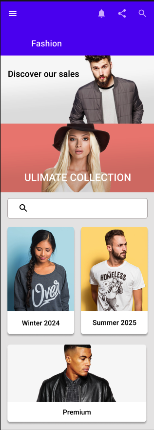

This is what the finished layer structure will look like in Figma

Create a frame for the main screen 360 x 1000 Pixels

Set-up a two column grid with margins and gutters 16 pixels

Re-name the Frame **Home**

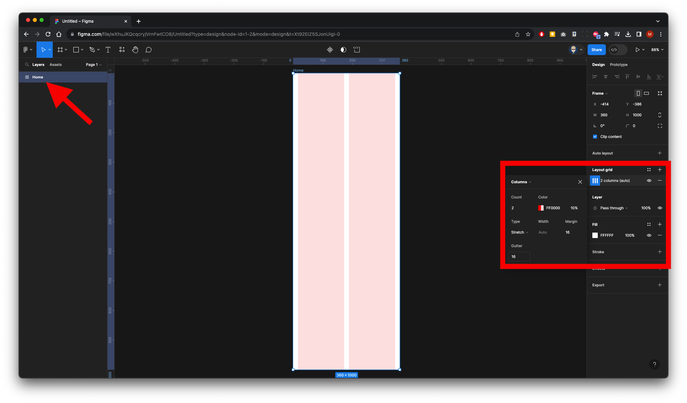

**These the approximate height of the assests**

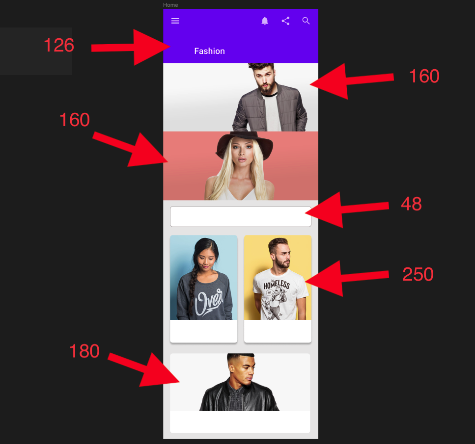

#### 2. Import Component & Icon Libraries

In the right panel click on Assets the the import library icon (Blue Book icon) the find **Material Design Kit 2** and click **Add File** 

**Note:** this will only work if you are part of the Educatinal Team,

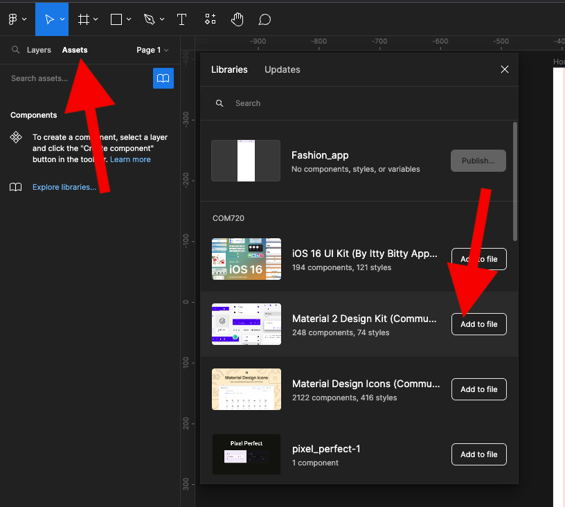

The kit will appear in the Assest List

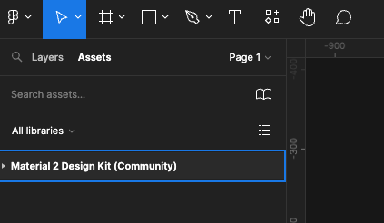

Repeat with **Material Design icon** 

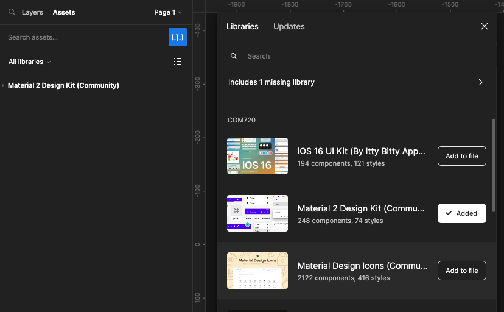

#### 3. Add Header App Bar
Click Assests from the left panel - from the material Kit 2 - App Bars - B. Extended and drag on to your frame

Update title to **Fashion**
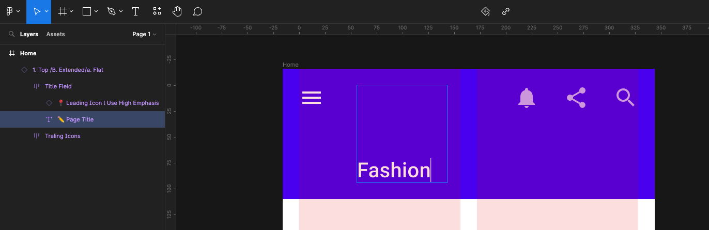

#### 4. Add page Layout

Create a new Frame with it selected press on Mac `cmd+shift+k` or on PC `control+shift+k` 

Select image and import

Select the image in the Layers panel on the left and scale to width and then thest the from and re-adjust to 160 high

Rename Frame to **Discover**

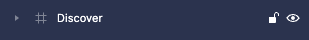

Repeat with the image below
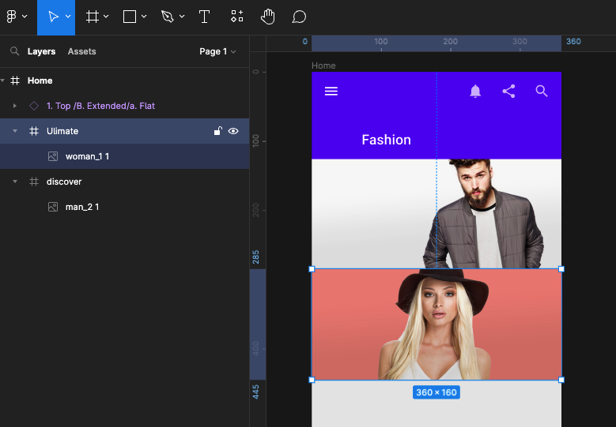

Now create a a search field using the margin guides and 48 high with the Frame call and call the layer Search

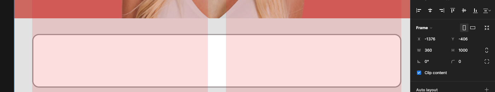

Create a Frame in the left column guide 250 high - add a 6 Radius and import imafe into it and scale ane addjust

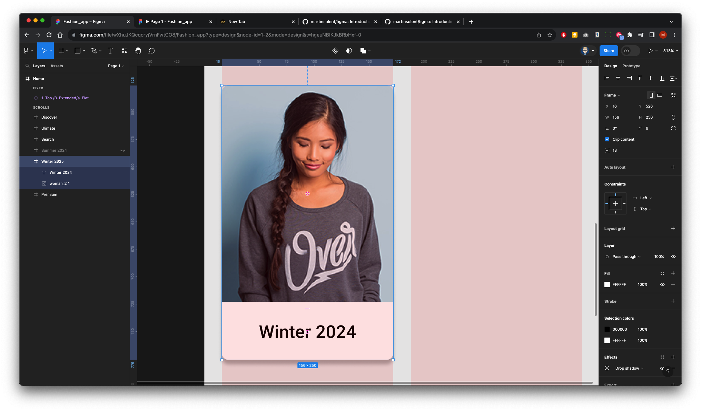

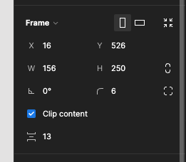

Add **Drop Shadow** Effect

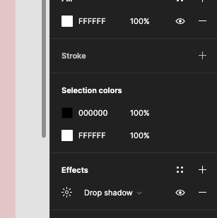

Name the Frame in Layers **Winter 2024**

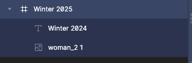

Repeat in the right column

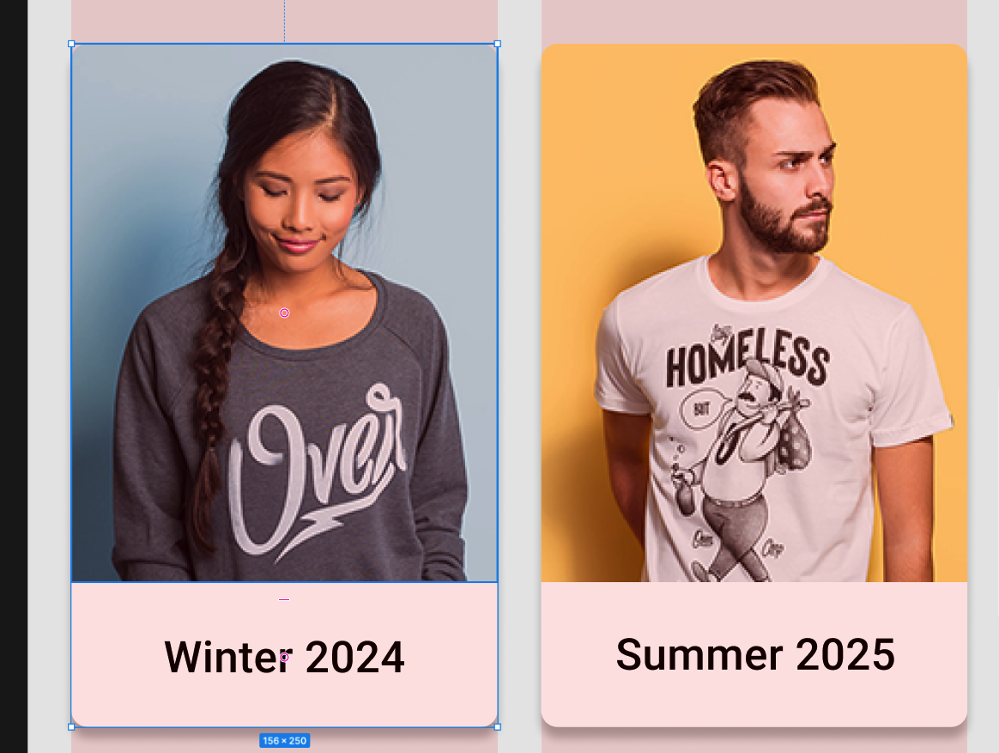

Finally repeat with bottom image

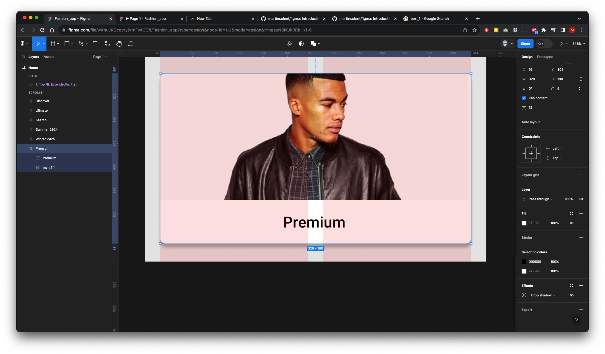

Reconfigure your level and make sure frames are named as below

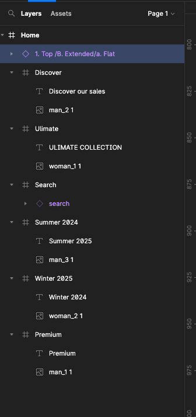

#### 5. Preview Prototype

With the top bar selected Go to the right Properties panel select **Prototype** and change Position to **Fixed (stay in place)** this will make the top bar sticky
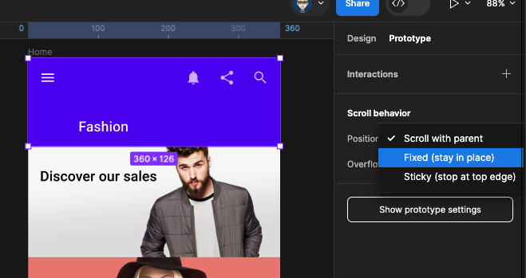

Change device to **Andriod Large**
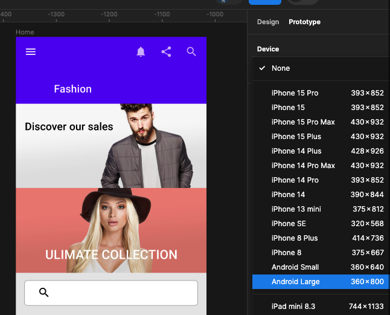

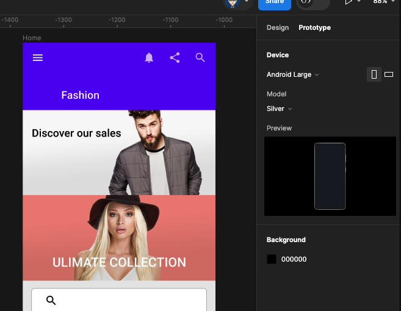

Click **Play** button to preview
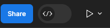

The final prototype in preview

[Download images to use in project](../images/fashion_app_2023/home_images.zip){: .btn .btn-purple .mr-2 }