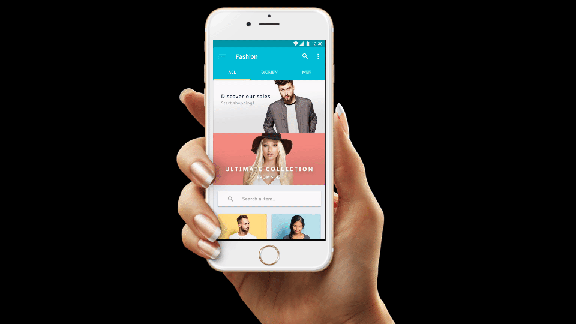
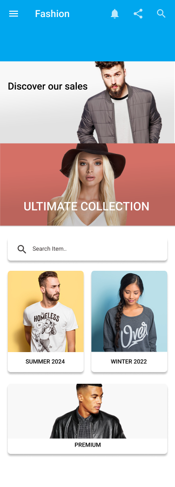
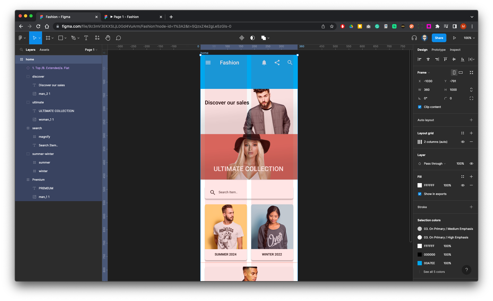
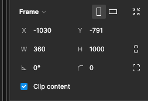
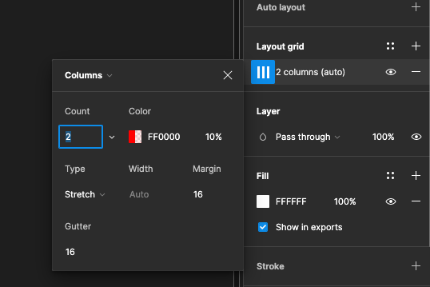

{: .no_toc }

# Layout & Grids - Fashion App

We will create this home screen for a fashion app using a two column layout.

Original designs can be found here:
[*eCommerce Concept - 12 App Screen* - Alfonso Severo](https://dribbble.com/shots/2051093-eCommerce-Concept-12-App-Screen)

This is what the finished layer structure will look like in Figma

Create a frame for the main screen 360 x 1000 Pixels

Set-up a two column grid with margins and gutters 16 pixels

[Download images to use in project](imgs/home_screen_task_2.zip){: .btn .btn-purple .mr-2 }