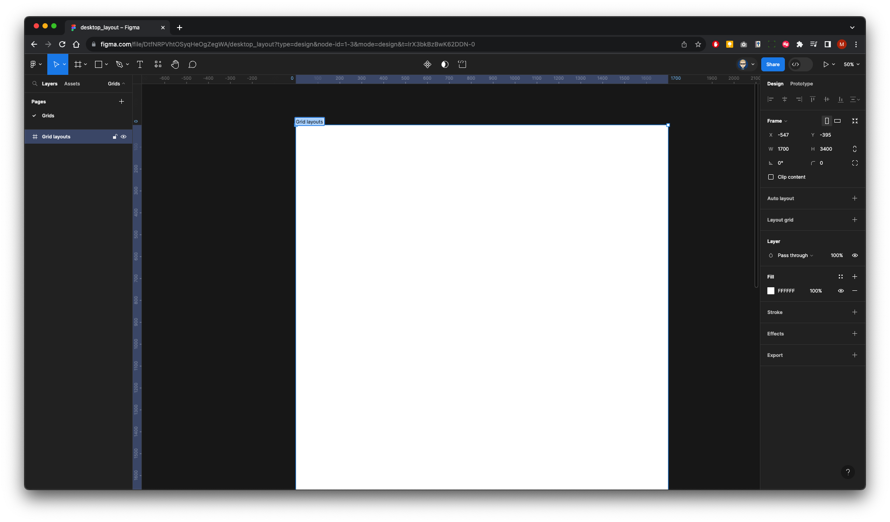
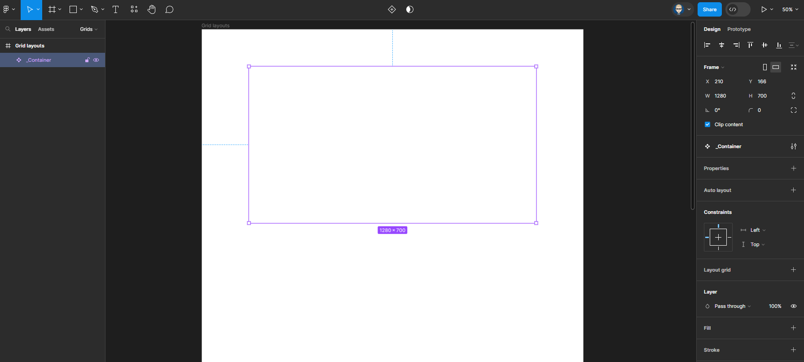
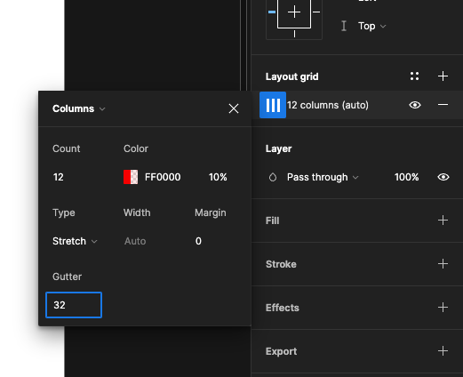
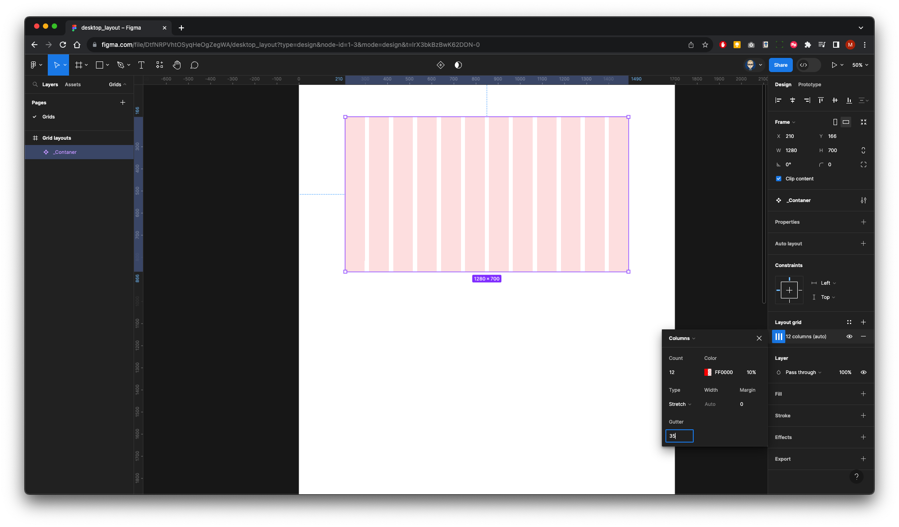
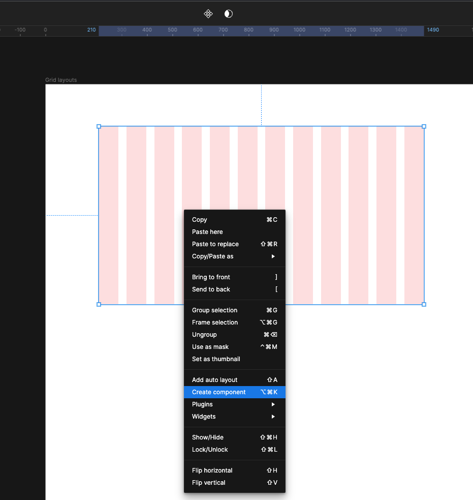
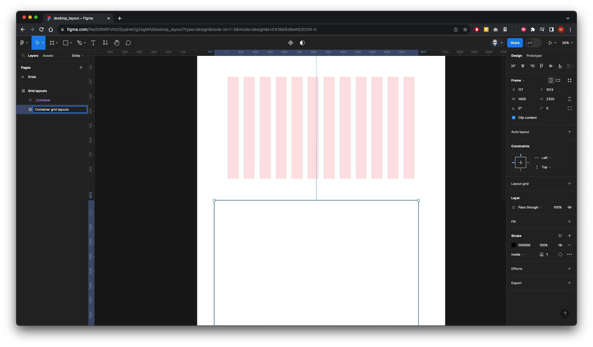
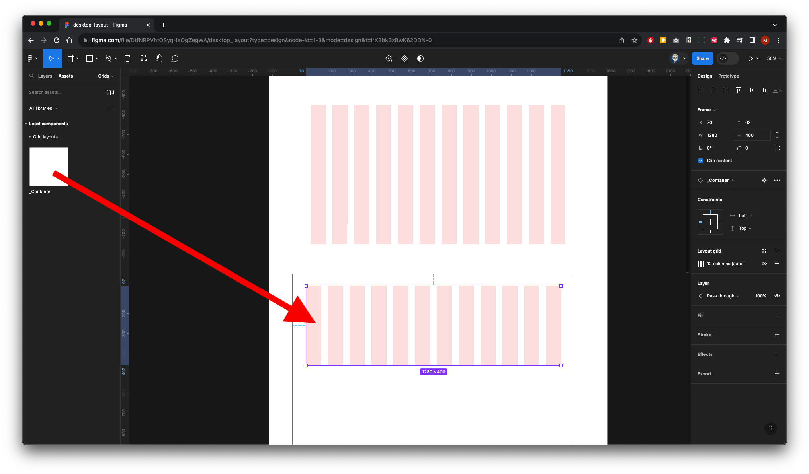
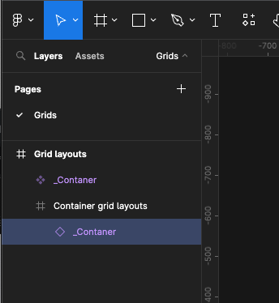
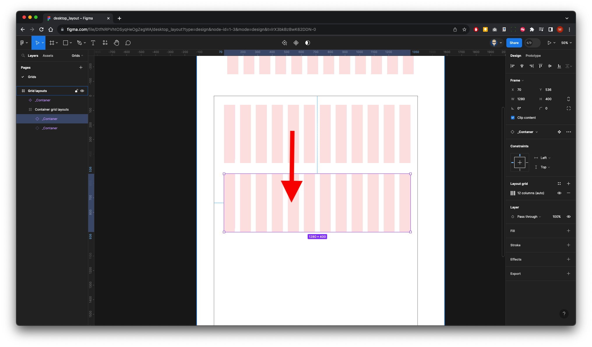
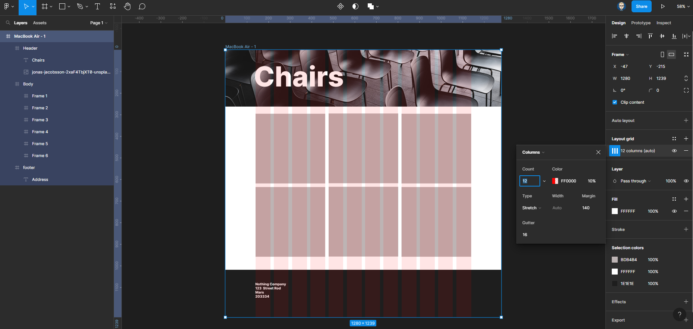

{: .no_toc }

# Layout & Grids - 12 Column Web Layout

We are going to use [Untitled UI – FREE Figma UI kit and design system](https://www.figma.com/community/file/1020079203222518115/untitled-ui-free-figma-ui-kit-and-design-system) from Figma Community as an example of how to implement a design system and using a Layout (Column) Grid to desktop & tablets.

#### 1. Create a new Figma file

 Create a new Figma file and give it a name
 
  Update Page 1 name it **Grids** 
  
  Create a frame 1700 x 3400 and call it **Grid Layouts**

  

Create another frame 1280 x 700 inside the **Grid Layouts** frame, call it **_Container** & centre it.

  

   In the Properties panel on the right, add a layout grid with 12 Column, Stretch and a Gutter of 32

  
  
  

 Now create another frame **1440 x 2320** below & call it **Container grid layouts** Put a Stoke on it the make it visible while working, you can swith off later

 

  From the panel on the left click on **Assets** from the Local components drag out _**Container** component inside the frame you have just created.

  Center & scale to 400 high.

Your Layers panel will look like this

Hold `ALT + SHIFT` on keyboard & drag down to create a copy

[Download Images](imgs/chairs.zip)
