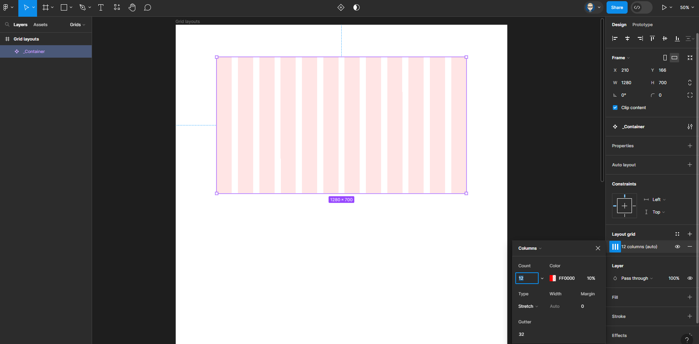

{: .no_toc }

# Layout & Grids - 12 Column Web Layout

We are going to use [Untitled UI – FREE Figma UI kit and design system](https://www.figma.com/community/file/1020079203222518115/untitled-ui-free-figma-ui-kit-and-design-system) from Figma Community as an example of how to implement a design system and using a Layout (Column) Grid to desktop & tablets.

### 1. Create a new Figma file

 Create a new Figma file and give it a name
 
  Update Page 1 name it **Grids** 
  
  Create a frame **1700 x 3400** and call it **Grid Layouts**

  

### 2, Create another frame 

**1280 x 700** inside the **Grid Layouts** frame, call it **_Container** & centre it.

  

   In the **Properties** panel on the right, add a layout grid with **12 Column, Stretch and a Gutter of 32**

  
  
  

### 3. Create a Component

Either right-mouse or click on the Create  Component icon on the top bar

### Create Grid Layouts

 Now create another frame **1440 x 2320** below & call it **Container grid layouts** Put a **Stoke** on it the make it visible while working, you can switch off later. This frame will contact all our Grid Layouts 12, 6, 5, 3 & 2.

 

  From the panel on the left click on **Assets** from the Local components drag out **_Container** component inside the frame you have just created.

  Centre & scale to **400 high.**

Your Layers panel will look like this

With this item selected  - In the right **Properties** panel click the icon with 4 dots to expand the **Grid Styles** 

Now click on the `+` icon to add a Grid Style.

Name it **12 Columns** & click **Create Style**

You will now have created a 12 Column style

### 4. Create another Grid Layout

Hold `ALT + SHIFT` on keyboard & drag down to create a copy

With this new item selected Click on the 12 Column style in the **Properties** panel on the right

Then click the `+` icon to add a new style 

Then click on **More Options**

Name it **6 Columns** 

In the **Properties** at the bottom click on the Edit icon and type in **6** in the **Count** field 

**Click Create Style**

### 5. Repeat this process to create:

* 5 Columns
* 3 Columns
* 2 Columns

By selecting a number of elements together you can add even spacing between them

### 6. Application

Now when you select any of the Containers you can change the column style (Number of columns) from the Properties panel on right

Or by clicking on the 4 icon **Grid Styles**

