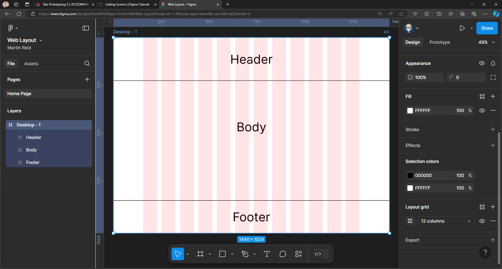
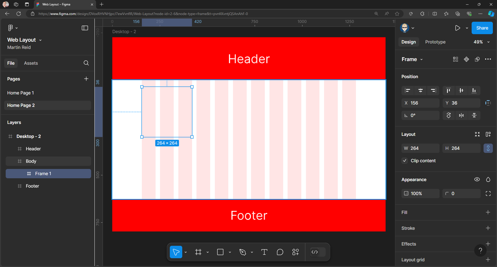
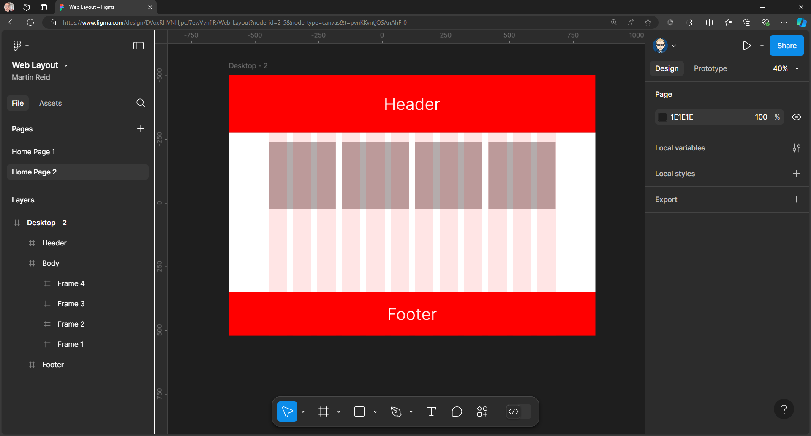
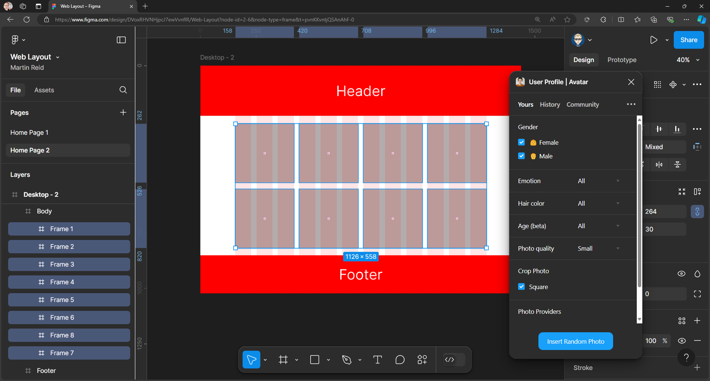

{: .no_toc }

# Web Layout
When prototyping a browser based web site you will need to use a 12 Column Layout guide.

This tutorial is base on Google Material Design System

Now set the following values:

Count: **12**
Margin: **156**
Gutter: **16**

A quick way to add content (images) is to use a plug in such as [User Profile | Avatar](https://www.figma.com/community/plugin/749945157855564842/user-profile-avatar) - Right mouse click on the Pasteboard Plugins > Manage Plugins Then search for **User Profile | Avatar**

