{: .no_toc }

# Login Screen Set-up in Figma

[VIDEO DIRECT LINK](){: .btn .btn-purple }

[DOWNLOAD STARTER FILE](images/){: .btn .btn-blue } 

[Download Dog Logo Image](images/dog1.png)

We are going to make a login screen based on [Material Design guidelines](https://material.io/components/text-fields#anatomy) in Figma although the principles can be applied to other programmes such as Adobe XD

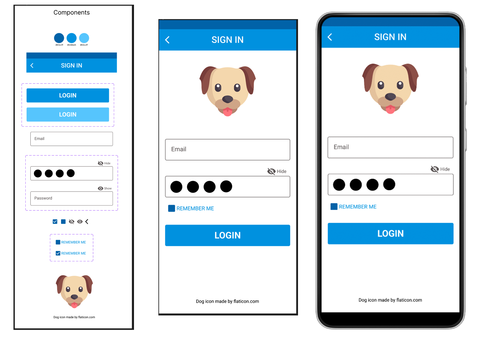

Create a new Figma Design Document give it a name a create 2 page:
 
1. Components
1. Layout

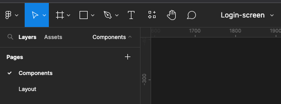

One the Components Page drag out a Section for design notes

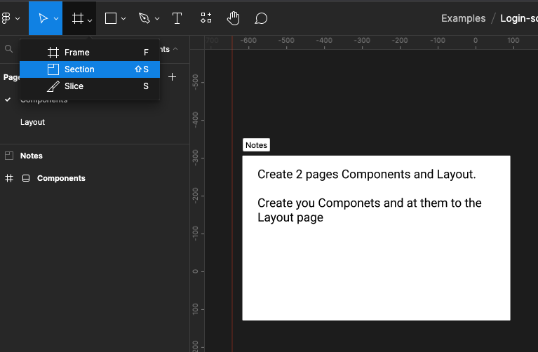

Still on the Components Page drag out a 466 W x 1284 H Frame and name it "Components"

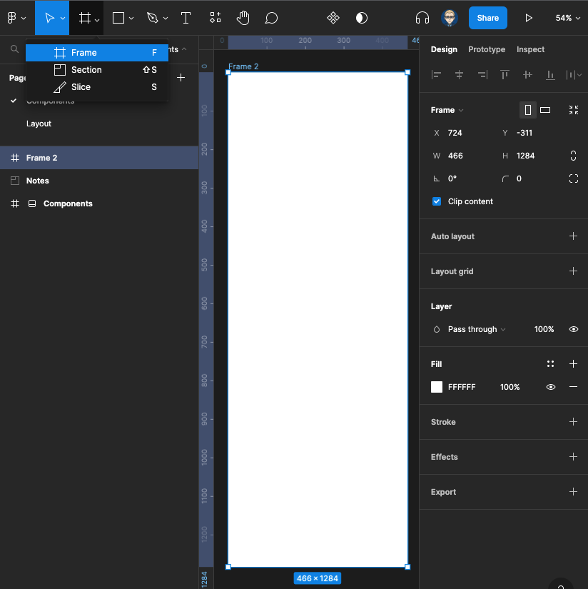

Set-up up an 4 pt Grid on this Frame

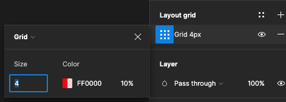

Create a component sheet of all your colours and components and also select your typography styles and download the icons you wish to use in this project they were selected from the [Material Design icons](https://material.io/resources/icons/?style=baseline) (sometimes you might want to create your own using the icon design principle they use in this design system)

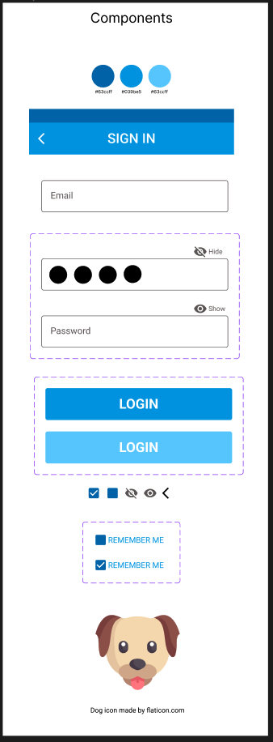

You can use a design system/ platform to select your colour scheme here we have use the Google Material Design Colour Tool

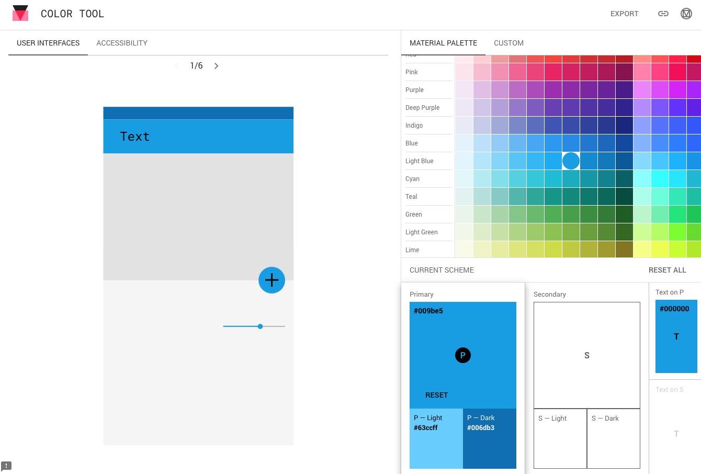

Create 3 colour swatches and add their HEX values

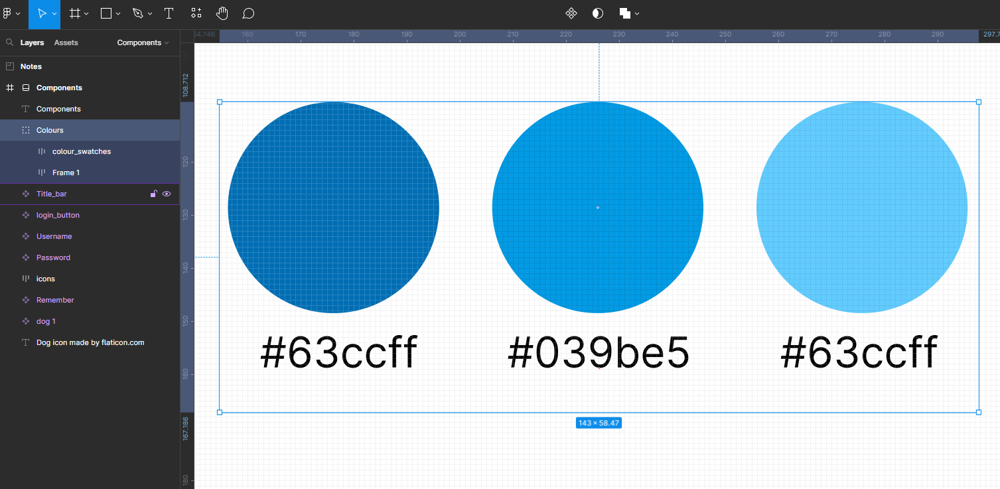

We will now create a Title Bar at the top of the screen

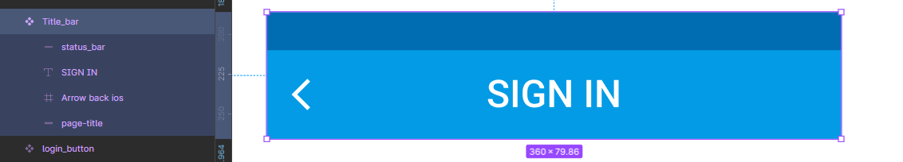

First create a status bar is 24 H x 360 W

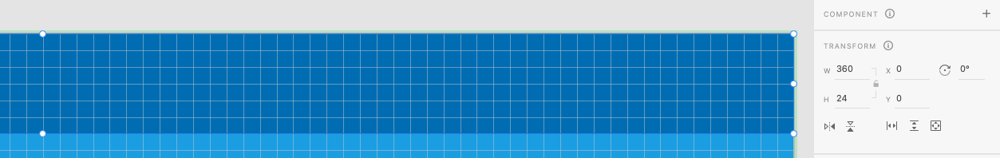

Then Title box underneath 56 H x 360 W and the font is Roboto medium 24pt

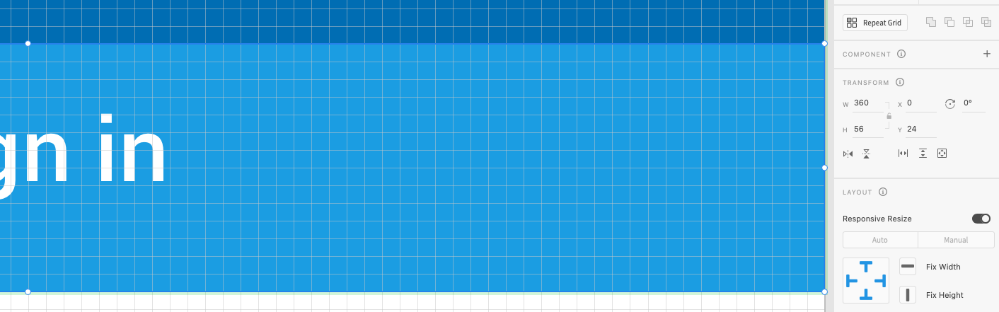

Then we move onto the username/email field - this is based upon guidance in Google material design

The username/email field is 328 x 56 with a 1 pt and Stroke colour 645E5E

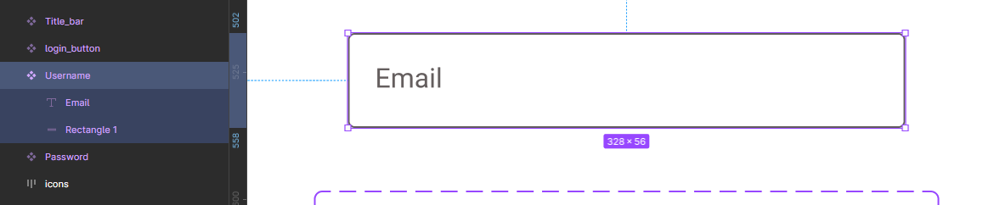

As with the username/email field the password component was added this has the option to total between the text being visible or just a set of dots.

The password field is 328 x 56 pixels

Change the Password Field into a Component (by Right-Mouse_clicking) then turn it into a Variant

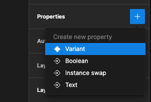

Create 2 functions in this Variant for show/hide Password

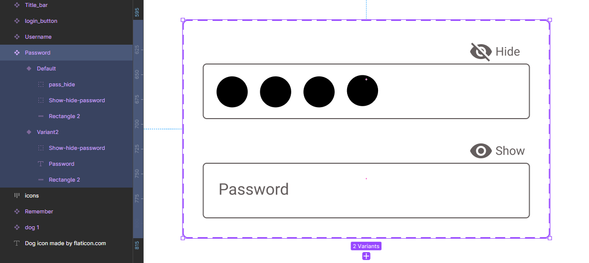

Find icons from Figma Community - and select 

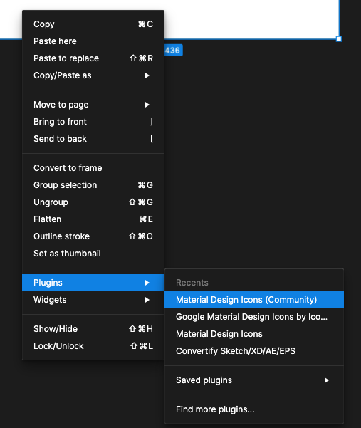

Find the following icons:

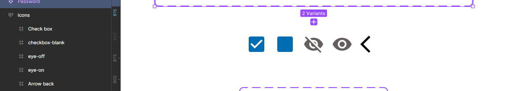

Then create a 328 w x 56 h login button use as a Variant for rollover (Hovering) or While Pressing 

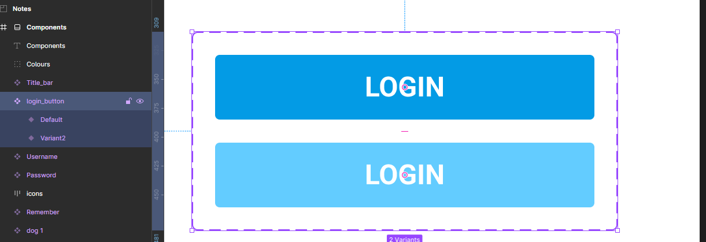

Then there is a section for remembering me, there is functionality to click to check the box and also there is a link to a forgot password word screen.

Create this as a 2 function Variant

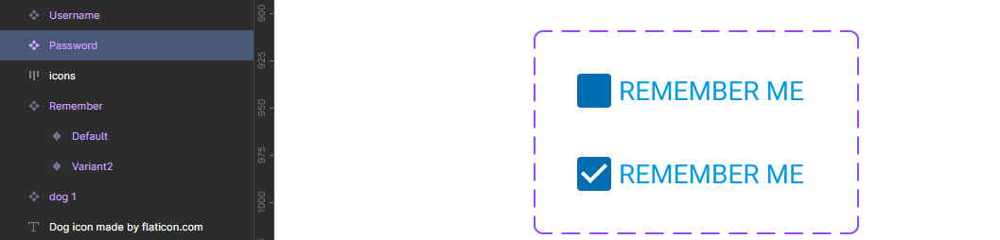

On the Layout page create a 360 H x 800 W Frame.

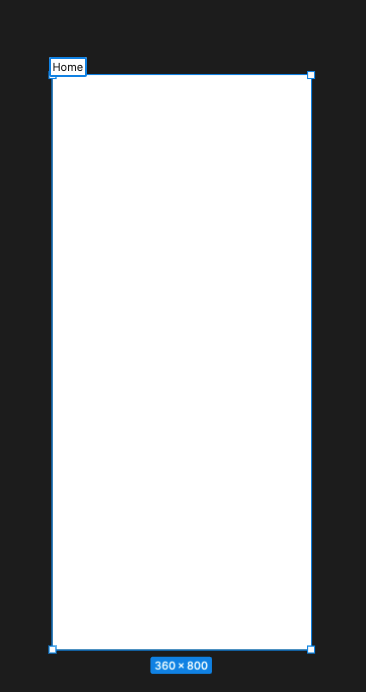

Click on Assets in the left panel and drag drop your Components to the Frame with 4 or 8 pt grid and leave 16 margin

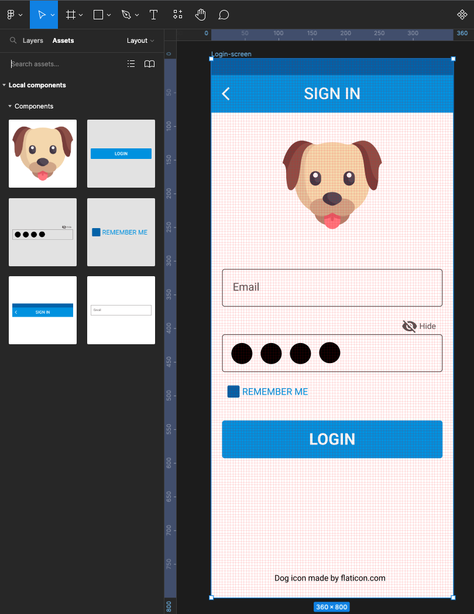

