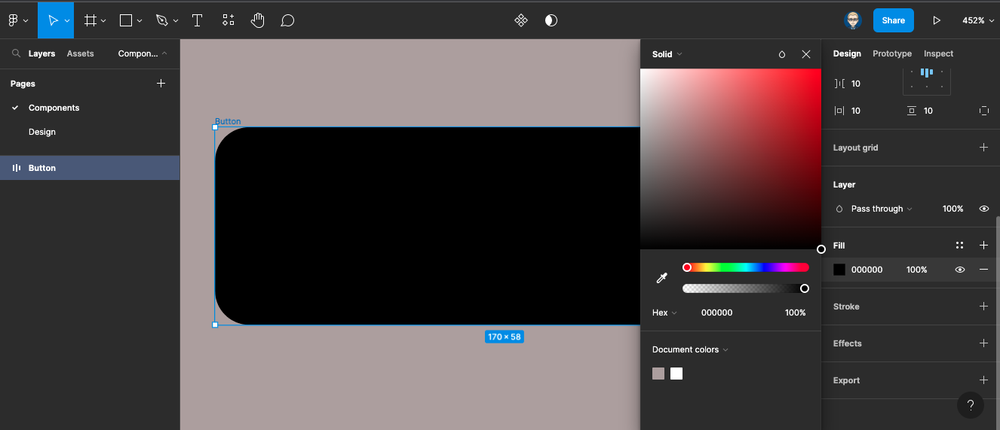
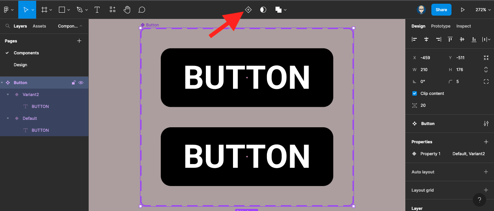
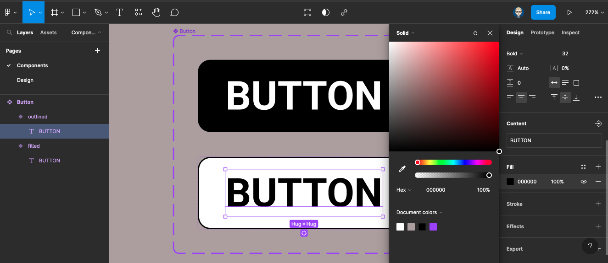

{: .no_toc }

# Menu - Auto-Layout

Create a frame 170w x 58h 

Name it Button

Click Auto-layout in properties panel

Auto-layout centre

W & H to fixed (from Hug)

Corner Radius 10

Fill colour Black

Select Text tool from menu or `T` on keyboard

Type in the word BUTTON

Select Parent Frame "Button" Click on its name/title or pressed `\` on keyboard

Make the button a component Click on Component icon or `Mac: Alt + Cmd +k` or `PC: Alt + Ctrl +k`

Select text layer either click it or `Enter` if Parent is selected, in the Properties click Content property icon

Call it Label & click create Property

Now create it as a Add Varaint

Select the Default layer button

In the Properties panel in the Current Variant section - change **Property** to **Type** and called it **filled**

Now select Variant2 layer and called the **Type** **outlined**

Select the **outlined** buton change Fill to white

Add Stroke (black) 1pt

Press Shit + Alt on your keyboard and drag to copy. You can then drag again or `Mac:Cmd + D`  or `Pc:Ctrl + D` to duplicate 3rd element.

