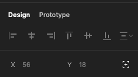
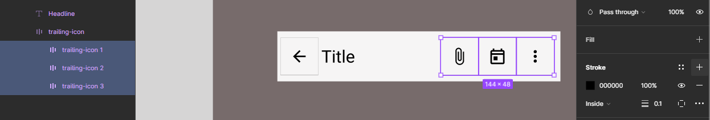
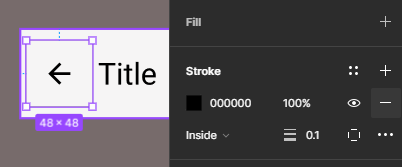
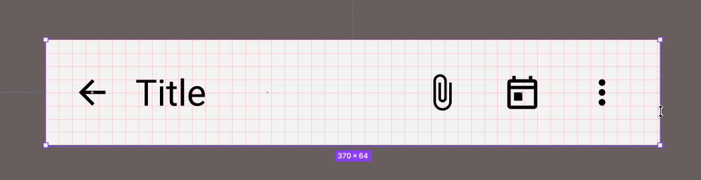
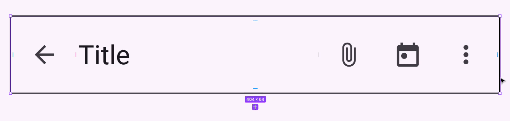
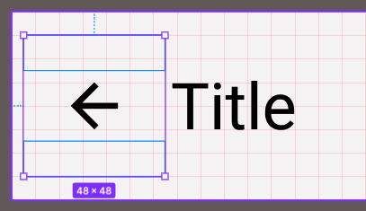
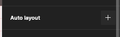
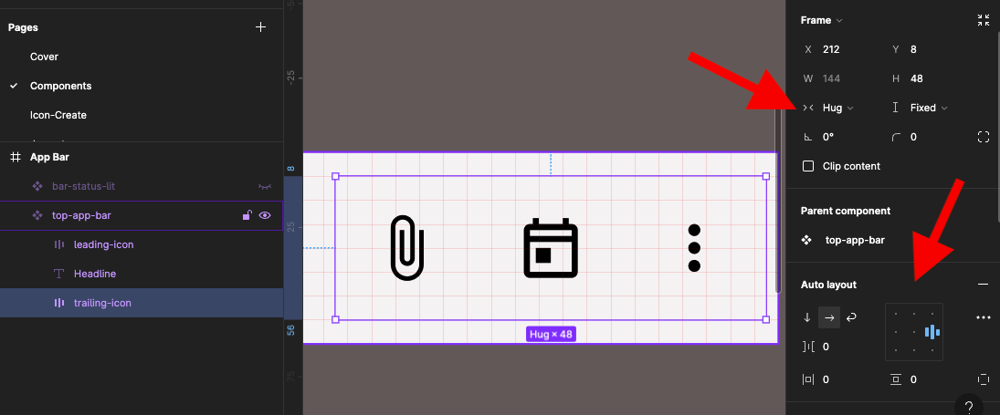
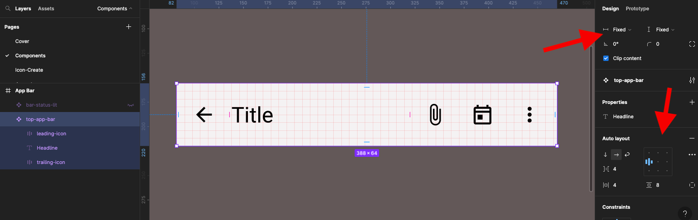
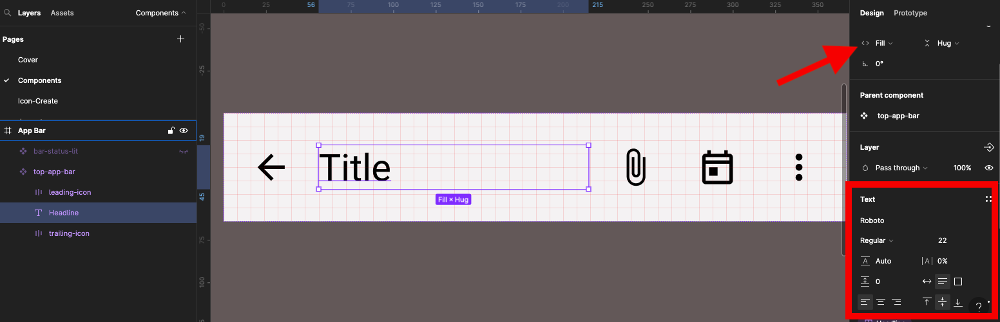

{: .no_toc }

# Pixel Perfect 2 - Top App Bar

 We are going to create a "pixel perfect" Component using Google Material Design guidelines. Making components is one of the first things you do when creating a UI project, you either create the Component yourself or you import them into your project by using a copyright free Library/UI Kit.

## Introduction

 <iframe src="https://solent.cloud.panopto.eu/Panopto/Pages/Embed.aspx?id=7dbf5edc-94b9-4ef4-9fd4-b09f0155995f&autoplay=false&offerviewer=true&showtitle=true&showbrand=true&captions=true&interactivity=all" height="405" width="720" style="border: 1px solid #464646;" allowfullscreen allow="autoplay" aria-label="Panopto Embedded Video Player"></iframe>

[M3 Material Design Guidelines](https://m3.material.io/components/top-app-bar/overview)

 <iframe src="https://solent.cloud.panopto.eu/Panopto/Pages/Embed.aspx?id=22549063-7644-4594-ad2d-b09f0155998e&autoplay=false&offerviewer=true&showtitle=true&showbrand=true&captions=true&interactivity=all" height="405" width="720" style="border: 1px solid #464646;" allowfullscreen allow="autoplay" aria-label="Panopto Embedded Video Player"></iframe>

We will be creating the **Top App Bar** Component which is part of the [Material Design kit M3](https://www.figma.com/community/file/1035203688168086460)

The Material Design Guidelines will give you all the inforamtion you need to know for creating Components such as sizes and spacings

This is what we are aiming to create:

## Create main container frame - Step 1

<iframe src="https://solent.cloud.panopto.eu/Panopto/Pages/Embed.aspx?id=4364cd6d-f792-4d09-af01-b09f015599e6&autoplay=false&offerviewer=true&showtitle=true&showbrand=true&captions=true&interactivity=all" height="405" width="720" style="border: 1px solid #464646;" allowfullscreen allow="autoplay" aria-label="Panopto Embedded Video Player"></iframe>

1. Create a Frame with Frame Tool or press `F` on keyboard
2. Call the Frame **Top-App-bar**
3. Set Height & Width **360x64**
4. Set Grid to **8pt**

## Connect to icon library - Step 2
 
 <iframe src="https://solent.cloud.panopto.eu/Panopto/Pages/Embed.aspx?id=c473fe8b-67c4-4476-b9d1-b09f0155e60c&autoplay=false&offerviewer=true&showtitle=true&showbrand=true&captions=true&interactivity=all" height="405" width="720" style="border: 1px solid #464646;" allowfullscreen allow="autoplay" aria-label="Panopto Embedded Video Player"></iframe>

 We could bring in icons using a plug-in, but we will import a icons libary this gives us the option to swap out (change) any of the icons. This will only work in the teams (Education Teams) version of Figma.

Go to [figma.com/community](https://www.figma.com/community) and search for Material Design Icons.

Click **Add to Figma** button - Once in figma it needs to be within the shared Team area rather than in your drafts folder and you need to have permissions to access where it is stored.

 1. From the panel on the left click on **Assets** 
 2. Then click on the **Library icon**

You should see all the libraries you have access to

 3. Click **Add file** next to **Material Design Icons**

It should now display **Added** - You can now close the panel `X`

 Make sure in the asset panel you have all library selected. You should now the **Material Design icon** Library.

 **Note:** Imported libraries do not live inside your project they are only linked to it, so you can have a number of projects or a number of people can share one library when updates are made to the library they can then be pushed out to all the projects that used the components and assets.

 

## The Leading Icon - Step 3

<iframe src="https://solent.cloud.panopto.eu/Panopto/Pages/Embed.aspx?id=7eea2e24-f037-441e-ac08-b09f0159276c&autoplay=false&offerviewer=true&showtitle=true&showbrand=true&captions=true&interactivity=all" height="405" width="720" style="border: 1px solid #464646;" allowfullscreen allow="autoplay" aria-label="Panopto Embedded Video Player"></iframe>

  In the Layers panel select the **top-app-bar** Frame and create another Frame inside of this **48x48** and call it **leading-icon**

  

  Give it a **Stroke** (border) of **0.1** this will be just work with we will turn it off later.
  

In the **Assets** panel search for **Back** This should display the back arrow in the **Material Design icon** library.

Click on **Insert Instance** to place it on the Frame

It should be inside the **leading-icon** Frame - we need to reposition it.

1. Move it so it's on top of the **leading-icon** Frame.
2. It should noe be inside the **leading-icon** Frame

**Note:** You can also reposition it by dragging it in the Layers panel

## Headline - Step 4

<iframe src="https://solent.cloud.panopto.eu/Panopto/Pages/Embed.aspx?id=bc7d3b8c-e0e1-4ef0-8733-b09f01668555&autoplay=false&offerviewer=true&showtitle=true&showbrand=true&captions=true&interactivity=all" height="405" width="720" style="border: 1px solid #464646;" allowfullscreen allow="autoplay" aria-label="Panopto Embedded Video Player"></iframe>

 1. Create a text box **152 x 28** by press `T` on keyboard or selecting the text Tool
 2. Make the **X 56** and **Y 18** in the Frame Properties in the right panel

 3. Font: **Roboto, Regular, 22pt**, **align left** & **centre middle vertacally** 
 4. Type in the word **Title**
 5. Name the Layer **headline**

## Trailing Icons - Step 5

<iframe src="https://solent.cloud.panopto.eu/Panopto/Pages/Embed.aspx?id=b8366a9a-3612-4809-8273-b09f01667efc&autoplay=false&offerviewer=true&showtitle=true&showbrand=true&captions=true&interactivity=all" height="405" width="720" style="border: 1px solid #464646;" allowfullscreen allow="autoplay" aria-label="Panopto Embedded Video Player"></iframe>

### Create icon containers

We will now create 3 more icons for the **Trailing Icon** section of the bar.

1. Create three frames at 48x48
2. Align them up so they have no gaps

Re-name these 3 Frames (in the Layers panel) as follows from left to right:

**trailing-icon 1
trailing-icon 2
trailing-icon 3**

### Add icons to the containers

<iframe src="https://solent.cloud.panopto.eu/Panopto/Pages/Embed.aspx?id=45c367eb-71b3-4d04-b140-b09f0167f082&autoplay=false&offerviewer=true&showtitle=true&showbrand=true&captions=true&interactivity=all" height="405" width="720" style="border: 1px solid #464646;" allowfullscreen allow="autoplay" aria-label="Panopto Embedded Video Player"></iframe>

We now will add a icon to each frame.

1. Go to the **Assets** panel
2. Search for **Attach**

Repeat with searching for **Today** & **More**. 

**Note:** Make sure you unselect the icon you imported before you bring in another one otherwise it will just replace the selected icon.

 The icons may be in the wrong position they need to be in each of the **Trailing Icon** frames

 Drag drop them so they are inside each of the Frames, you can also do this by dragging them in the layers panel

 

  You can get them to the centre in each of the container frames by moving them until you see the alignment guides in red

 

 ###  Apply Auto Layout 
  
  We need to apply **Auto Layout** to each of the frames, this will mean the frames will collapse and we need to re-align them back to the original size and positions.

  Select **trailing-icon 1** in the properties panel on the right 
  
1. Click the `+` on **Auto Layout**
2. Centre
3. Horizontal and Vertical padding set to 0

 Repeat this with the remaining icons

 

### Fixed broken layout

The layouts have now been broken, So we need to fix them.

Note we could have **Auto Layout** these Frames to start with bur we are looking at what **Auto Layout** does and how to fix any issues.

 Shift click to select all three layers.

In the **Frame Properties** Panel on the right:

Reinstate the **height and width to 48**
**Horizontal and Vertical resizing** should both be set to **Fixed**

Select all 3 **Trailing Icon** Frames

 **Auto Layout** them and align **centre right**

 Rename layer **trailing-icon**

### Delete Stokes from Icons

<iframe src="https://solent.cloud.panopto.eu/Panopto/Pages/Embed.aspx?id=c90e2aee-83a7-4caa-a20c-b09f016d4a71&autoplay=false&offerviewer=true&showtitle=true&showbrand=true&captions=true&interactivity=all" height="405" width="720" style="border: 1px solid #464646;" allowfullscreen allow="autoplay" aria-label="Panopto Embedded Video Player"></iframe>

We set up **Strokes** (borders) on the icon containers to make them visable to help in alignment. We will now delete them - but you could just switch them off if you need them later.

1. Shift click each of them
2. From the Stroke Properties in the right panel click on the delete icon.

Repeat this with the Back Arrow icon

## Create Component - Step 6

With the **top-app-bar** selected either **Right-Mouse** and select **Create Component**

...or clivk the **Create Component icon** on the Menu bar

Done. Make sure the Layers or ordered from Top to Bottom:

**leading-icon**
**Headline**
**trailing-icon**

## Add Text Property on the Headline text box - Step 7

We  need to set-up the Title on the **Headline** text to be editable through the text properties when an **Instance** is drag out in the UI layout.

Select the **Headline** text

In the **Text Properties** click on the **Add Text** icon

**Name: Headline**
**Value: Title**

##  Responsiveness - Step 8

<iframe src="https://solent.cloud.panopto.eu/Panopto/Pages/Embed.aspx?id=26209b03-5230-4290-ab0d-b09f016d4c39&autoplay=false&offerviewer=true&showtitle=true&showbrand=true&captions=true&interactivity=all" height="405" width="720" style="border: 1px solid #464646;" allowfullscreen allow="autoplay" aria-label="Panopto Embedded Video Player"></iframe>

 The Component needs to be responsive, but when we drag it in and out from the right side it is not responsive.

 Note: As mentioned above we could have **Auto Layout** are frames to start with, but we will learn how to create Responsiveness to a static layout.

 

This is how it should work, we need to fix this

First of all the **leading Icon** on the left needs to have **Auto Layout** applied

Select the **leading Icon**  Container

In the the properties panel on the right in the **Auto Layout** section click on the + icon

1. In the frame properties set fixed for both vertical and horizontal
2. In the auto layout section Centre
3. The frame properties **Hug** (horizontal) and **Fixed** (vertical)

 
 Now select the trailing Icon section make sure the auto layout is aligned middle right 

1. Now select the **top-app-bar** frame and apply **Auto Layout** 
2. Align left middle
3. In the frame properties **Fixed** for both vertical and horizontal

Finally select the **Headline** title set it frame properties to **Fill** (horizontal) and **Hug** (vertical)

