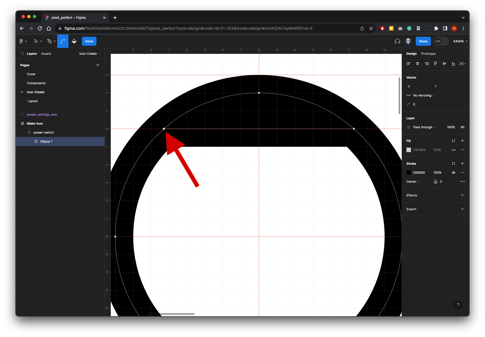

{: .no_toc }

# Pixel Perfect 1 - Icons
 Creating icons is more associated with general design or illustration, but is important for a digital designer/UX to understand the core principles of how an icon is constructed and implemented within a UI layout and more importantly how it structure relates to A given design system.

Creating a family of icons is time-consuming, although Figma can create and work with Vector Images these are basic in comparison to what you would find in [Adobe illustrator](https://help.figma.com/hc/en-us/articles/360040030374-Copy-assets-between-design-tools) and also there is a large amount of free to use icons available through [Figma Community.](https://www.figma.com/community) so it would be best to use these rather creating your own but it is important to learn how to make an icon. Here we will import an icon from [Material Design (Community)](https://www.figma.com/community/file/1014241558898418245) which can be found in [Figma Community.](https://www.figma.com/community)

#### 1. Set-up

We will create a new Frame on the Icon page, we will then bring in an icon from Material Design (Community) plug-in. We will use this to set up guides and copy icon.

1. On the **Icon-Create** page
2. Select the **Frame** Tool from the Toolbar or press `P` on keyboard
3. Resize to **100x50**
4. Name it **Make-icon**

1. Right-Mouse on the pasteboard
2. From the plug-ins select material design (Communinity) If you do not have this plug-in installed select manage plug-ins and
3. Search for it then run/install

4. From the icon panel search for **Power** then click on the **Power Switch** icon which will then appear on the pasteboard

**Tip:** With **Material Design** icons they have a bounding box (other icons may not have a separate bounding box) with the icon itself is inside - So there is a Container and then the actual vector icon inside this container the container box makes life easier to work getting spacings right with irregular shaped icons. 

Because of the Container (bounding box) it's a common mistake when moving the icon that you move either the container without the icon, or move the icon out of the container - **Also when it comes to icons do not scale them just use them as they are when it comes to material design the icons or 24x24**

 So the best way to move an icon is by clicking and holding the **name label** top left of its container

#### 2. Create Copy Guides

 We will set up some guides using the Icon as a template

The Zoom drop-down menu on top right not only had settings to zoom in and out but you can also switch on the **Pixel grid** and also **Rulers** and toddle **Snap to grid.**

To help us with the layout switch on **Pixel grid**

 

To drag out Guides you must have Rulers switch on

Drag out 3 guides to align up as below:

We need a guide for Top, Bottom & Centre of the container

Make sure the container layer is select to show the outline - the container is **24x24** so we need a centre guide at **12**

Finally we need a guide on the ontented cut points of the circle

Switch OFF **Snap to pixel grid**

Then drag a guide as below:    

Now drag out a Rectangle shape (select in the Toolbar or press `R`) on the left of the example icon size it to **24x24**

Make sure **Snap to pixel grid** is switch ON and drag guides out as below:

Finally delete the Rectangle shape

Then drag 2 guides 4 blocks in for the left & right outside guides

#### 3. Create Copy

First of all we will create a **24x24px** container for our icon. Not all icons have a container.

1. Select the Frame Tool from the Toolbar Press `F` on your keyboard.

2. Drag out from the centre guide while holding `Alt` and `Shift` on your keyboard this will create a perfect square and created from the centre.

3. We will add a Stroke (border) **0.1pt** Just as a guide which will be switched off at the end.

Inside this container we will create a circle using the **Ellipse** tool.

1. Select **Ellipse** tool from the Toolbar which is embedded in the shapes or press `o` on your keyboard 

2. Drag out from the centre while holding `Alt` and `Shift` on your keyboard this will create a perfect circle and created from the centre.

3. Set the Stroke to **2pt** and turn off Fill colour.

4. Make sure the Stroke is Centred

 #### 4. Cut Off Top of Circle

With the circle selected press `Return` on your keyboard this will bring up the Path in the centre of the stroke.

Select the **Pen** tool from the Toolbar or press `P` on the keyboard.

Using the guides from the example we are copying click two points to cut off the top of the circle - You do this by clicking on one point on the right..

...then moving across to the opposite side and clicking the second point - This will draw a line across the top of the circle.

Now click on the top Vector point of the circle and press delete

This will delete the very top of the circle.

Now click on the centre Vector point on the line you have just created and press delete

This will chop off the top of the circle.

 #### 5. Add Final Line
 
 Finally with the Line Tool - find this in the Toolbar embedded in the shapes or press `L` on your keyboard drag out the line as per guides and give it a stroke of 2pt.

 

Delete Container Stroke

