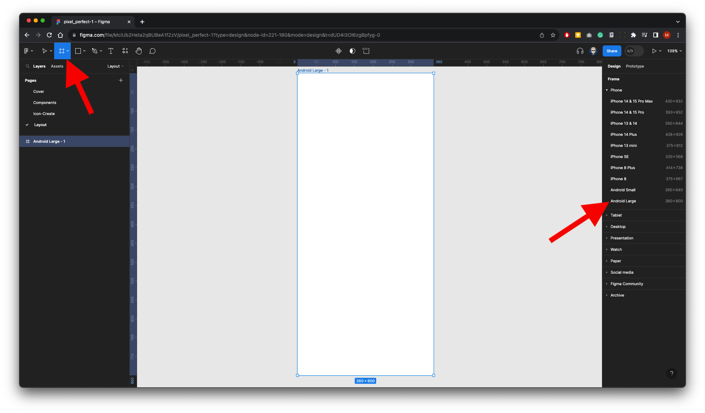
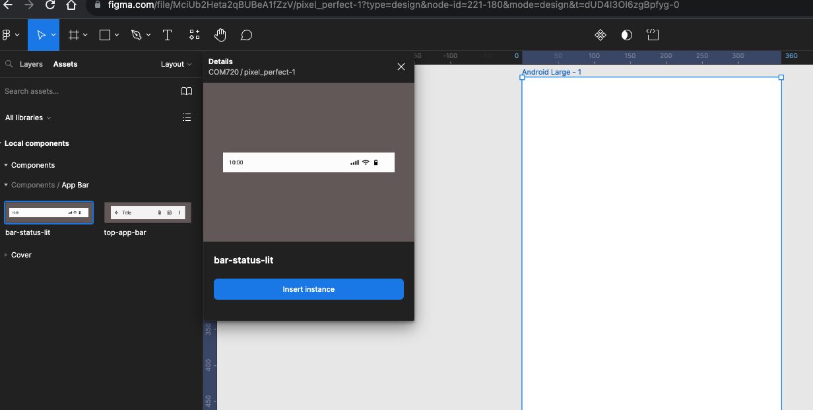
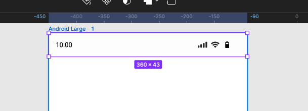
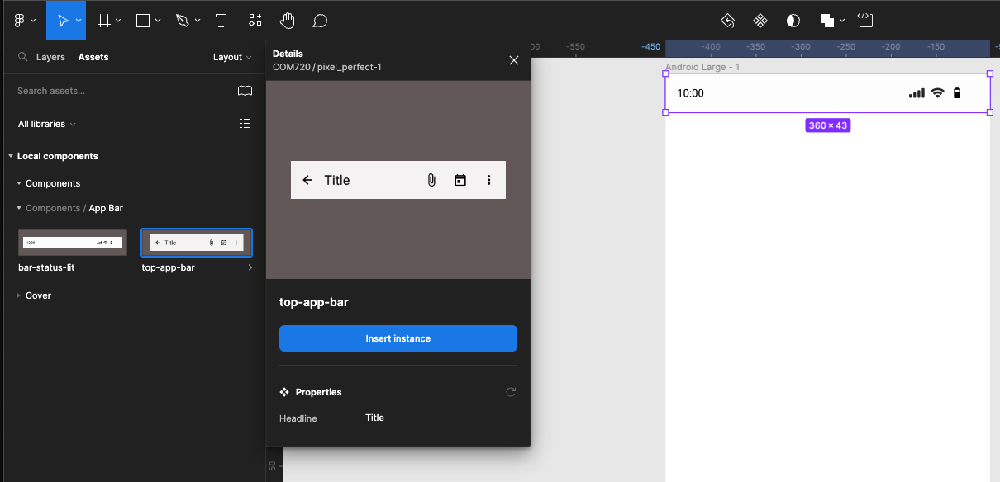
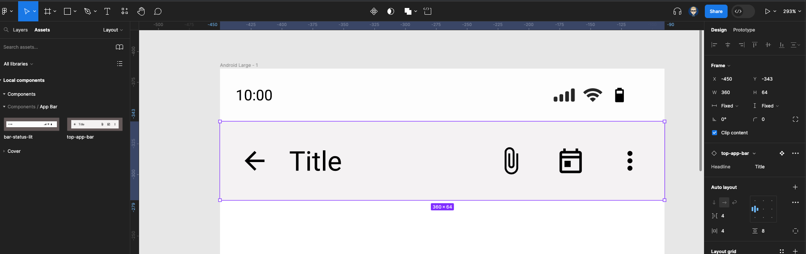
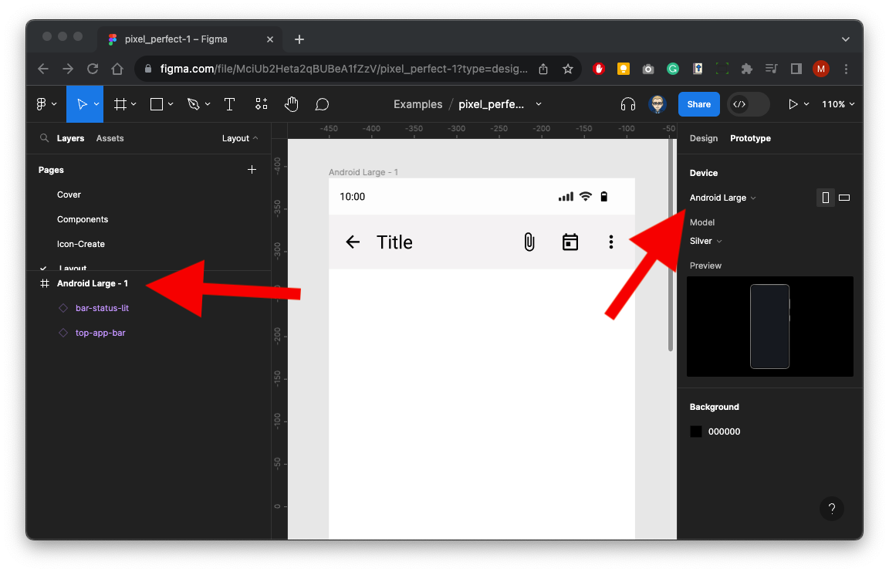
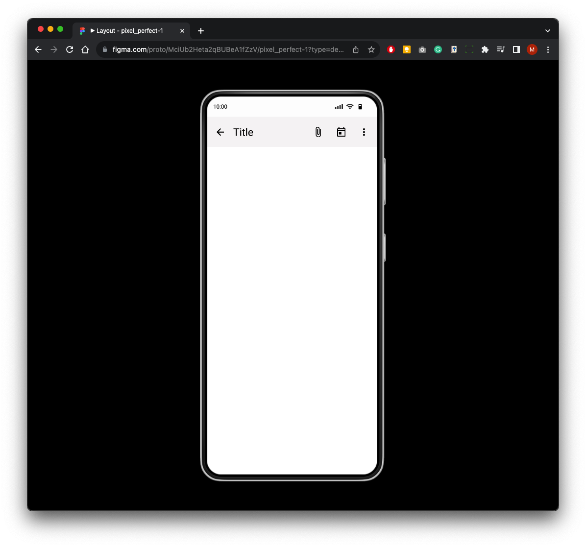

{: .no_toc }

# Pixel Perfect 3 - UI Layout

We will now add our **App Top Bar** **(Instance)** into a UI layout on the **Layout** Page. Finally we will veiw in the [Figma Mirror mobile](https://martinsolent.github.io/figma/) app (for Android or Apple iOS)

On the layout page create a frame using the Android Large template

1. Select the **Assets** panel on the left 
2. Insert Status Bar

Position at top of screen

Insert **top-app-bar**

Position under status bar

### Review

In the right panel change **Design** to **Prototype** it should pick up that it is a **large android** screen.

Make sure your assets are inside the Android large Frame in the layers - If they will not be visible in the preview, so make sure you drag them inside the frame if this is the case.

Press the play button

It will now present in preview mode with the phone  Bezel

