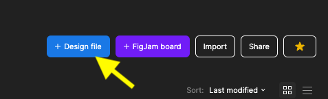
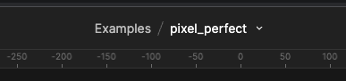
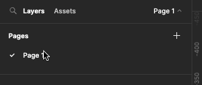
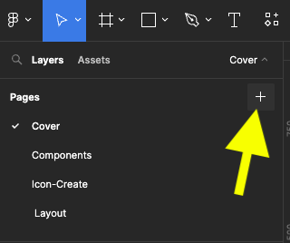
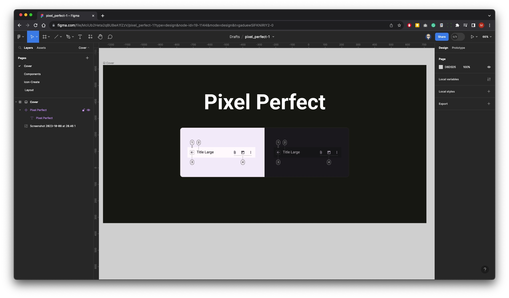

{: .no_toc .text-delta }

# Pixel Perfect Set-up

Create a new Design File

Name your File in this example **pixel_perfect** 

Re-name Page 1 **Cover**

Create 3 more pages by click on the + icon and call them:

Components
Icon-Create
Layout

We have  looked at creating a thumbnail/ Cover four or project more details [here](https://martinsolent.github.io/figma/docs/project_set-up/child_2.html)

**Here a recap:** On the Cover page create a Frame 1920x960 and call it Cover, add your design work & the right-move on the Frame on the layer panel and select **Thumbnail** from the pop-up

#### Create Cover
