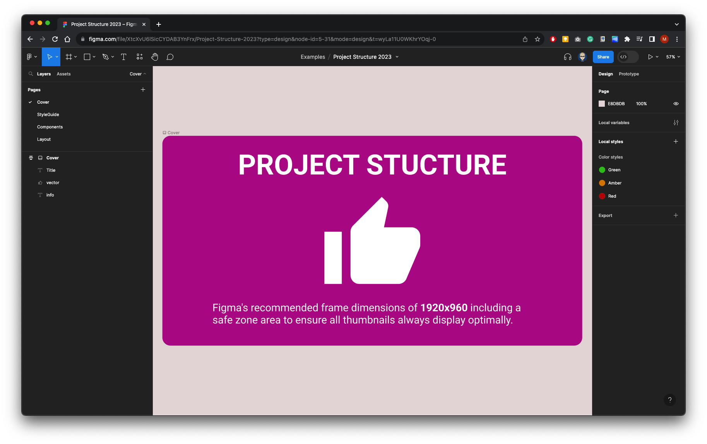
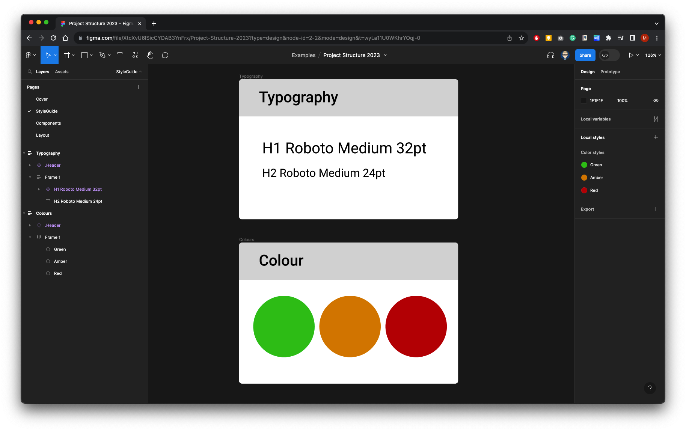
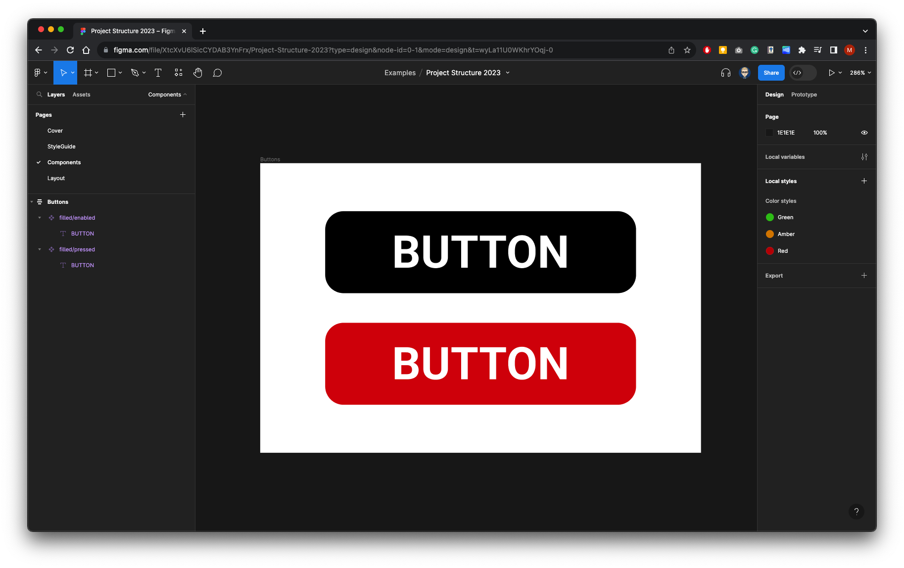
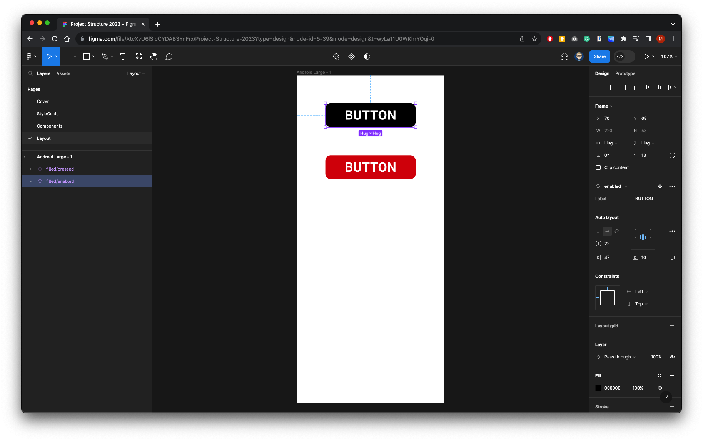

{: .no_toc }

#  Project Set-up Walk-though Overview

We are going to set up a project document consisting of four pages.

**Page 1 - Cover:** This page will be the thumbnail and information sheet for our project.

**Page 2 - StyleGuide:** This page will be a simple style guide with typography and colour scheme.

**Page 3 - Components:** This page will contain all components that we will used instances of in our layout.

**Page 4 - Layout:** In small projects you can incorporate pages for your user interface layout - Larger projects you would have a document with style guides and components that you would import (Library) into a separate proct document for your UI layout.

