{: .no_toc }

#  Project Set-up Walk-though: Page 1 - Cover

 Open Figma and create a new design file
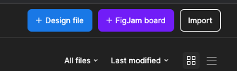

 Give it a name on the top bar
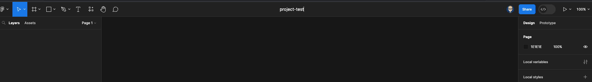

 Figma will already set you up with Page 1 rename this Cover in the left panel
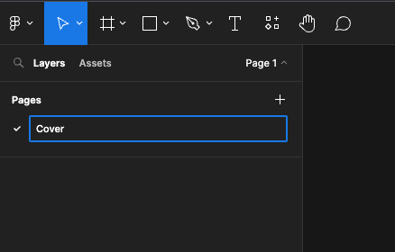

 Press F on your keyboard or click on the frame tool on the Toolbar. Then drag out a frame.
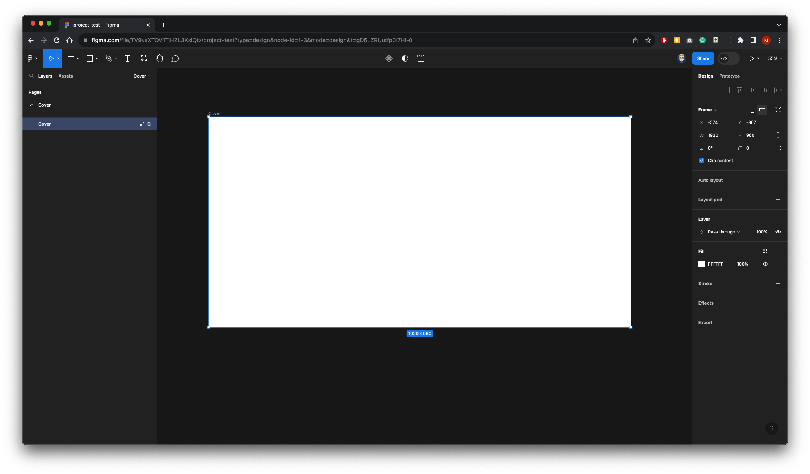

 Call the frame Cover in the Layers Panel. In the design properties panel on the right make the width 19120 and the height 960. Give the frame a radius of 37 and finally give it a full colour.
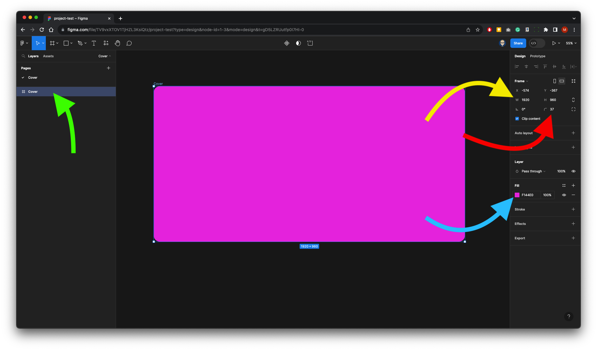

 Either press T on your keyboard or select the Text tool from the toolbar. Give the frame a title in this example we have used the Roboto font at 128 point & Bold
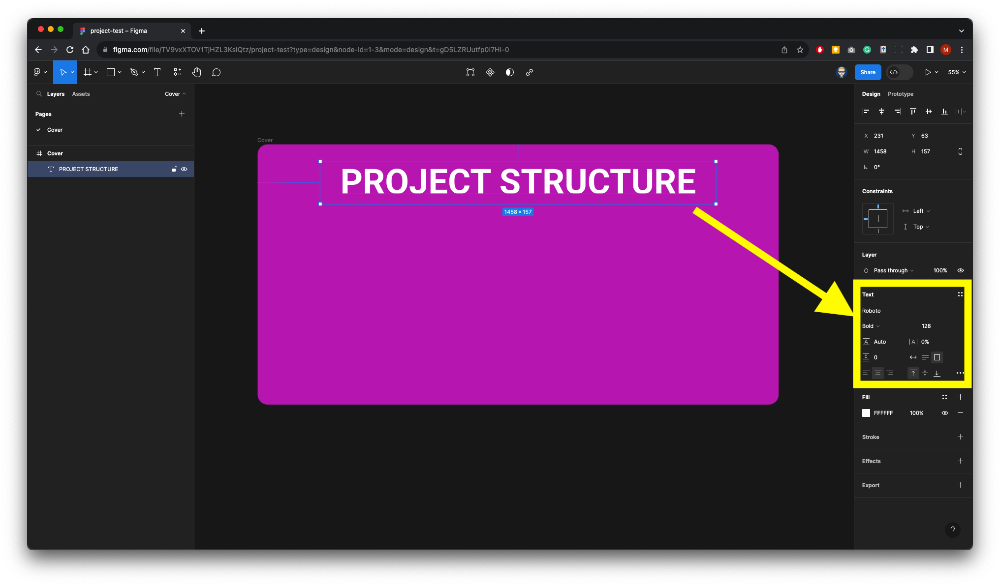

 we have added text at the bottom of the frame in this example we have used Roboto at 48 point
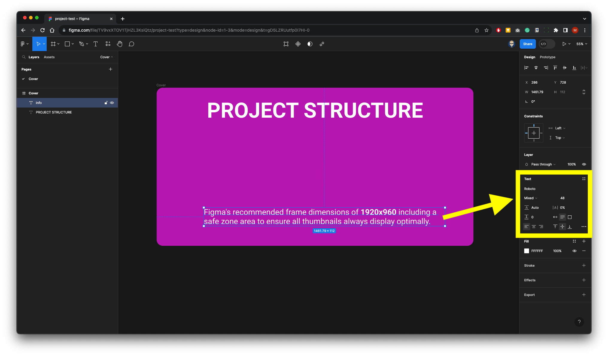

 We will now add an icon for the centre of the page. Right-Mouse to bring up the plug-ins, if you have not saved any plug-ins, go to manage plug-ins and in this example look for material design Icons(Community)
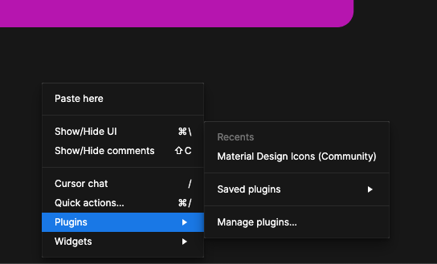

 Search and select an icon - Then click on it to add to page
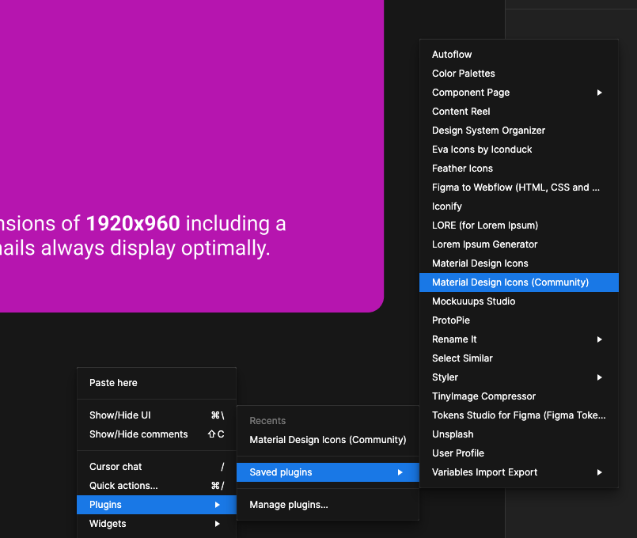

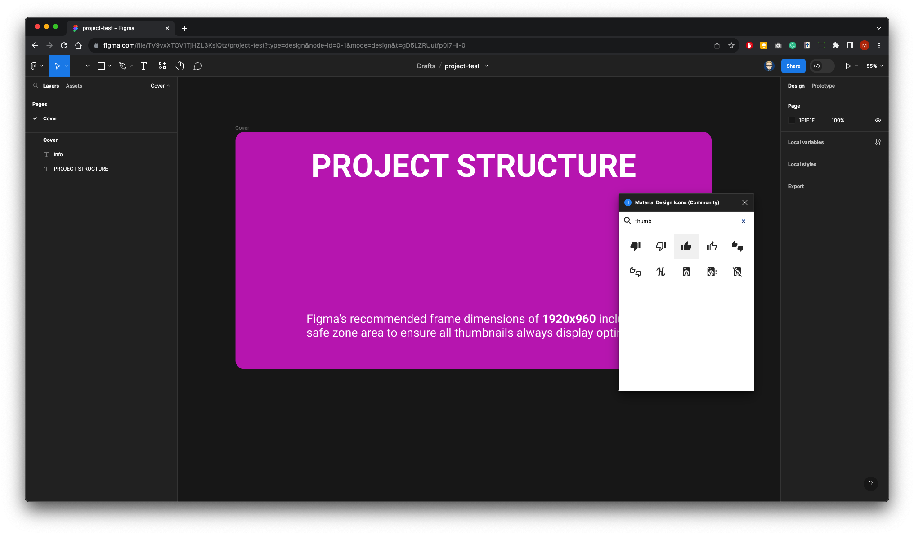

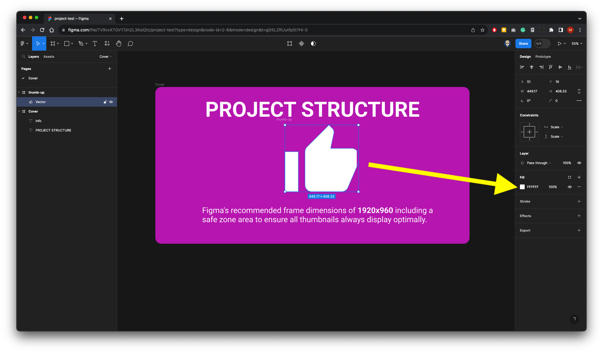

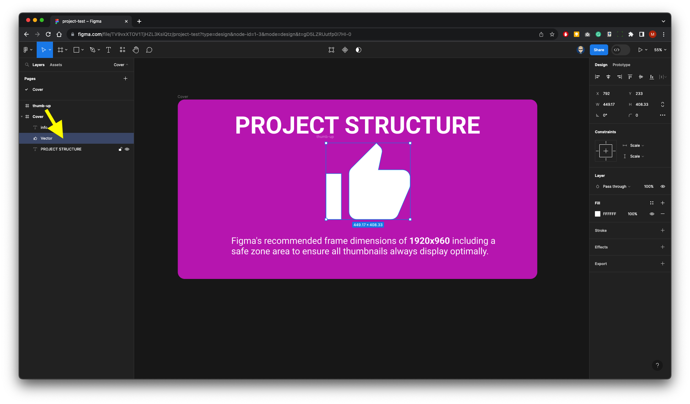

