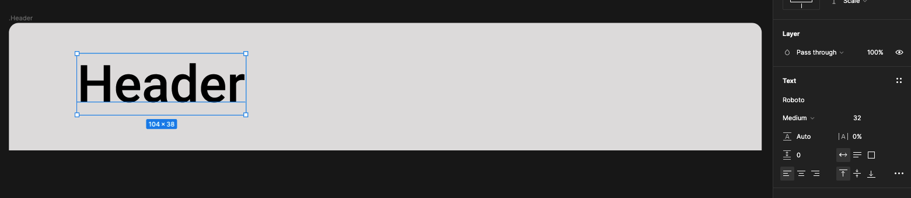
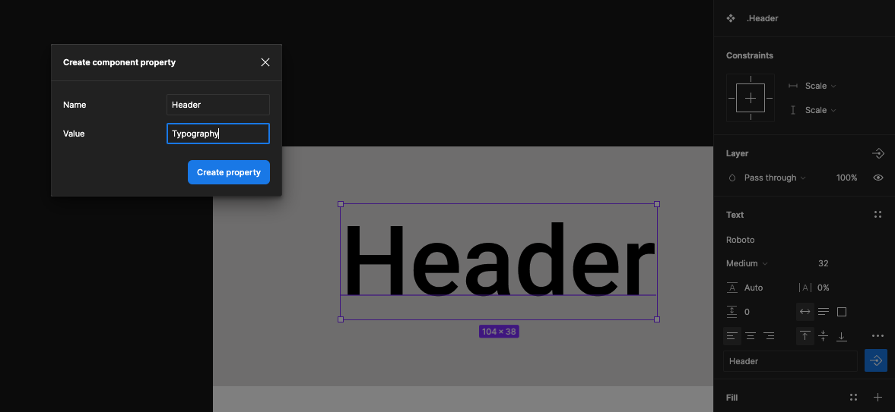
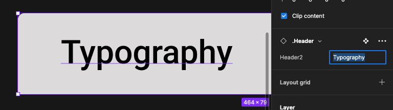
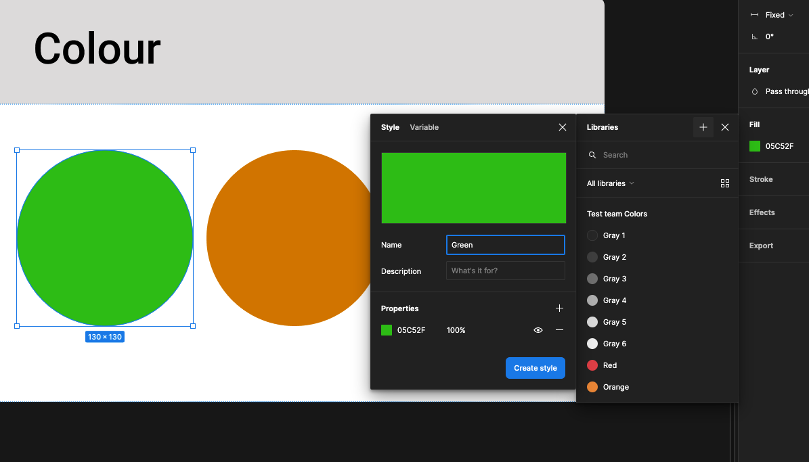

{: .no_toc }

#  Project Set-up Walk-though: Page 2 - Style Guide

 Create a new page and call it style guide

 Create a frame on the page Width 464 & Height 79, call it .Header. Create top left and right radiuses 6 and finally give it a full colour Grey
 
 
Add text called Header at 32pt
 

 Right-Mouse click and Create Component
 

 You will now see a Purple diamond shapes on the top left of the frame and also in the layers panel. This means the selection is now a component and instances can be created from this Master.
 

 Select the Header Text box in the property section in the tax panel click on the create component properties
 

Replace Name with Header and Value with Typography
 
 

Now create another text frame, 464 x 218, set bottom left and right radiuses at 6 and leave the fill white. Move this frame up to it buts up to the Header frame
 

 Add a text frame with Roboto text medium 32 point as below
  

Add another text frame with Roboto text medium 24 point as below

In the Layers panel select boy=th Header and Frame1 

 From the right properties panel click on the plus icon next to auto layout this will combine both frames together

Figma Will have called this layer group Frame 1, Rename it Typography and press enter

 
 In the left panel select Assets and click on .Header - Typography

Click on Insert Instance
 

The instance will appear on your baseboard
 

 With the instant selected in the properties section of the right panel change typography to colour and hit return
 

  Now create another 464x220 frame with the bottom left and right radiuses set at 6 and fill white
  Add 3 Cirle shapes all same size. Great one and then hold shift and alt drag. Colour them green and red. 19

 

 
 
 Then select both the header and the frame with the coloured circles and convert to auto layout
 

 This will group both frames together and automatically name the new layer group Frame 2. Rename this to colour.
 

 
 

 Now click on the green
 

 In the film properties on the right panel click on the icon with 4 squares To set up a colour style. Click on the plus icon
 

Name the colour green
 

 Repeat the same process with the amber and red circles.
 