{: .no_toc }

#  Project Set-up Walk-though: Page 3 - Component

Create a new page called Components
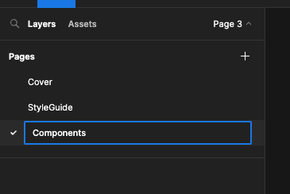

Drag out a 300x200 Frame called Buttons
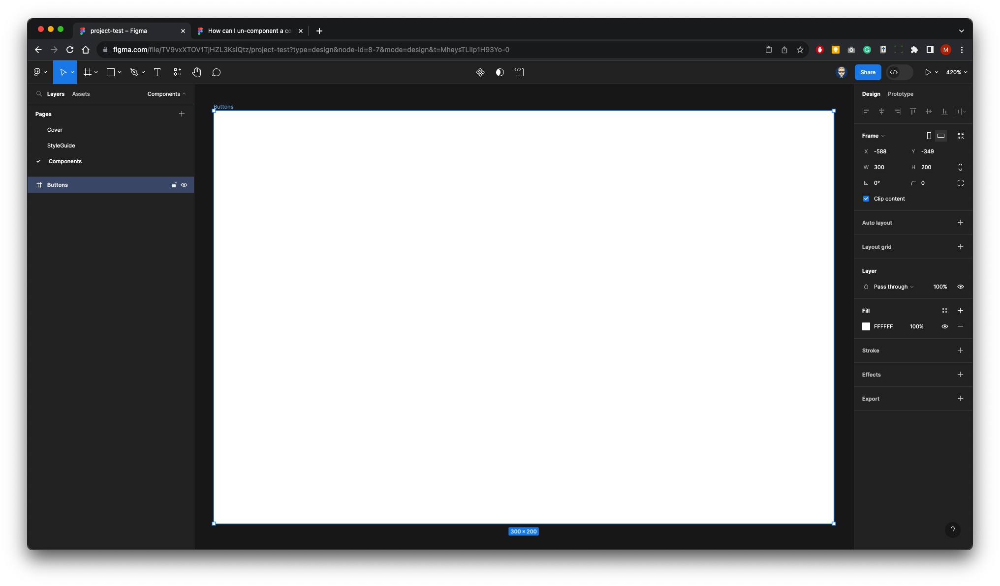

Now drag out another Fame within this:
220x58
Fill colour Red
Corner Radius 13

With this Frame Selected from the right right panel click Auto Layout
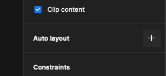

Either click T on your keyboard or select text from the Toolbar and click inside the Frame
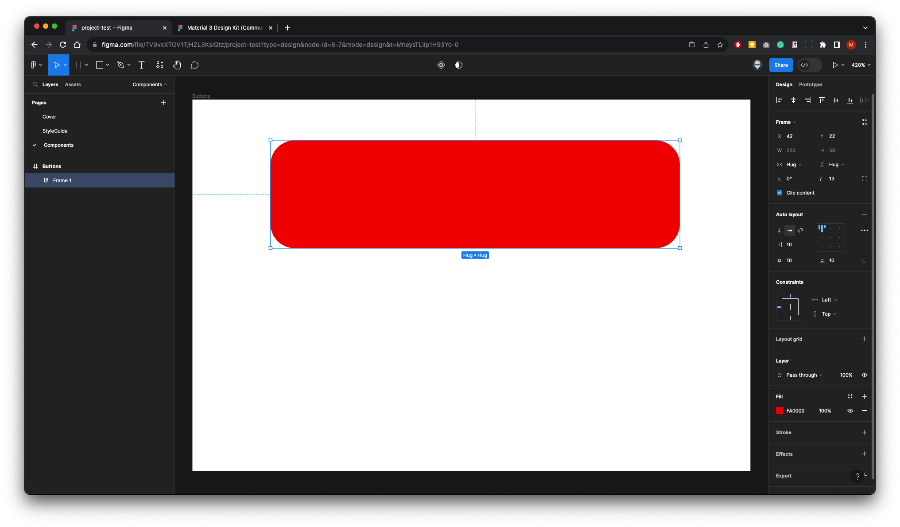

It will collapse, that's OK
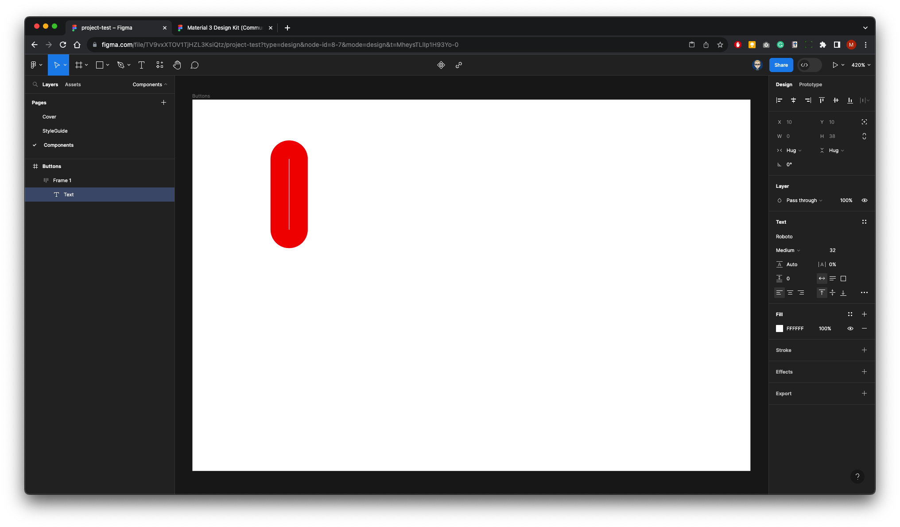

Set-up the Text properties in the right panel to:

Roboto - Medium - 23pt - Fill White
Type word BUTTON
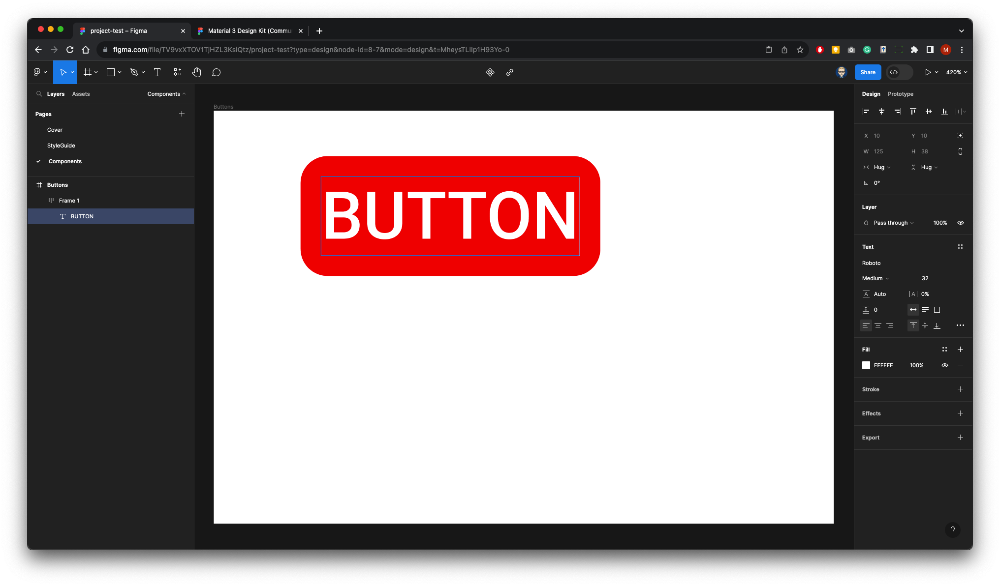

In Auto Layout panel click Centre
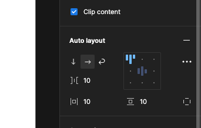

Noe drag out the Button width
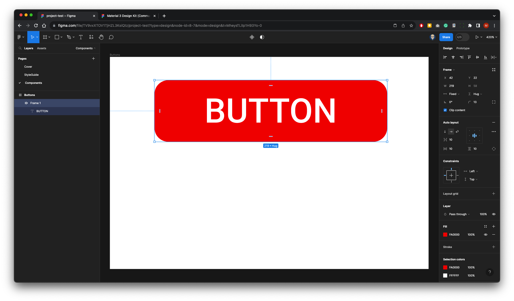

Re-name the Button Layer to filled/enabled
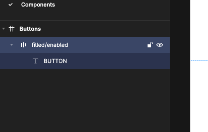

Pres ALT and SHIFT and drag down to copy Button
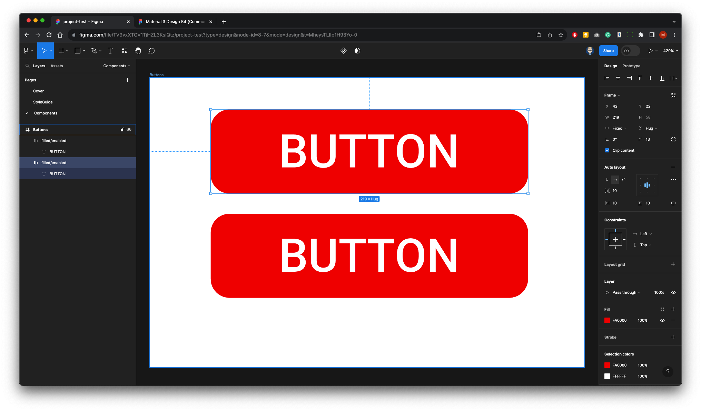

The Layer panel will now look like this
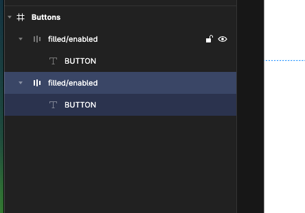

Rename the the bottom Button to fillded/pressed
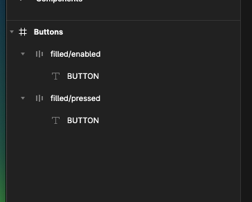

Change the fill of the top Button to Black
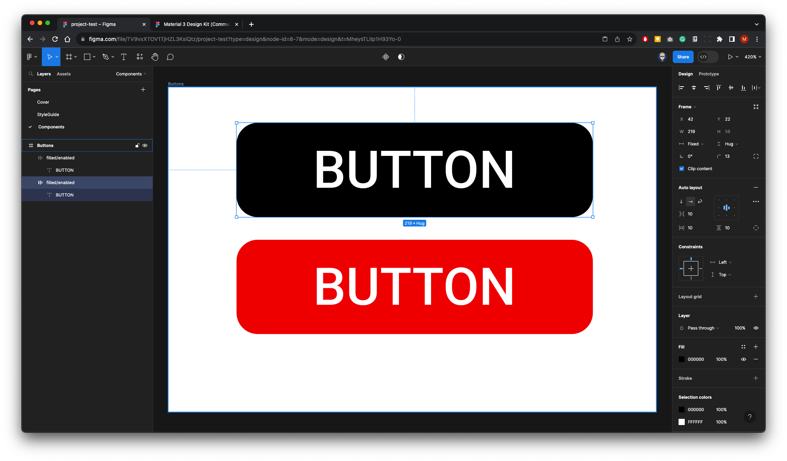

Right-Mouse each Button in turn and Create Component
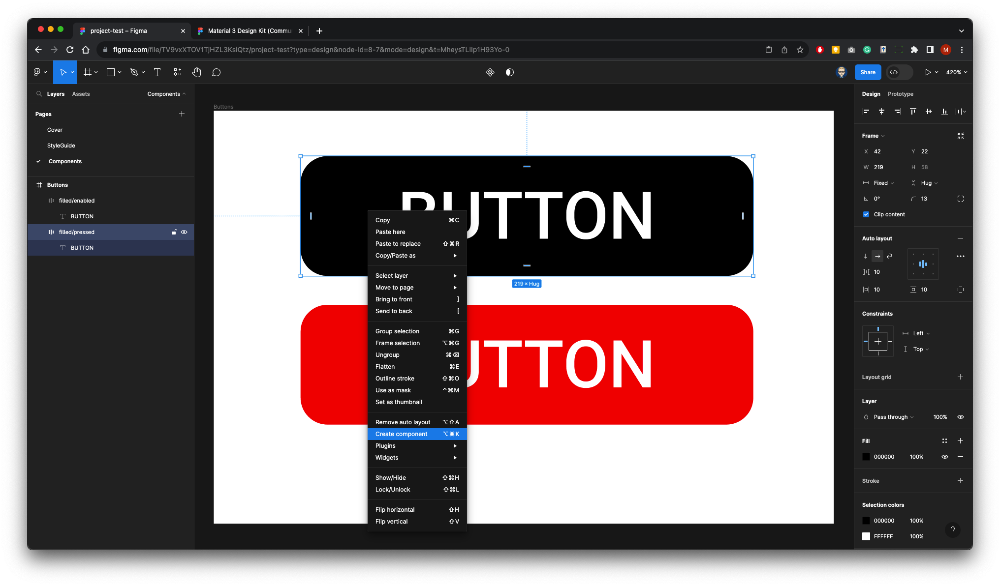

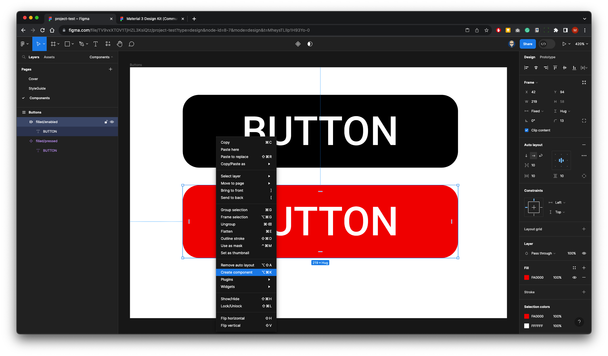

Layers panel will look like this
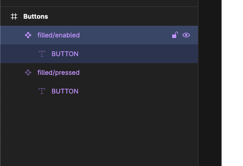

Select the Buuton text frame on top Button - in the Text Properties - Create Component Property - Name to Label
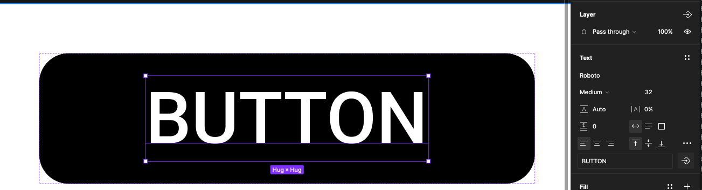

Repeat with bottom Button
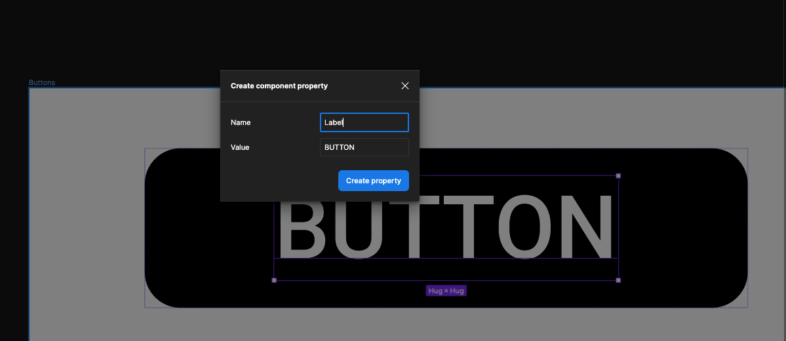

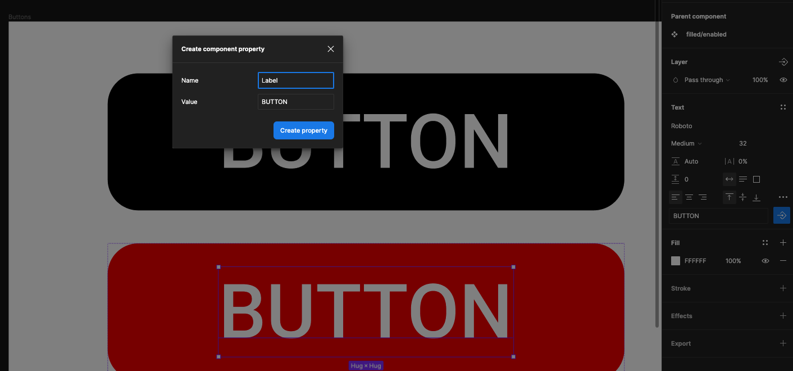

Your  Component are ready to use in your UI designs and Layouts
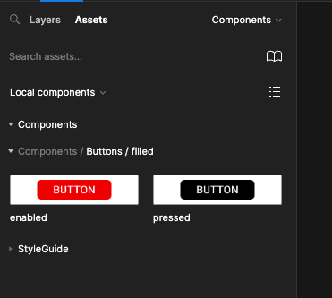