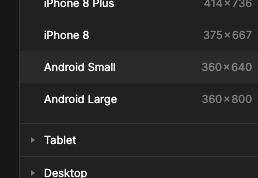
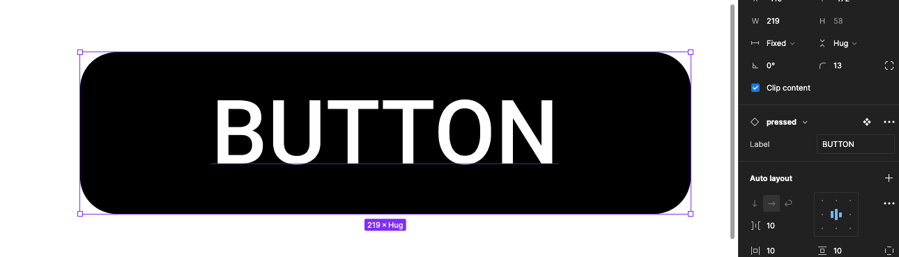

{: .no_toc }

#  Project Set-up Walk-though: Page 4 - Layout
 
 Finally we will create a page to lay out some of the Components we have created.

Create new page and call it layout

Now create a Frame either by clicking on the frame tool in the Toolbar or pressing F on your keyboard.

From the properties panel on the right click on android small for the screen size

In the left panel click on the assets tab

Click on a button component and click on Insert Instance.

 The button will now appear on the page

In the Properties panel on the right update the text on the label

Creating Text Properties on a component is the best way to edit and update labels or other text on an Instance

