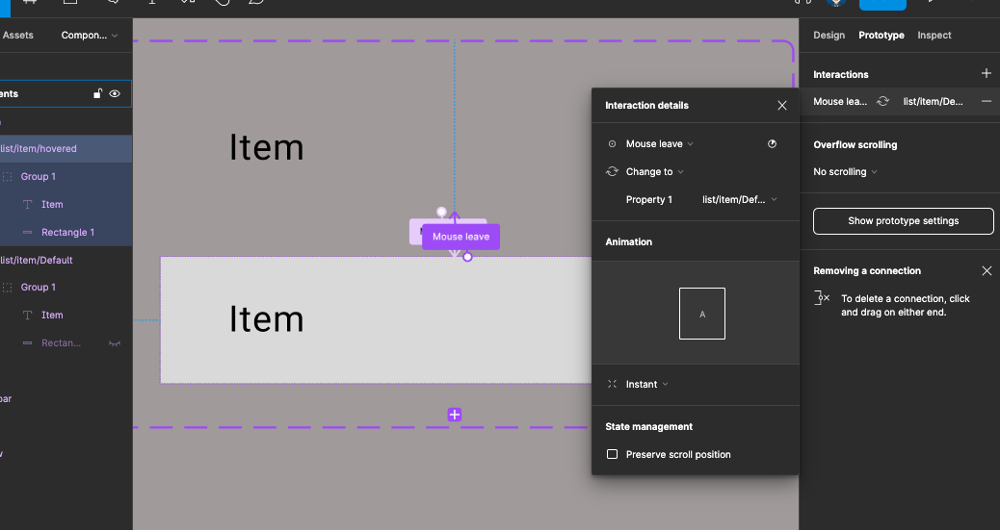
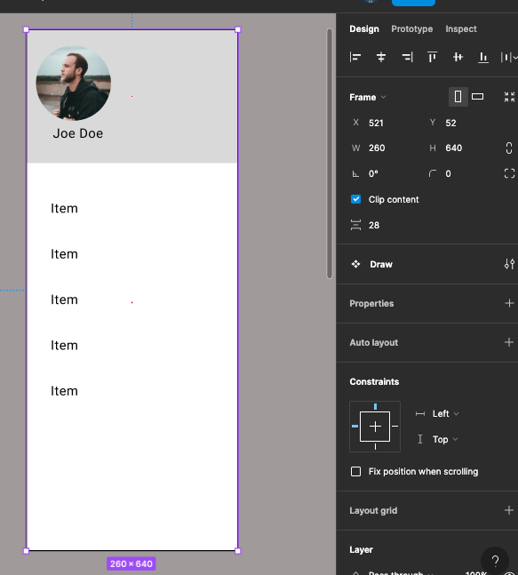
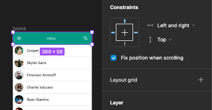

{: .no_toc }

# Overlay Draw

Create a title bar -with a menu icon, a title and an icon in this case a search/magnifying glass

Now we will create a label item this will consist of the frame with an ellipse shape containing an avatar and the name label.

Create a bottom Stroke with the colour black

Get the text July left - centred vertically and fixed size

