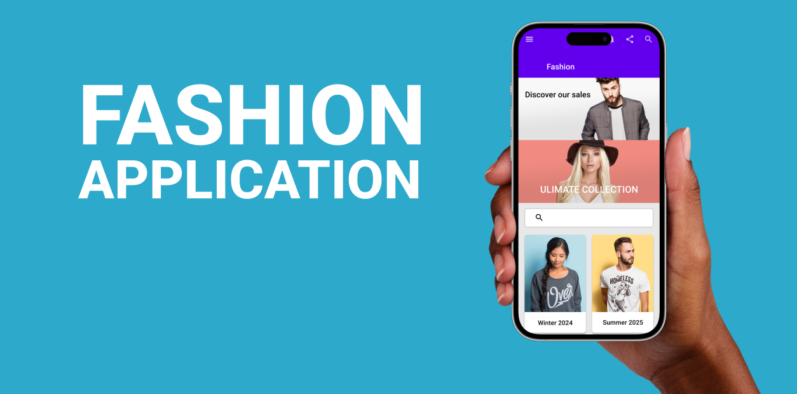

{: .no_toc }

# Web & App Mock-ups

First you need to load the **Mockuuups Studio** Plugin from Figma Community.

Right Mouse on the paste board

Select Plugins > Manage Plugins...

Search for **Mockuuups Studio** in the Manage Plugins Panel

Then click **Save** at the bottom of the Panel

You will nee to select a Frame (Screen) to appear in the mock-up

Once selected Right Mouse on the Pasteboard

Select Plugins > Mockuuups Studio

Your Frame (Screen) will Preview on the available mock-ups

Click to select to one your want to use, you can customise using the options on the Title Bar

Click **Export** > **Place into Document**

It will now appear on your Pasteboard

You may need to Scale (Drag corner while holding `Shift`on Keyboard) & move it

You can export the mock-up as an image (PNG or JPEG) to use in your reports, case studies, portfolios & presentations

You can also use the mock-up on a 'Project Cover' Page.

Create a New Page & name it Cover, make sure it is the top page on the Page list - if not drag it up

Create your design within a 1920 x 960 Frame, once complete select the Frame, Right Mouse & select **Set as Thumbnail** 

