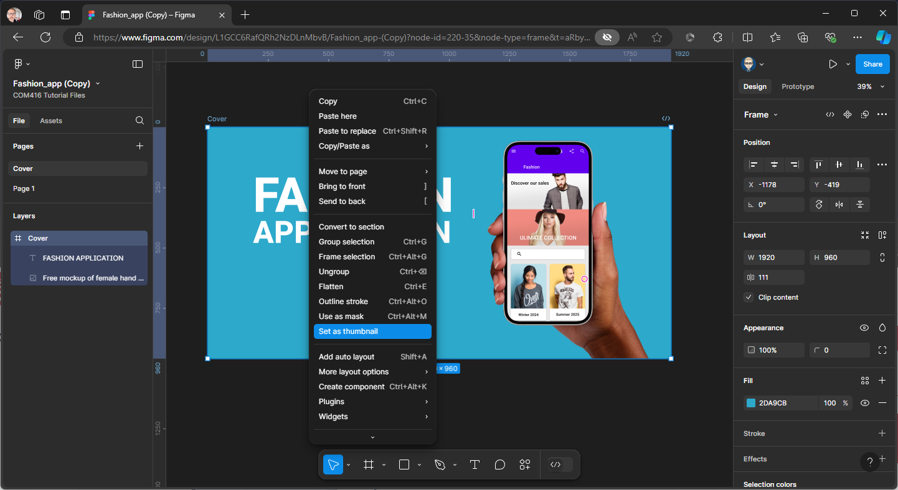

{: .no_toc }

# Web & App Mock-ups

Designing a mock-up of your UI is a great way to visualise and promote your UX/UI project. Figma offers tools that make it easy to create a polished representation of your design, which you can use in various ways:

**Project File Cover:** Use the mock-up as a thumbnail on your Figma project file. This provides a professional look and gives viewers an immediate idea of what your project is about.

**Export for External Use:** Export your Figma mock-up to showcase it elsewhere, whether in presentations, portfolios, or social media.

### 1. Mock-up Plugin Set-up

First you need to load the **Mockuuups Studio** Plugin from Figma Community.

Right Mouse on the paste board

Select Plugins > Manage Plugins...

Search for **Mockuuups Studio** in the Manage Plugins Panel

Then click **Save** at the bottom of the Panel

### 2. Create the Mock-up

You will need to select a Frame (Screen) to appear in the mock-up

Once selected Right Mouse on the Pasteboard

Select Plugins > Mockuuups Studio

Your Frame (Screen) will Preview on the available mock-ups

Click to select to one your want to use, you can customise using the options on the Title Bar

Click **Export** > **Place into Document**

It will now appear on your Pasteboard

You may need to Scale (Drag corner while holding `Shift`on Keyboard) & move it

### 3. Export Mock-up as an Image File

You can export the mock-up as an image (PNG or JPEG) to use in your reports, case studies, portfolios & presentations

### 4. Mock-up on Project Thumbnail

You can also use the mock-up on a **'Project Cover'** Page.

Create a New Page & name it **Cover**, make sure it is the top page on the Page list - if not drag it up

Create your design within a **1920 x 960 Frame**, 

Once complete select the Frame & Right Mouse & select **Set as Thumbnail** 

The Thumbnail icon will appear on both the Frame Label & in the Layers panel

Now go back to Files

Your cover Thumbnail will now be presented on your Project File

