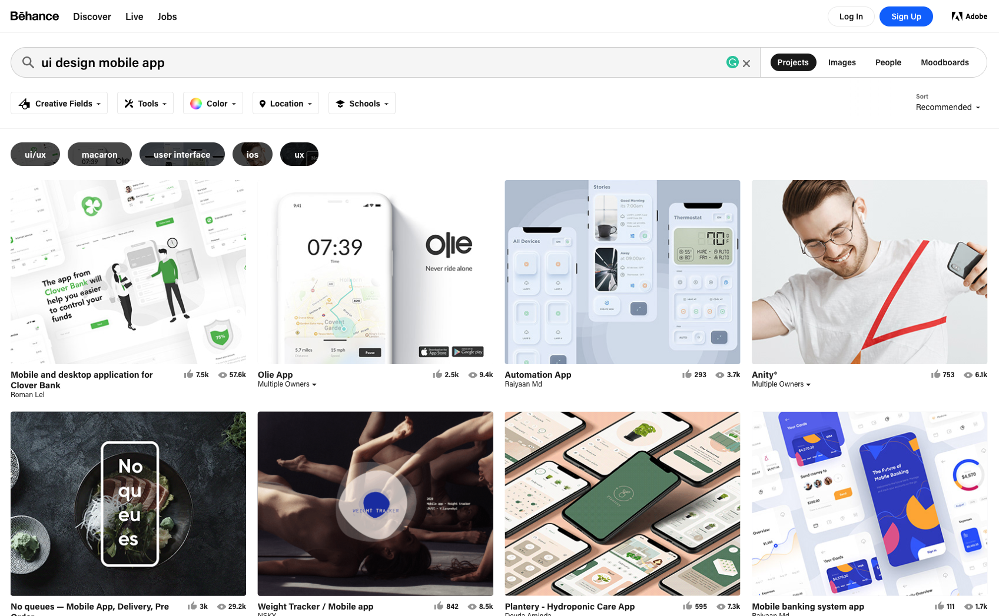
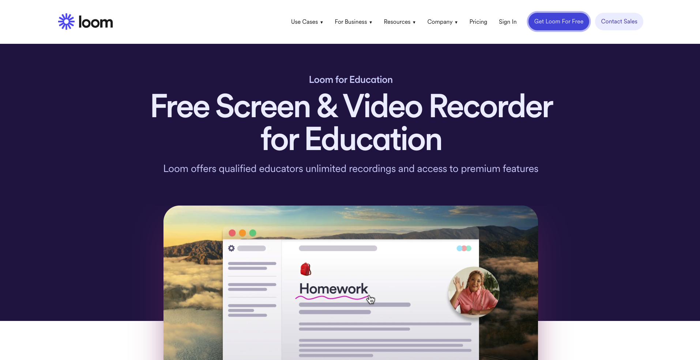

{: .no_toc }

# Online Portfolios

**Behance File Type & File Size**

Your images need to be saved as JPEG Although you can use PNG & GIF files too. Make sure when you save your images you can press them to the smaller file size that still keeps the quality of the image.

<iframe src="https://solent.cloud.panopto.eu/Panopto/Pages/Embed.aspx?pid=accda614-91c3-45e2-9c66-ac6a00a43f02&amp;autoplay=false&amp;offerviewer=true&amp;showtitle=true&amp;showbrand=false&amp;start=0&amp;interactivity=all" height="405" width="720" allowfullscreen="" allow="autoplay" style="font-size: 0.9375rem; letter-spacing: 0.45px; border-width: 1px; border-style: solid; border-color: #464646;"></iframe>

When outputting your images from PhotoShop, InDesign or illustrator you need to export them as JPEGs

You can use the same process of making your design work in Figma just make your frame 1400 pixels wide then export it as a JPEG - remember the height doesn't really matter on Behance.

Images should use the RGB colour space not CMYKImage uploads should be 1400px wide or less [More details here](https://help.behance.net/hc/en-us/articles/204484614-Guide-Formatting-Images-For-Display-On-Behance)

## Medium.com Introduction and Walk-through

<iframe src="https://solent.cloud.panopto.eu/Panopto/Pages/Embed.aspx?id=adff3c49-1a57-41dc-8d95-b0d00168e544&autoplay=false&offerviewer=true&showtitle=true&showbrand=true&captions=true&interactivity=all" height="405" width="720" style="border: 1px solid #464646;" allowfullscreen allow="autoplay" aria-label="Panopto Embedded Video Player"></iframe>

## Screen Recording

#### Loom (Mac & PC)

[LOOM.COM (Education)](https://www.loom.com/education)

#### QuickTime (Mac)

<iframe src="https://solent.cloud.panopto.eu/Panopto/Pages/Embed.aspx?id=064b5b35-74b9-44d7-a9a3-b0d0016f119c&autoplay=false&offerviewer=true&showtitle=true&showbrand=true&captions=true&interactivity=all" height="405" width="720" style="border: 1px solid #464646;" allowfullscreen allow="autoplay" aria-label="Panopto Embedded Video Player"></iframe>

#### Screen Recorder PC

<iframe width="560" height="315" src="https://www.youtube.com/embed/GrVflPPpfDw?si=v3mPhvjcvWd-b27m" title="YouTube video player" frameborder="0" allow="accelerometer; autoplay; clipboard-write; encrypted-media; gyroscope; picture-in-picture; web-share" allowfullscreen></iframe>

#### OBS Studio (Mac & Windows)

<iframe width="560" height="315" src="https://www.youtube.com/embed/nWbJJ4RnPx8?si=yJo8nb0XeZFOgVCv" title="YouTube video player" frameborder="0" allow="accelerometer; autoplay; clipboard-write; encrypted-media; gyroscope; picture-in-picture; web-share" allowfullscreen></iframe>